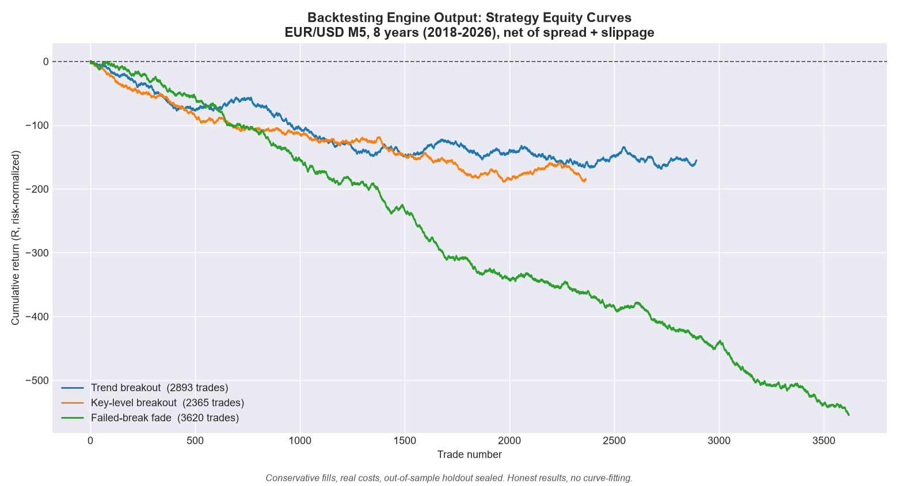

# Custom Backtesting and Validation Engine (Python)

> A rigorous, modular framework for testing trading strategies on years of real
> market data, built to give honest answers about whether a strategy actually
> has an edge before any capital is risked.

## The problem it solves

Most strategy backtests look profitable and then fail live. The usual reasons:
optimistic fills, look-ahead bugs, ignored costs, and overfitting. This engine is
built the opposite way, around conservative and validated methodology, so the
result you get is a result you can trust.

## Core capabilities

- **Historical data pipeline.** Pulls and caches years of M5 and D1 candles from
  MetaTrader 5 across multiple instruments (FX, indices, metals), with correct
  timezone and DST handling.
- **Execution simulator.** Simulates fills in risk-normalized R-multiples:
  conservative within-bar ordering (worst-case fill), partial take-profits
  (50/40/10), break-even stop promotion after the first target, and realistic
  spread, slippage, and overnight-financing costs.
- **Pre-registered scorecard.** Expectancy, win rate, profit factor, max
  drawdown, streaks, and trades per day. The full picture, never one
  cherry-picked number.
- **Sealed out-of-sample holdout.** Strategies are tuned on training data only.
  The holdout is touched exactly once. Real validation discipline.
- **No look-ahead by construction.** Engine functions only ever see data up to
  the current bar, which structurally prevents the most common backtesting bug.
- **Null-hypothesis validation.** A random-entry baseline confirms the engine is
  statistically fair (returns close to cost, correct long and short symmetry,
  correct market drift), proving the results are not an artifact of the tool.

## Strategies implemented and tested

Breakout, mean-reversion (fade), trend-following (time-series momentum), and ICT
concepts (liquidity sweeps, CISD, inverse FVG, SMT). More than 10 strategy
variants across 4 instruments over 8 years of data.

## Tech

Python, SQLite, MetaTrader 5 integration, conservative R-multiple fill model.

## What this means for you

I can build you a custom backtester for your own strategy or indicator, validate
an idea before you risk money on it, and tell you the honest truth about whether
it holds up. Conservative fills, real costs, proper out-of-sample testing. No
hype, just data, including catching the optimistic assumptions that make a
backtest lie.

*Above: the engine's output across three popular strategies on 8 years of
EUR/USD data, net of costs. All three lose after spread and slippage, which is
the honest result. The value here is the rigorous, conservative analysis, not a
promise of profit.*
