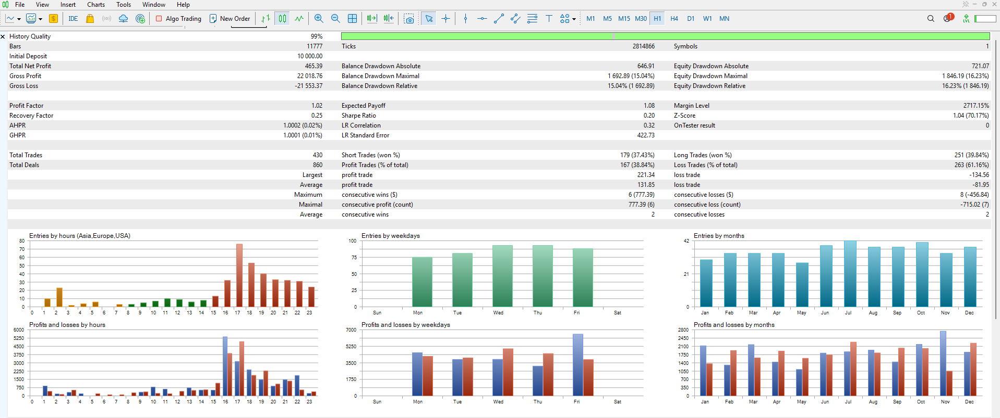
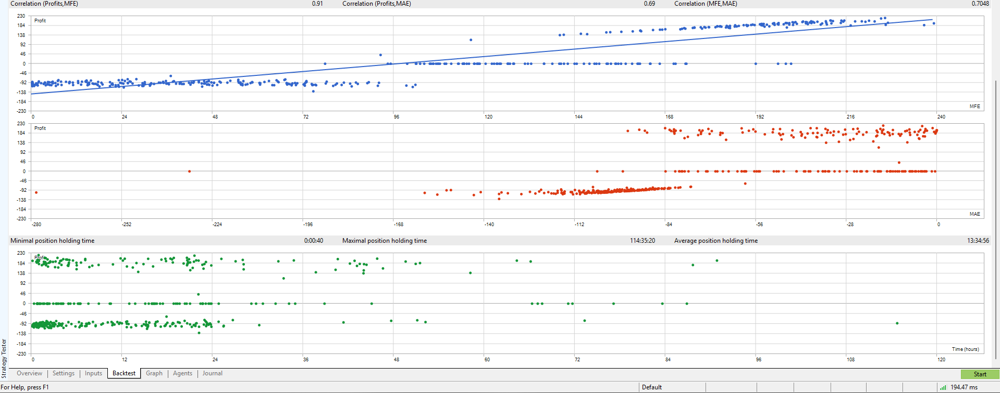

# TrendBreakoutEA: Risk-Managed Breakout Expert Advisor (MQL5)

> A configurable, trend-filtered breakout Expert Advisor for MetaTrader 5, built
> from scratch with a focus on clean execution and real risk management.

## What it does

- **Entries.** Donchian breakout (price breaks the highest high or lowest low of
  the prior N bars), filtered by a 200-period EMA trend, so it only trades
  breakouts in the direction of the larger trend.
- **Stops.** ATR-based, so the stop adapts to current volatility instead of using
  a fixed distance.
- **Targets.** A configurable reward-to-risk multiple.
- **Position sizing.** Risks a fixed percentage of account balance per trade,
  calculated from the stop distance.
- **Break-even.** Automatically moves the stop to entry once the trade reaches
  one unit of risk in profit.
- **Extras.** One position at a time, optional session-hour filter, fully
  parameterized inputs.

## Backtest results

Tested on US30 (Dow), H1 timeframe, over 2 years, using 99% real-tick quality
data (2.8 million ticks).

| Metric | Result |
|---|---|
| Total trades | 430 |
| Profit factor | 1.02 |
| Max drawdown | 15% |
| Win rate | 38.8% |
| Average win vs average loss | $131.85 vs $81.95 |
| History quality | 99% |

The result is roughly breakeven, which is the honest and expected outcome for a
pure breakout strategy. What the test demonstrates is the build quality: 430
clean executions, controlled drawdown, correct position sizing, and the classic
trend-following return profile (lower win rate, larger winners).





## A look at the code

Risk management is the part that actually protects an account, so here is how the
EA sizes every trade. It risks a fixed percentage of balance, converts that risk
into lots using the symbol's real tick value, then rounds to the broker's volume
step and clamps to its limits. No hard-coded lot sizes, no assumptions about the
instrument:

```cpp
//+------------------------------------------------------------------+
//| Position size from a fixed % of balance and the stop distance.   |
//+------------------------------------------------------------------+
double CalcLots(double stopDistPrice)
{
   double risk      = AccountInfoDouble(ACCOUNT_BALANCE) * InpRiskPercent / 100.0;
   double tickValue = SymbolInfoDouble(_Symbol, SYMBOL_TRADE_TICK_VALUE);
   double tickSize  = SymbolInfoDouble(_Symbol, SYMBOL_TRADE_TICK_SIZE);
   if(tickSize <= 0.0 || tickValue <= 0.0 || stopDistPrice <= 0.0) return 0.0;

   double lossPerLot = (stopDistPrice / tickSize) * tickValue;
   if(lossPerLot <= 0.0) return 0.0;

   double lots = risk / lossPerLot;

   double minLot = SymbolInfoDouble(_Symbol, SYMBOL_VOLUME_MIN);
   double maxLot = SymbolInfoDouble(_Symbol, SYMBOL_VOLUME_MAX);
   double step   = SymbolInfoDouble(_Symbol, SYMBOL_VOLUME_STEP);
   if(step > 0.0) lots = MathFloor(lots / step) * step;
   if(lots < minLot) lots = minLot;
   if(lots > maxLot) lots = maxLot;
   return lots;
}
```

## What this means for you

If you have a strategy you want automated, I build it exactly to your rules, with
this same standard of risk management and testing. You get a working bot and an
honest backtest, so you know what you are dealing with before you risk capital.
