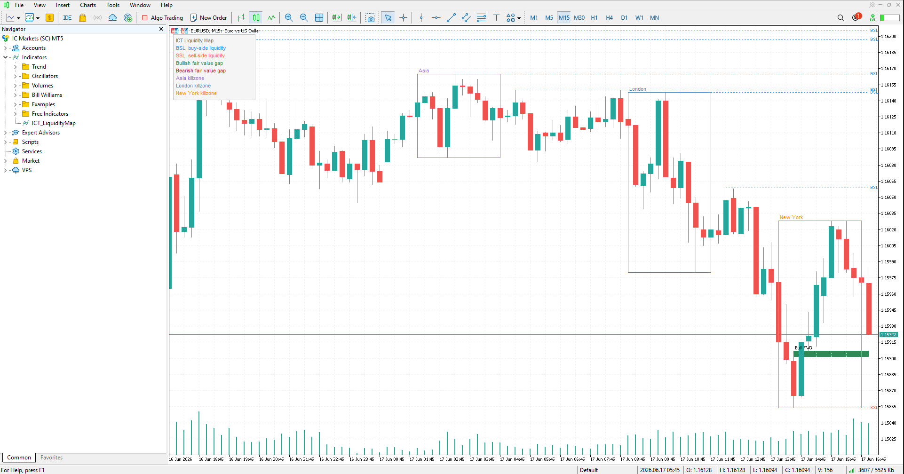

# ICT Liquidity Map: Market-Structure & Session Indicator (MQL5)

> A custom MetaTrader 5 indicator that marks the three things ICT and
> smart-money traders watch most: resting liquidity, fair value gaps, and
> killzone sessions. Built from scratch, fully parameterized.

## What it does

- **Liquidity levels.** Detects confirmed swing highs and lows and draws them as
  resting liquidity lines: buy-side liquidity (BSL) above swing highs and
  sell-side liquidity (SSL) below swing lows. By default it shows only the levels
  price has not yet taken, so the chart highlights liquidity that is still
  resting rather than cluttering it with levels that are already gone. Swing
  strength is adjustable, so you control how major a level has to be.
- **Fair Value Gaps.** Finds the classic 3-candle imbalance and marks each gap as
  a labeled box, "Bull FVG" or "Bear FVG", with a configurable minimum size
  filter to ignore noise. It can show every gap or, in one click, only the
  unmitigated gaps price has not filled yet.
- **Killzones.** Outlines the London, New York, and Asia sessions as a labeled
  zone per day, where the top and bottom edges mark the session high and low,
  exactly the levels traders watch for sweeps. Session hours and colors are fully
  configurable to match your broker's server time.
- **Built-in legend.** A compact color key sits in the corner so anyone reading
  the chart knows what every line, box, and zone means at a glance.

## How it is built

- Pure object drawing on the chart: every line, box, and label lives under a
  single name prefix, so the indicator cleans up after itself when removed and
  never leaves orphaned objects behind.
- Rebuilds once per new bar (not on every tick), and only scans a configurable
  window of recent bars, so it stays light even on lower timeframes.
- Every visual is optional and color-controlled through inputs. Turn off what you
  do not want, restyle what you keep.

## A look at the code

Here is the fair value gap detection, the classic 3-candle imbalance, together
with the check that hides any gap price has already traded back through, so the
chart stays focused on imbalances still in play:

```cpp
// A Fair Value Gap is a 3-candle imbalance. With candle i as the middle one,
// a bullish gap exists when candle (i-1)'s high sits below candle (i+1)'s low,
// leaving an untraded pocket the market often returns to fill.
if(low[i + 1] > high[i - 1])
{
   double gap    = low[i + 1] - high[i - 1];
   bool   filled = BullFVGFilled(i, to, low, high[i - 1]);   // has price returned?
   if(gap >= minGap && !(InpUnmitigatedOnly && filled))
      DrawFVGBox(time[i - 1], high[i - 1], low[i + 1], i, to, time, "Bull FVG", InpBullFVGColor);
}

//--- A gap counts as "filled" once a later candle trades back into it.
bool BullFVGFilled(int midIdx, int to, const double &low[], double gapBottom)
{
   for(int j = midIdx + 2; j <= to; j++)
      if(low[j] <= gapBottom) return true;
   return false;
}
```

## Screenshot



## What this means for you

This is the kind of visual tool I build to order. If you trade a specific model,
ICT or otherwise, I turn your exact rules into a clean indicator: the levels you
care about, drawn the way you want them, with inputs so you can tune it yourself.
You describe the setup, I build the tool that puts it on your chart.
