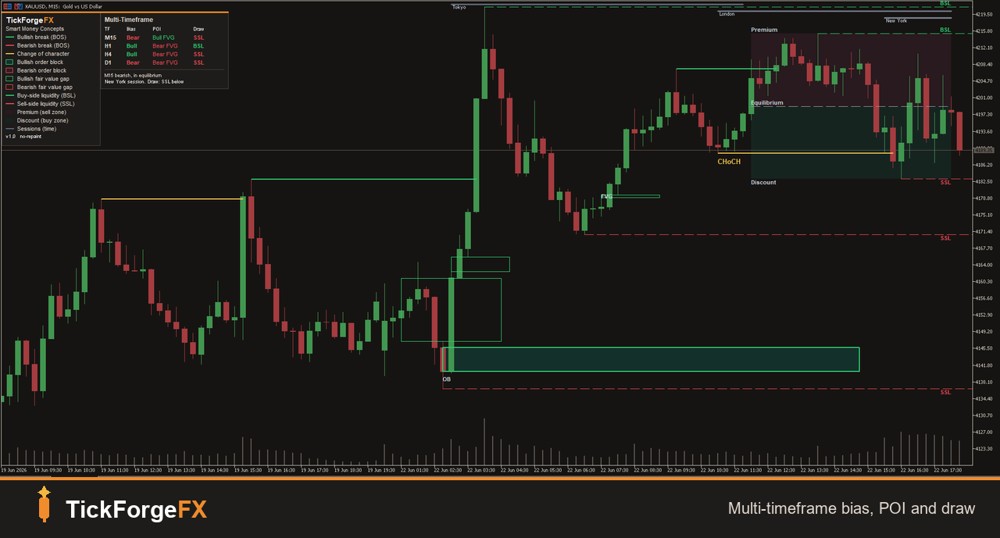

# TickForgeFX: Custom Trading Tools for MetaTrader 5

I build and backtest custom trading tools for traders, prop firms, and trading
communities. If you have a strategy, an indicator idea, or a tool you wish
existed, I build it, test it properly, and tell you honestly whether it holds up
before you risk a dollar.

## What I build

- **Expert Advisors (trading bots)** for MetaTrader 5, coded exactly from your
  strategy rules with proper risk management and tested honestly. You bring the
  strategy, I build it faithfully and tell you how it holds up before you risk a
  dollar. MetaTrader 4 (MQL4) builds on request.
- **Custom indicators** for MetaTrader 5: dashboards, alerts, liquidity tools,
  session markers, and more. TradingView (Pine Script) on request.
- **Strategy backtesting and validation.** I test your idea on years of real
  data with conservative, honest assumptions, so you know what is real before
  you trade it.
- **Trading tools and automation.** Risk and position-size calculators, trade
  journals, data scrapers, alert bots, prop-firm drawdown trackers.
- **Fixing and upgrading** existing bots and indicators.

## How I work

Six years in the markets means I speak your language and I understand what
actually matters: clean execution, real risk management, and honest testing. I
will not sell you a "guaranteed profitable bot," because nobody honest can. I
build your idea exactly to spec, test it rigorously, and give you the truth.

## Flagship: Smart Money Concepts by TickForgeFX

A clean, no-repaint Smart Money Concepts indicator for MetaTrader 5. Market
structure (BOS / CHoCH), order blocks, fair value gaps, liquidity (BSL / SSL,
equal highs and lows, previous day levels), premium and discount with an OTE
band, killzone sessions, and a multi-timeframe dashboard with a plain-English
read of the current picture. Detection runs on closed bars only and never
repaints. Now live on the MQL5 Market:
[SMC and ICT Structure Liquidity Dashboard](https://www.mql5.com/en/market/product/182687).

## Case study: Trend Breakout EA

A worked example of how I build and test a strategy, not a product. A trend-filtered
Donchian breakout coded exactly to spec, with real risk management and no grid or
martingale, then backtested honestly with conservative costs. Over two years on US30 H1
it returned a profit factor of 0.98, a marginal, slightly negative baseline, and the
case study reports that plainly. The value here is the transparent method and the clean,
extensible code, never a profit claim.

Full rules, setup, and numbers: [Trend Breakout EA case study](products/trend-breakout-ea/CASE_STUDY.md).

## Contact

- MQL5: https://www.mql5.com/en/users/tickforgefx
- Email: TickForgeFX@protonmail.com
