# TickForgeFX: Custom Trading Tools for MetaTrader 5

I build and backtest custom trading tools for traders, prop firms, and trading
communities. If you have a strategy, an indicator idea, or a tool you wish
existed, I build it, test it properly, and tell you honestly whether it holds up
before you risk a dollar.

## What I build

- **Expert Advisors (trading bots)** for MetaTrader 5, coded exactly from your
  strategy rules with proper risk management and tested honestly. You bring the
  strategy, I build it faithfully and tell you how it holds up before you risk a
  dollar. MetaTrader 4 (MQL4) builds on request.
- **Custom indicators** for MetaTrader 5: dashboards, alerts, liquidity tools,
  session markers, and more. TradingView (Pine Script) on request.
- **Strategy backtesting and validation.** I test your idea on years of real
  data with conservative, honest assumptions, so you know what is real before
  you trade it.
- **Trading tools and automation.** Risk and position-size calculators, trade
  journals, data scrapers, alert bots, prop-firm drawdown trackers.
- **Fixing and upgrading** existing bots and indicators.

## How I work

Six years in the markets means I speak your language and I understand what
actually matters: clean execution, real risk management, and honest testing. I
will not sell you a "guaranteed profitable bot," because nobody honest can. I
build your idea exactly to spec, test it rigorously, and give you the truth.

## Flagship: Smart Money Concepts by TickForgeFX

A clean, no-repaint Smart Money Concepts indicator for MetaTrader 5. Market
structure (BOS / CHoCH), order blocks, fair value gaps, liquidity (BSL / SSL,
equal highs and lows, previous day levels), premium and discount with an OTE
band, killzone sessions, and a multi-timeframe dashboard. The panel reads the
current bias, zone, session, nearest liquidity, and the named key price levels
at a glance, with the distance to price in pips on the levels that are a single
price. The killzone sessions find your broker's clock on their own and follow
daylight saving, so they land on the right hours the moment you attach.
Detection runs on closed bars only and never repaints. Now live on
the MQL5 Market:
[SMC and ICT Structure Liquidity Dashboard](https://www.mql5.com/en/market/product/182687).

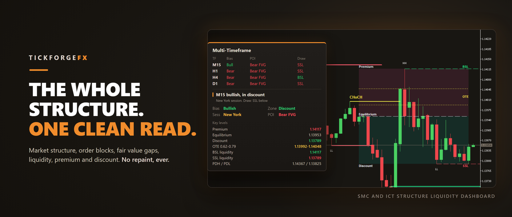

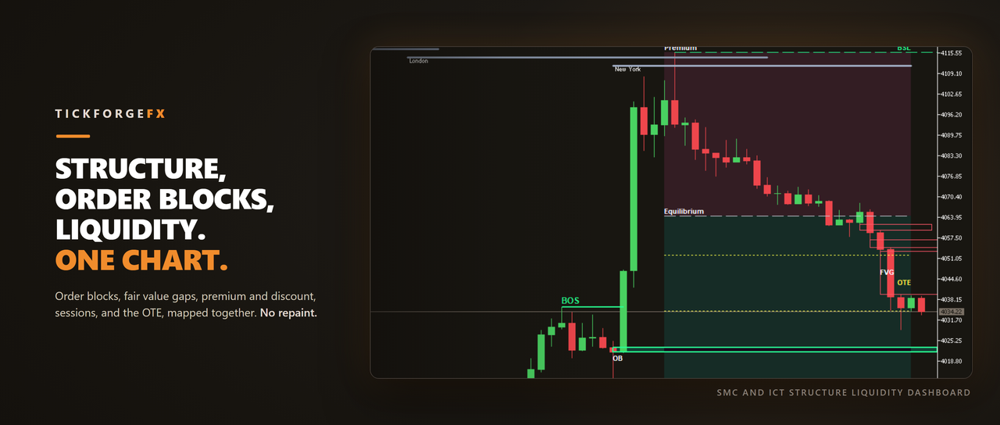

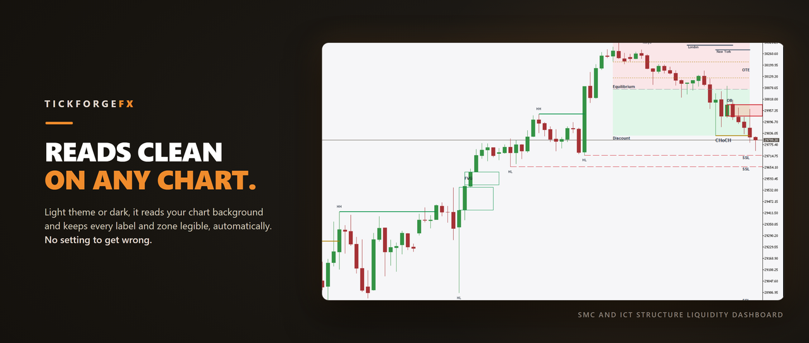

## Paid tool: Currency Strength Scanner Pro

A currency strength meter that does the next step for you. It ranks the 8 majors by their
strength, then turns that into a ranked table of the strongest-versus-weakest pairs to trade,
shows how many timeframes agree on each, and alerts you (popup, push, email, sound) when the
single best setup forms. Everything is closed-bar, so nothing repaints, and it alerts the one
best pair rather than a dozen correlated buzzes. Monitor-only: it ranks strength, it does not
trade or predict. On the MQL5 Market:
[Currency Strength Scanner Pro](https://www.mql5.com/en/market/product/184937).

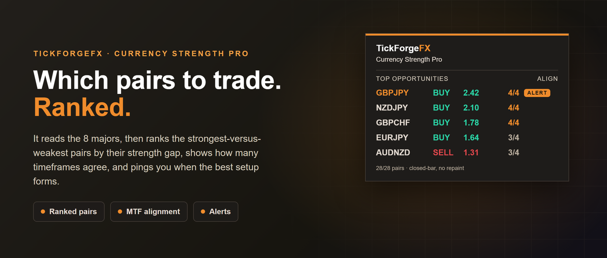

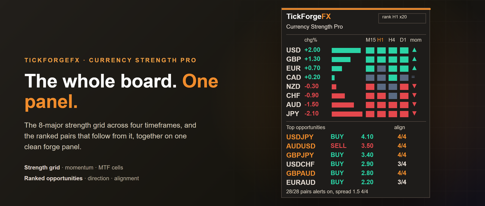

## Paid tool: Trade Manager with Risk Sizing and Trailing Stops

Three lines on your chart: entry, stop and target. Drag the stop to where the trade is actually
wrong and the lot size follows it, so the risk stays exactly the percent you set no matter how
wide or tight you place it. One click sends the order at that size, as a market order or as the
right pending order depending on where you put the entry line. After that it runs the trade: two
partial closes, break-even with a buffer, and a trailing stop in four modes (fixed distance, ATR,
chandelier below the high since entry, or behind the last closed candles). A daily and an overall
loss limit sit underneath, and on a breach they cancel working orders, close what the tool opened
and refuse new entries until the day rolls. It never decides to trade; there are no signals and no
strategy in it. The parts worth knowing are the ones nobody advertises: it refuses to size a
degenerate plan rather than handing back a confident number, a button that cannot fire says why in
plain words, and the sizing reads the loss tick value for the stop leg and the profit one for the
target, which differ on many CFDs and crosses. On the MQL5 Market:
[Trade Manager with Risk Sizing and Trailing Stops](https://www.mql5.com/en/market/product/189281).

[Watch the 84 second demo](https://www.youtube.com/watch?v=M_lc3k1AJak), recorded on a live chart.

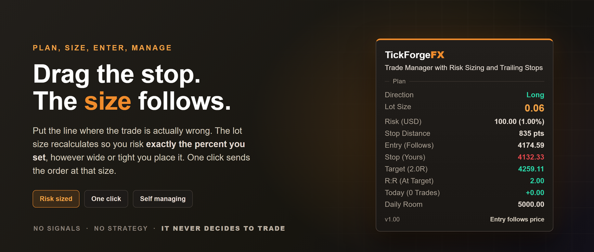

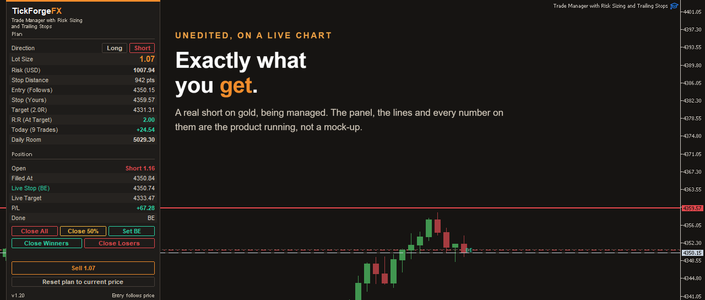

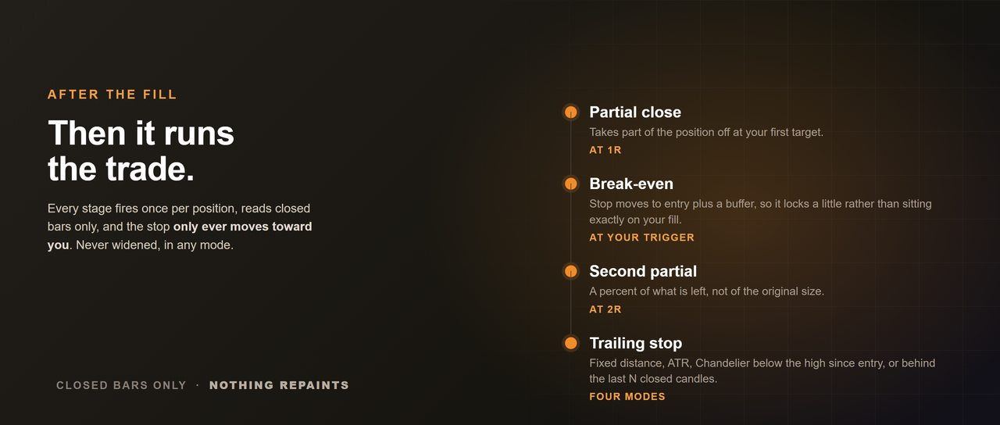

## Free tool: Visual Risk and Position Size Calculator

A clean, free position-size calculator for MetaTrader 5. Drop it on any chart and
drag three lines, Entry, Stop, and Target, to your levels. The panel reads back the
exact lot size for the percent of your account you choose to risk, the money at risk
in your account currency, the stop distance, and the reward-to-risk with the potential
profit at your target. It respects your broker's minimum, maximum, and step, and it
flags when your account is too small for your chosen risk. No signals, no repaint, just
the number you need before you place the trade. Free on the MQL5 Market:
[Visual Risk and Position Size Calculator](https://www.mql5.com/en/market/product/183000).

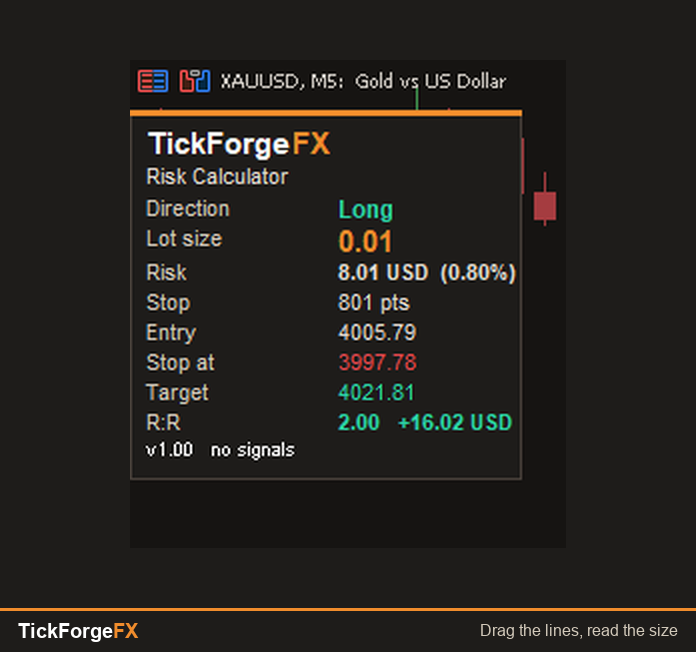

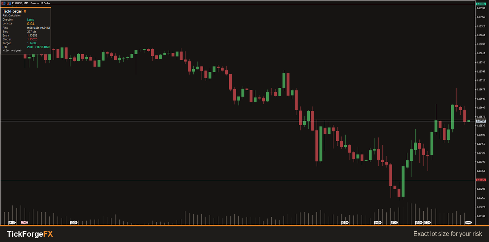

## Free tool: ICT Killzone and Session Tracker

A clean, free session tool for MetaTrader 5. A live panel counts down the Sydney, Tokyo,
London, and New York sessions, which one is open, how long is left, and when the next one
opens, with each session's name colour-coded so the panel doubles as a legend. On the chart,
each session's high and low range is drawn as a clean box. Times run on GMT with automatic
daylight-saving adjustment, so the sessions stay correct through the year without manual
re-timing. No signals, no repaint. Free on the MQL5 Market:
[ICT Killzone and Session Tracker](https://www.mql5.com/en/market/product/183024).

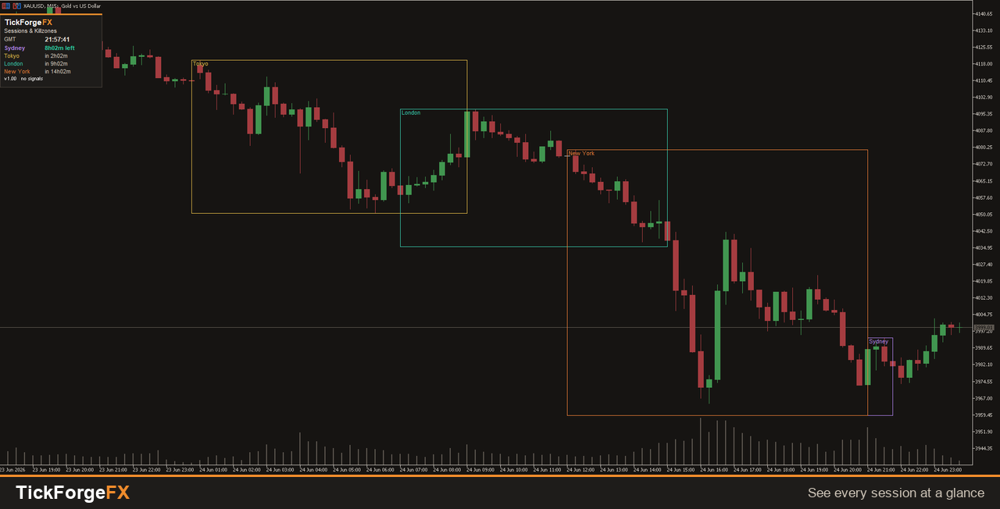

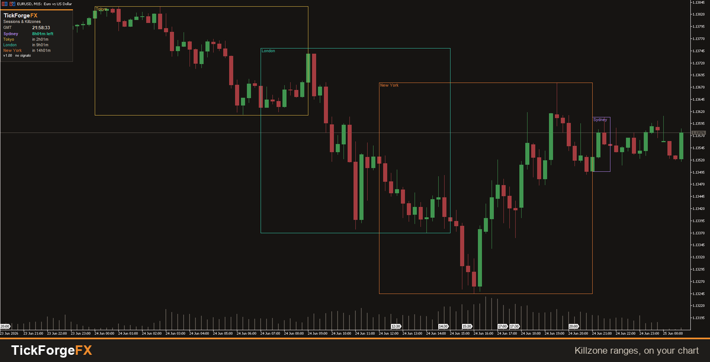

## Free tool: Daily Weekly Monthly Key Levels

A clean, free reference-levels tool for MetaTrader 5. It draws the levels traders watch all
day, previous day high, low and close, previous week high and low, the daily and weekly opens,
and optional previous month high and low, read straight from the broker's own daily, weekly,
and monthly candles, so there is nothing to configure for your timezone. A compact panel lists
each level and how far it sits from price in pips. The labels adapt to the chart theme, light
on dark, dark on a white chart, so they stay readable everywhere. No signals, no repaint. Free
on the MQL5 Market:
[Daily Weekly Monthly Key Levels](https://www.mql5.com/en/market/product/183203).

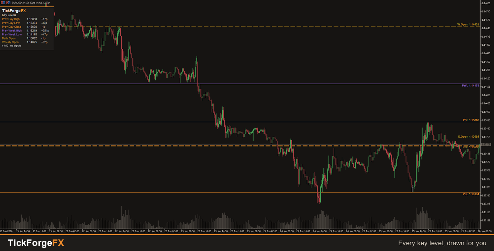

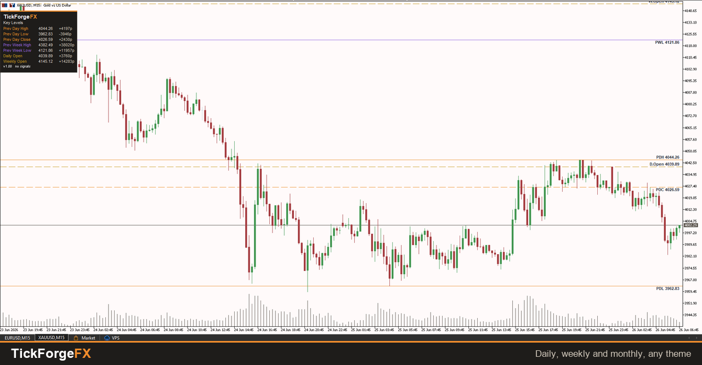

## Free tool: ADR Average Daily Range Meter

A clean, free tool for MetaTrader 5 that shows how far this market usually moves in a day, how
much of that range price has already used, and where the day runs out of room. A live panel
reads the average daily range over the last N days, how much of it today has used in points and
percent, and the room left up and down. The projected ADR high and ADR low are drawn on the
chart, with tags that stay visible when you zoom in. When price has spent an average day's range
continuation gets less likely and reversals more common, so this keeps that context in front of
you before you chase a move. No signals, no repaint. Free on the MQL5 Market:
[ADR Average Daily Range Meter](https://www.mql5.com/en/market/product/183839).

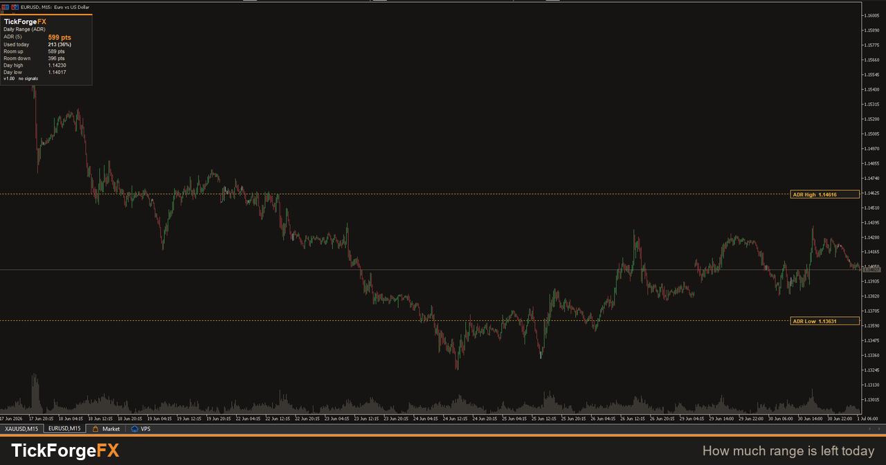

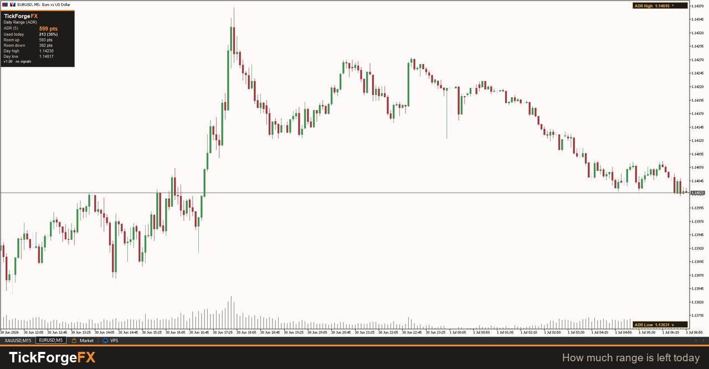

## Free tool: Auto Breakeven Trailing Stop and Partial Close

A free position manager for MetaTrader 5. Attach it to a chart and it looks after the
trades you already have open: it moves them to break-even once they are in profit, trails the stop
as they run, and takes a partial off at your target. Every rule is independent, and as of v1.1 you
can read each trigger in the unit that fits how you trade: points (the default), ATR multiples, R
multiples, or money. As of v1.2 it can also alert you the moment it acts, when a trade moves to
break-even, trailing starts, or a partial closes, by popup, push, email, or sound. It manages by
symbol and by magic number, or
everything on the account including trades you placed by hand, and a stop only ever moves to
protect, never to loosen. The partial is taken once per position and remembered durably, so a
reload, a recompile, or a terminal restart can never take a second partial off the same trade. It
never opens a trade and fires no signal. It only manages what is already there. Free on the MQL5
Market:
[Auto Breakeven Trailing Stop and Partial Close](https://www.mql5.com/en/market/product/184556).

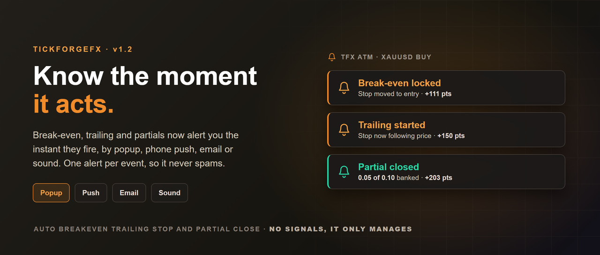

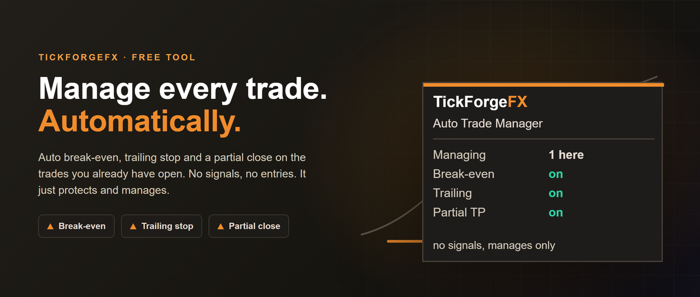

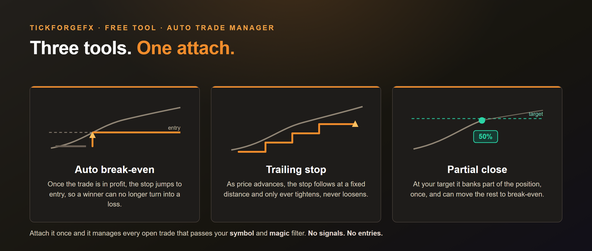

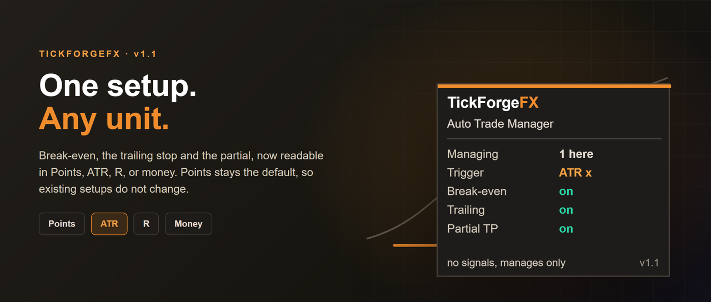

## Free tool: Prop Firm Drawdown and Daily Loss Guard

A clean, free risk panel for MetaTrader 5. It watches the two rails that end most prop-firm
accounts, the daily loss limit and the overall (max) loss limit, and shows you exactly how close
you are, live, with a progress bar for each and the cash room left before you breach. The daily
limit is measured on current equity from your start-of-day balance, so open floating losses count
the way most firms actually breach, and the overall limit can be static (a fixed floor, the FTMO
style) or trailing from your peak. It carries a SAFE, CAUTION, or DANGER status and alerts you at a
warning level and again on a breach. The day's baseline and your peak are stored durably, so a
restart never resets your day or hides a real drawdown. It never trades and fires no signals. Free
on the MQL5 Market:
[Prop Firm Drawdown and Daily Loss Guard](https://www.mql5.com/en/market/product/184431).

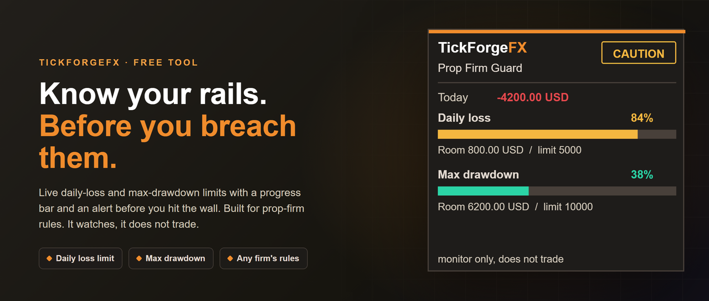

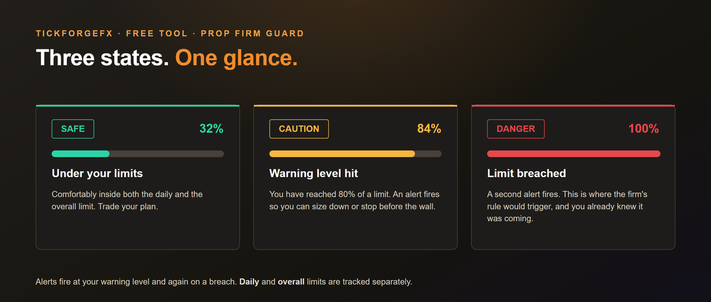

## Free tool: Trading Performance Statistics

A clean, free performance panel for MetaTrader 5. It reads your closed trade history and totals the
numbers most traders never sit down and calculate: net P/L, win rate, profit factor, average win
versus loss, payoff, expectancy, and your best and worst trade. A trade you closed in parts counts
as one position, not several, so the numbers match how you actually traded. Filter by period
(today, this week, this month, the last 7 or 30 days, or all time), by this chart's symbol, or by
magic number to isolate one strategy. It shows the truth, good or bad, updated as you trade, so a
vague feeling about your edge becomes a number you can act on. It reads history only and can never
place or close a trade. Free on the MQL5 Market:
[Trading Performance Statistics](https://www.mql5.com/en/market/product/184488).

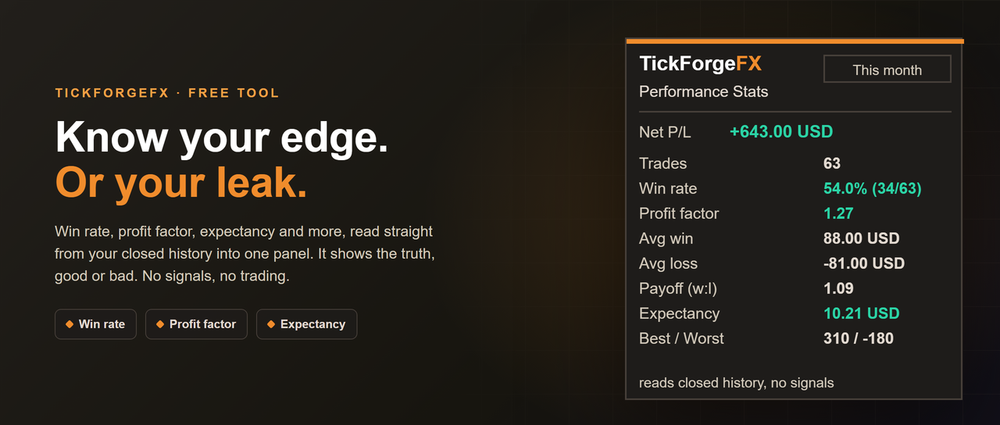

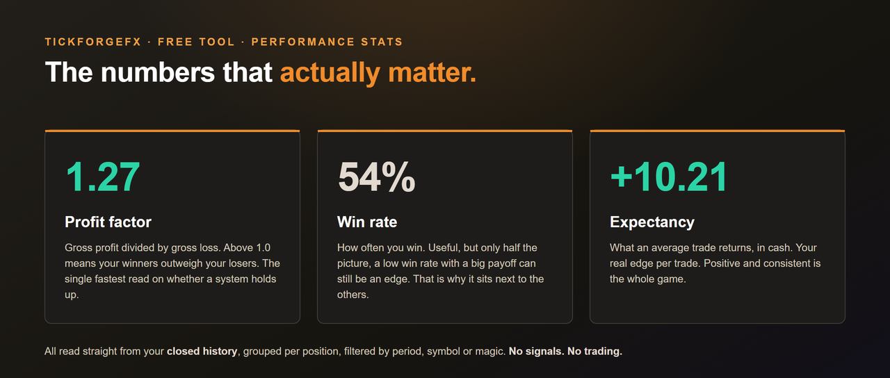

## Free tool: Currency Strength Meter Multi Timeframe

A clean, free currency strength meter for MetaTrader 5. It ranks the eight major currencies (EUR,
GBP, AUD, NZD, USD, CAD, CHF, JPY) by how they are actually moving across the 28 major pairs, and
shows which are strong, which are weak, and which way each one is turning. It computes on closed bars
only, so it does not twitch on every tick the way most free meters do. Each currency carries a
multi-timeframe alignment strip (four timeframes at a glance) and a momentum arrow, and the panel
names the cleanest strong-versus-weak pair to watch. It auto-detects your broker's symbol naming, so
it just works. No signals, no repaint. Free on the MQL5 Market:
[Currency Strength Meter Multi Timeframe](https://www.mql5.com/en/market/product/184632).

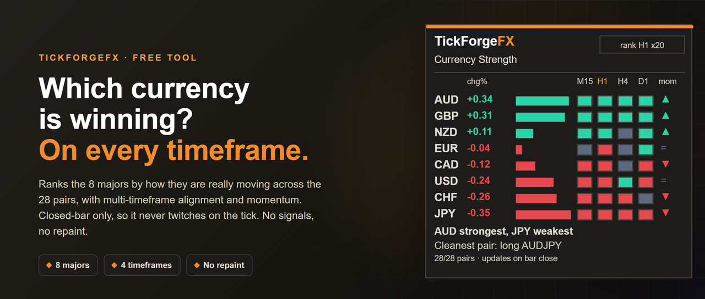

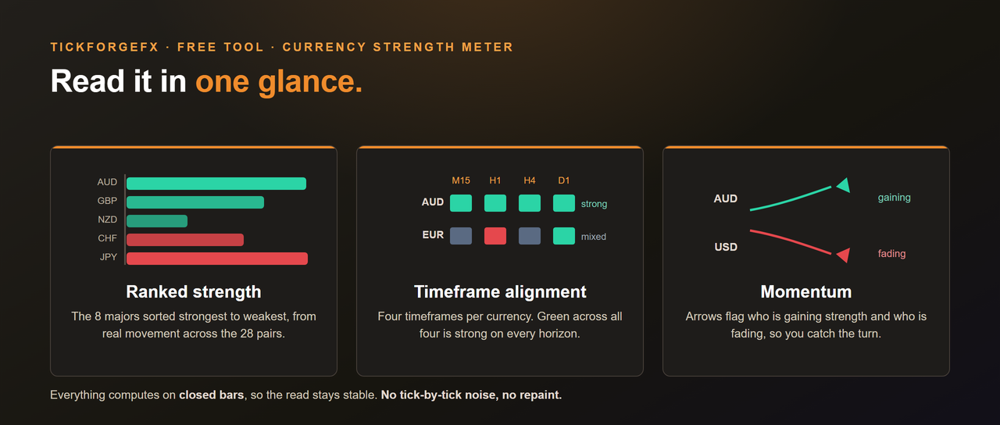

## Free tool: Candle Close Countdown Timer

A clean, free countdown for MetaTrader 5. Attach it to any chart and it shows the exact time
left on the current candle, a progress bar as the candle forms, and a live countdown for a whole
set of higher timeframes at the same time. Time your entries and exits to the close instead of
guessing, and know when a higher-timeframe candle is about to print while you work on a lower
one. Server-time accurate, no signals, no repaint. Free on the MQL5 Market:
[Candle Close Countdown Timer](https://www.mql5.com/en/market/product/184780).

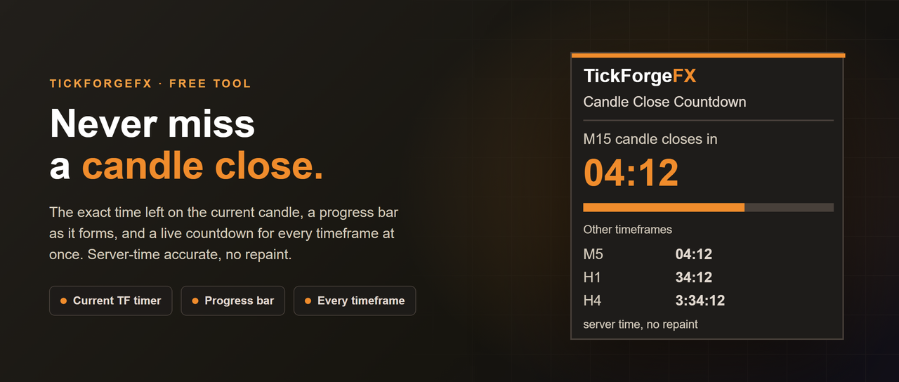

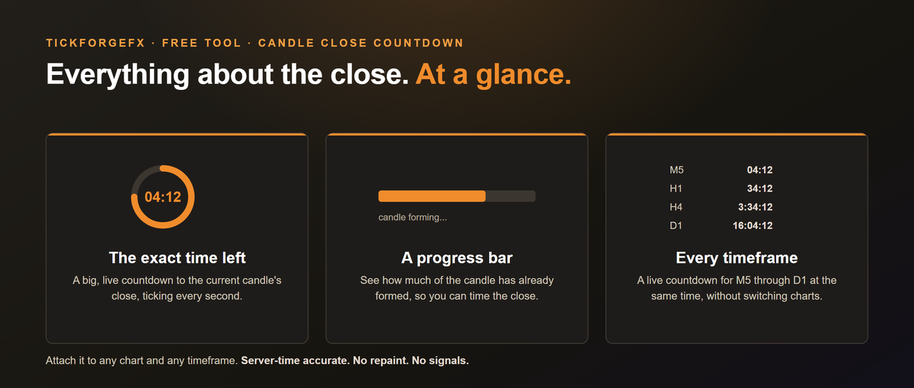

## Free tool: Round Number Levels

A clean, free round-number indicator for MetaTrader 5. Attach it to any chart and it draws the
psychological round-number price levels traders watch, the major "00" figures as solid lines and
the "50" half levels as dotted lines, each labelled with its price. It auto-scales to whatever
you trade (the 100-pip figures on FX, roughly fifty dollars on gold, five hundred on an index)
and re-centres as price moves. Distinct from the Daily Weekly Monthly Key Levels tool: those are
session highs and lows, these are round-number magnets. No signals, no repaint. Free on the MQL5
Market:
[Round Number Levels](https://www.mql5.com/en/market/product/184779).

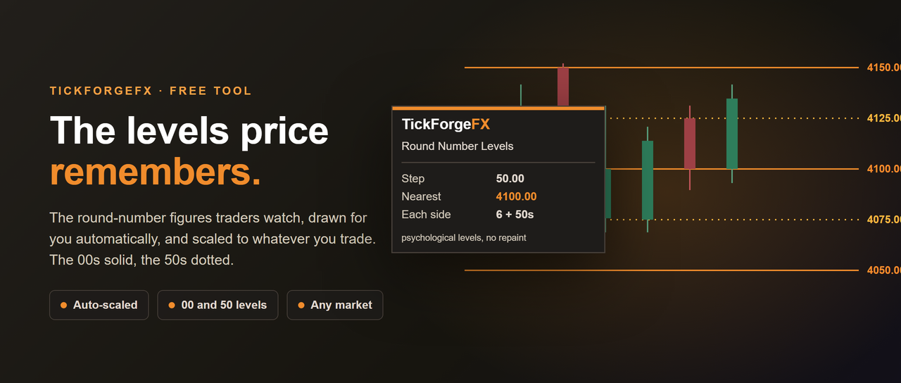

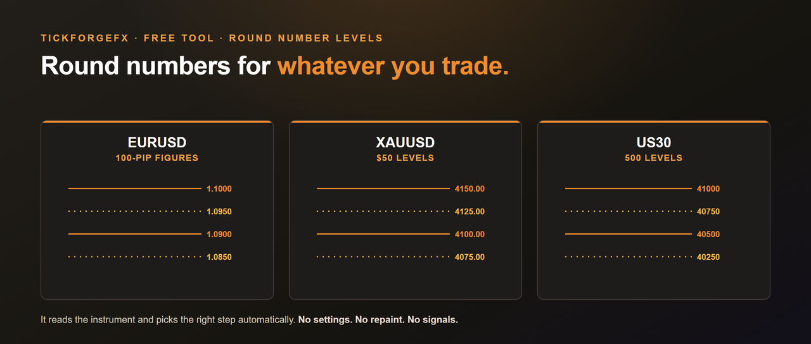

## Free tool: One Click Close and Breakeven Panel

A one-click exit cockpit for MetaTrader 5. When you need to act right now you can close everything,
take only your winners, cut only your losers, flatten one direction, move every open trade to
break-even, or clear your pending orders, each from a single button on a clean draggable panel. A
confirm step guards the destructive actions, and colour-coded feedback tells you exactly what each
click did. It works account-wide or on the current symbol only, on both netting and hedging
accounts. It opens no trades and fires no signals: it acts only on the positions you already hold,
and only when you click. Free on the MQL5 Market:
[One Click Close and Breakeven Panel](https://www.mql5.com/en/market/product/185051).

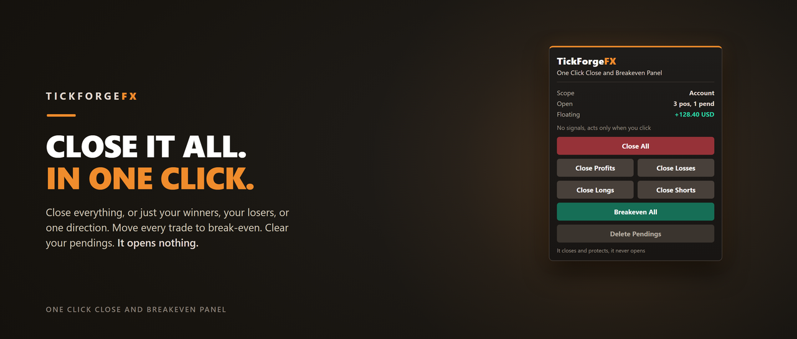

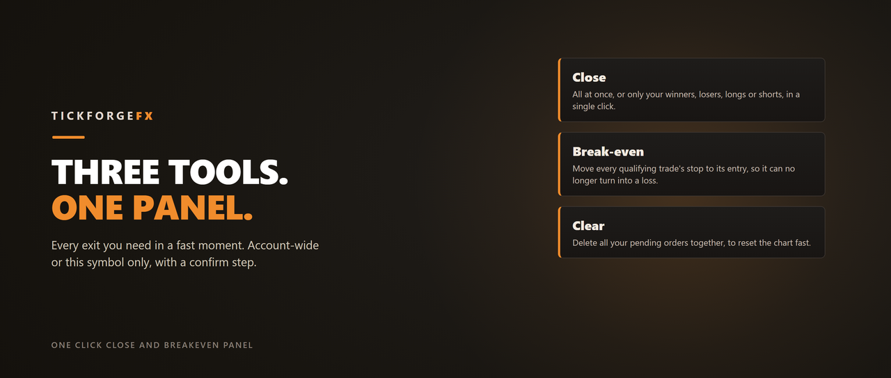

## Free tool: Basket Close Manager

A basket exit for MetaTrader 5. If you run a grid, a hedge, or several trades toward one idea, you
care about the whole basket, not each ticket. Attach it to a chart, set a total target, and it
closes every open trade at once the moment their combined result reaches your number. Target it in
account cash or a percent of balance or equity, add an optional loss limit as a basket stop, and
scope it by symbol, magic number, or direction. A warm-up guard means a startup glitch can never
trigger a close. It opens no trades and fires no signals: it only closes positions you already hold.
Free on the MQL5 Market:
[Basket Close Manager](https://www.mql5.com/en/market/product/185323).

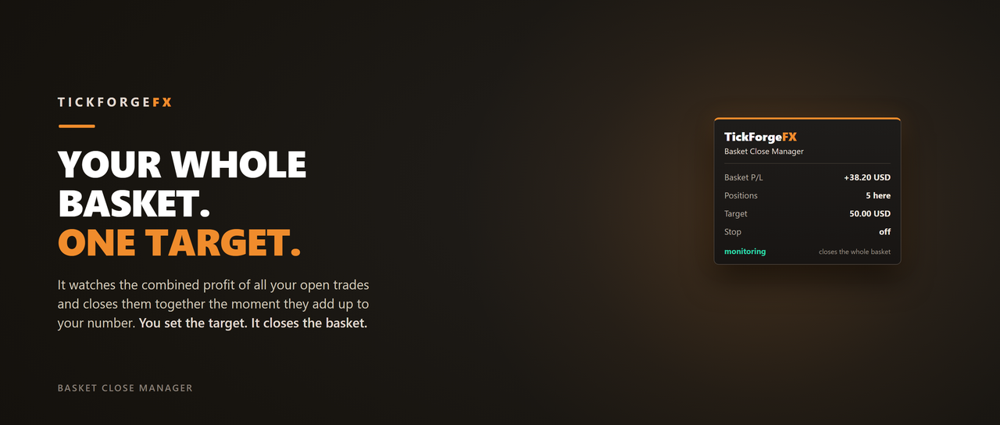

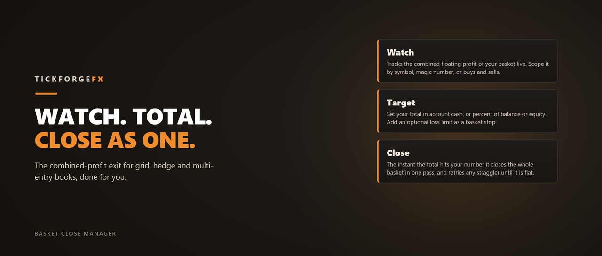

## Free tool: Auto Close by Time and Weekend

A free scheduled closer for MetaTrader 5. Attach it to a chart, set a time, and it flattens your
open trades for you: at a set time each day, before the weekend gap, or once a trade has been open
past a maximum holding time. Enable one, two, or all three. It runs on server time so the weekend
close still fires on a quiet Friday, it waits out a spread spike so it never flattens you into a
blowout, and it will not fire a stale close on a late startup or re-close your trades after a
restart. It opens nothing and fires no signal: it only closes trades you already have open, on the
schedule you set. Free on the MQL5 Market:
[Auto Close by Time and Weekend](https://www.mql5.com/en/market/product/185602).

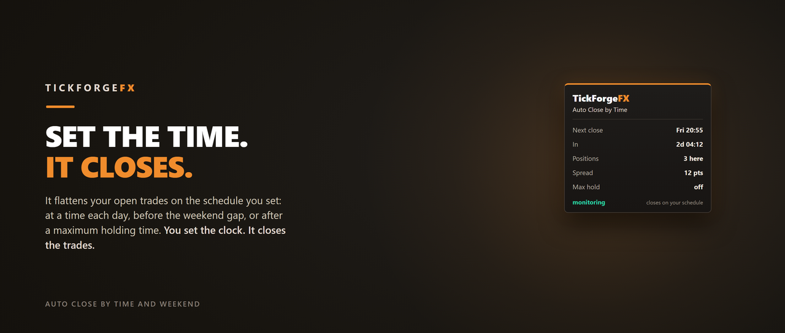

## Free tool: Pivot Points Classic Fibonacci Camarilla

A free pivot-points indicator for MetaTrader 5. It computes the support and resistance levels a
large part of the market watches each session, in three methods, Classic floor pivots, Fibonacci,
and Camarilla, from the previous closed daily, weekly, or monthly candle. Each level is a labelled
line, and a compact panel lists the central pivot, every resistance and support, and how far price
sits from each in pips. Levels that sit far from price pin to the chart edge with an arrow so you
always see the whole set, and because the source candle is closed they stay fixed for the session.
No signals, no repaint. Free on the MQL5 Market:
[Pivot Points Classic Fibonacci Camarilla](https://www.mql5.com/en/market/product/186251).

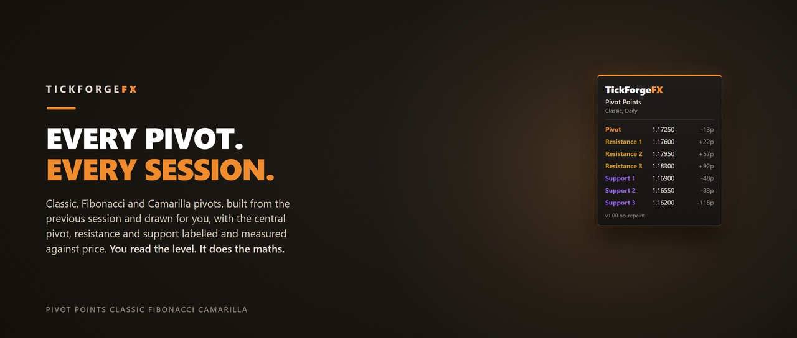

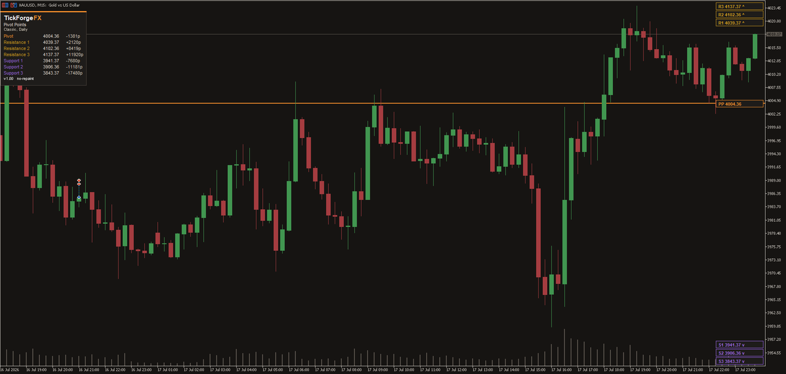

## Free tool: Prop Firm Challenge Objectives Tracker

A funded-account challenge is decided by three numbers and your terminal shows you none of
them. This panel tracks all three on your chart: how much of the profit target you have
made, how many trading days you have banked, and how much of your total profit came from
your single best day. That last one is the consistency rule, and it costs more traders
their payout than drawdown does. It reads your account and your own closed deal history,
it never places, modifies or closes an order, and it deliberately draws no loss or
drawdown rails at all, because staying inside the rules is a different question from being
on course to pass. The parts worth knowing are the ones that decide whether you can trust
a number: the account size is derived from your own deal history rather than assumed, and
a funding deal only starts a new cycle when it is large enough to actually be one, so a
small rebate cannot silently wipe out weeks of progress. Where the history genuinely
cannot answer, it says so instead of printing a confident figure. The consistency reading
stays undefined until enough days exist for the cap to be reachable at all, because with
two winning days the better of them is never under half. On the MQL5 Market:
[Prop Firm Challenge Objectives Tracker](https://www.mql5.com/en/market/product/189565).

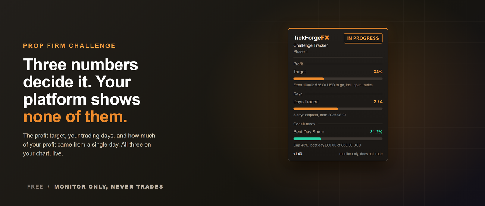

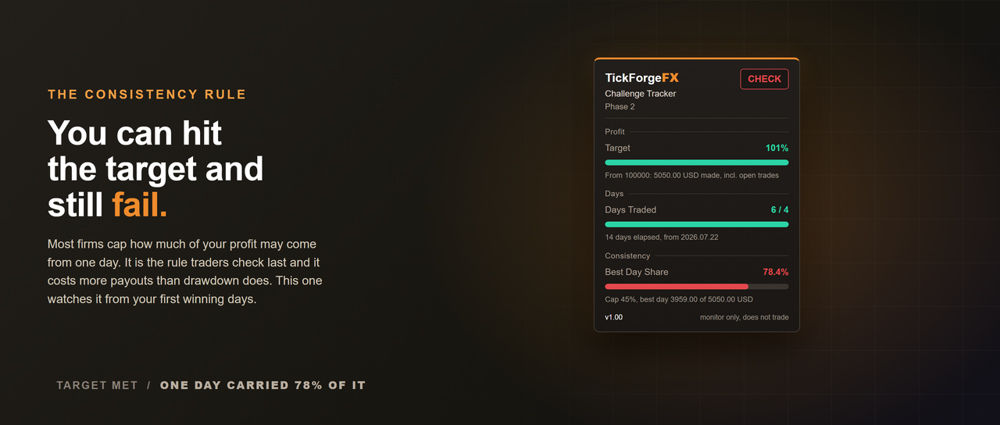

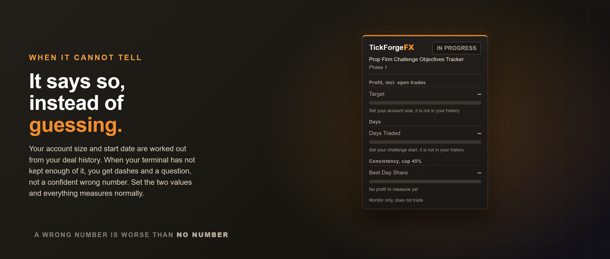

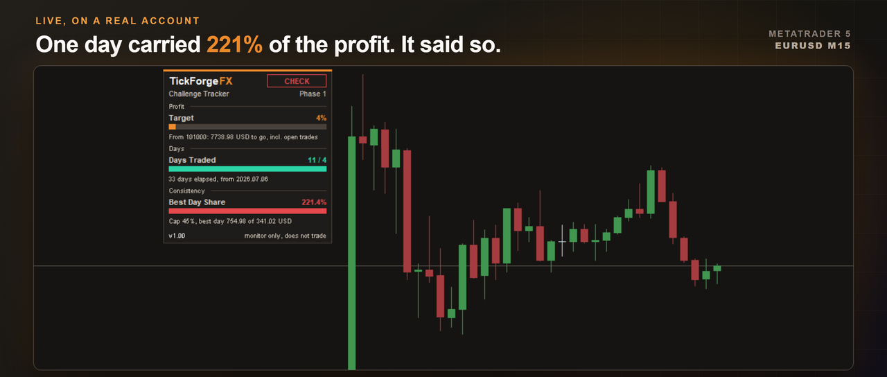

## Case study: Trend Breakout EA

A worked example of how I build and test a strategy, not a product. A trend-filtered
Donchian breakout coded exactly to spec, with real risk management and no grid or
martingale, then backtested honestly with conservative costs. Over two years on US30 H1
it returned a profit factor of 0.98, a marginal, slightly negative baseline, and the
case study reports that plainly. The value here is the transparent method and the clean,
extensible code, never a profit claim.

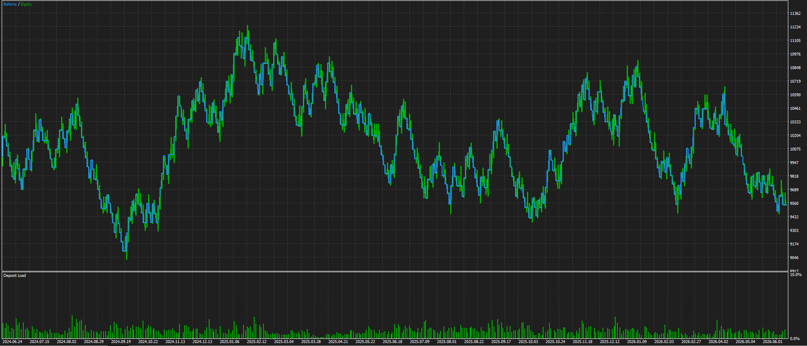

Full rules, setup, and numbers: [Trend Breakout EA case study](products/trend-breakout-ea/CASE_STUDY.md).

## Contact

- MQL5: https://www.mql5.com/en/users/tickforgefx
- Email: TickForgeFX@protonmail.com
