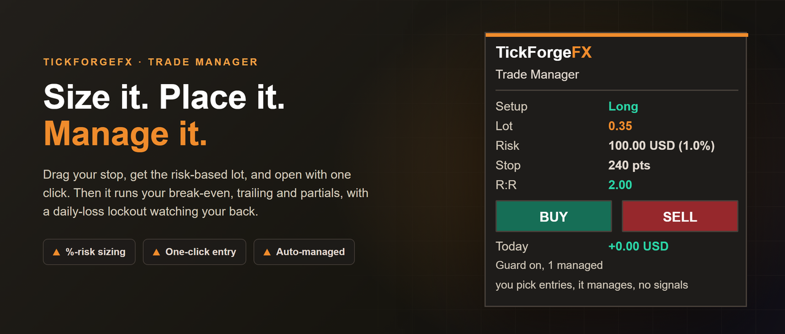
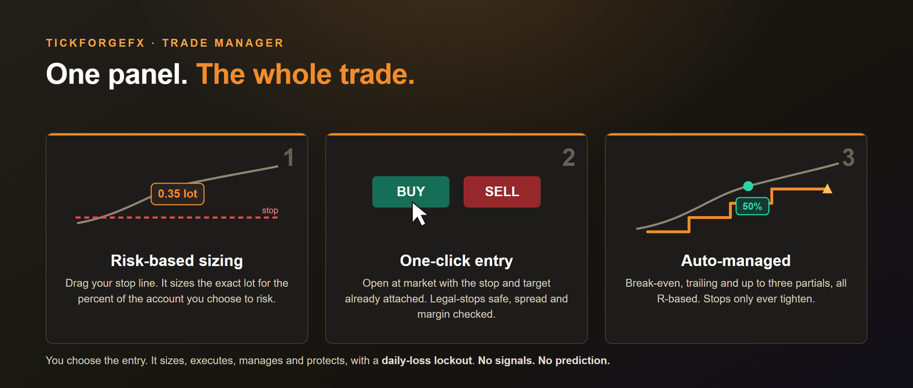

# TickForgeFX: Custom Trading Tools for MetaTrader 5

I build and backtest custom trading tools for traders, prop firms, and trading
communities. If you have a strategy, an indicator idea, or a tool you wish
existed, I build it, test it properly, and tell you honestly whether it holds up
before you risk a dollar.

## What I build

- **Expert Advisors (trading bots)** for MetaTrader 5, coded exactly from your
  strategy rules with proper risk management and tested honestly. You bring the
  strategy, I build it faithfully and tell you how it holds up before you risk a
  dollar. MetaTrader 4 (MQL4) builds on request.
- **Custom indicators** for MetaTrader 5: dashboards, alerts, liquidity tools,
  session markers, and more. TradingView (Pine Script) on request.
- **Strategy backtesting and validation.** I test your idea on years of real
  data with conservative, honest assumptions, so you know what is real before
  you trade it.
- **Trading tools and automation.** Risk and position-size calculators, trade
  journals, data scrapers, alert bots, prop-firm drawdown trackers.
- **Fixing and upgrading** existing bots and indicators.

## How I work

Six years in the markets means I speak your language and I understand what
actually matters: clean execution, real risk management, and honest testing. I
will not sell you a "guaranteed profitable bot," because nobody honest can. I
build your idea exactly to spec, test it rigorously, and give you the truth.

## Flagship: Smart Money Concepts by TickForgeFX

A clean, no-repaint Smart Money Concepts indicator for MetaTrader 5. Market
structure (BOS / CHoCH), order blocks, fair value gaps, liquidity (BSL / SSL,
equal highs and lows, previous day levels), premium and discount with an OTE
band, killzone sessions, and a multi-timeframe dashboard. The panel reads the
current bias, zone, session, nearest liquidity, and the named key price levels
at a glance. Detection runs on closed bars only and never repaints. Now live on
the MQL5 Market:
[SMC and ICT Structure Liquidity Dashboard](https://www.mql5.com/en/market/product/182687).

## Paid tool: Trade Manager One Click Risk and Partials

The honest trade cockpit for MetaTrader 5. You decide when to trade; it handles the risk
sizing, the one-click execution, the full management, and the daily protection. Drag a stop
line and read the exact lot size for the percent of your account you choose to risk, then open
with one click: the trade goes on with your stop and target attached. From there it runs auto
break-even, a trailing stop, and up to three partial take-profits, all set in R, and it locks
out new entries for the rest of the day when your daily loss limit is hit. Stops only ever move
to protect, never to loosen. It fires no signals and makes no predictions. On the MQL5 Market:
[Trade Manager One Click Risk and Partials](https://www.mql5.com/en/market/product/184764).

## Paid tool: Currency Strength Scanner Pro

A currency strength meter that does the next step for you. It ranks the 8 majors by their
strength, then turns that into a ranked table of the strongest-versus-weakest pairs to trade,
shows how many timeframes agree on each, and alerts you (popup, push, email, sound) when the
single best setup forms. Everything is closed-bar, so nothing repaints, and it alerts the one
best pair rather than a dozen correlated buzzes. Monitor-only: it ranks strength, it does not
trade or predict. On the MQL5 Market:
[Currency Strength Scanner Pro](https://www.mql5.com/en/market/product/184937).

## Free tool: Visual Risk and Position Size Calculator

A clean, free position-size calculator for MetaTrader 5. Drop it on any chart and
drag three lines, Entry, Stop, and Target, to your levels. The panel reads back the
exact lot size for the percent of your account you choose to risk, the money at risk
in your account currency, the stop distance, and the reward-to-risk with the potential
profit at your target. It respects your broker's minimum, maximum, and step, and it
flags when your account is too small for your chosen risk. No signals, no repaint, just
the number you need before you place the trade. Free on the MQL5 Market:
[Visual Risk and Position Size Calculator](https://www.mql5.com/en/market/product/183000).

## Free tool: ICT Killzone and Session Tracker

A clean, free session tool for MetaTrader 5. A live panel counts down the Sydney, Tokyo,
London, and New York sessions, which one is open, how long is left, and when the next one
opens, with each session's name colour-coded so the panel doubles as a legend. On the chart,
each session's high and low range is drawn as a clean box. Times run on GMT with automatic
daylight-saving adjustment, so the sessions stay correct through the year without manual
re-timing. No signals, no repaint. Free on the MQL5 Market:
[ICT Killzone and Session Tracker](https://www.mql5.com/en/market/product/183024).

## Free tool: Daily Weekly Monthly Key Levels

A clean, free reference-levels tool for MetaTrader 5. It draws the levels traders watch all
day, previous day high, low and close, previous week high and low, the daily and weekly opens,
and optional previous month high and low, read straight from the broker's own daily, weekly,
and monthly candles, so there is nothing to configure for your timezone. A compact panel lists
each level and how far it sits from price in pips. The labels adapt to the chart theme, light
on dark, dark on a white chart, so they stay readable everywhere. No signals, no repaint. Free
on the MQL5 Market:
[Daily Weekly Monthly Key Levels](https://www.mql5.com/en/market/product/183203).

## Free tool: ADR Average Daily Range Meter

A clean, free tool for MetaTrader 5 that shows how far this market usually moves in a day, how
much of that range price has already used, and where the day runs out of room. A live panel
reads the average daily range over the last N days, how much of it today has used in points and
percent, and the room left up and down. The projected ADR high and ADR low are drawn on the
chart, with tags that stay visible when you zoom in. When price has spent an average day's range
continuation gets less likely and reversals more common, so this keeps that context in front of
you before you chase a move. No signals, no repaint. Free on the MQL5 Market:
[ADR Average Daily Range Meter](https://www.mql5.com/en/market/product/183839).

## Free tool: Auto Breakeven Trailing Stop and Partial Close

A clean, free position manager for MetaTrader 5. Attach it to a chart and it looks after the
trades you already have open: it moves them to break-even once they are in profit, trails the stop
as they run, and takes a partial off at your target. Every rule is independent and set in points,
so it works on any symbol the moment you attach it. It manages by symbol and by magic number, or
everything on the account including trades you placed by hand, and a stop only ever moves to
protect, never to loosen. The partial is taken once per position and remembered durably, so a
reload, a recompile, or a terminal restart can never take a second partial off the same trade. It
never opens a trade and fires no signal. It only manages what is already there. Free on the MQL5
Market:
[Auto Breakeven Trailing Stop and Partial Close](https://www.mql5.com/en/market/product/184556).

## Free tool: Prop Firm Drawdown and Daily Loss Guard

A clean, free risk panel for MetaTrader 5. It watches the two rails that end most prop-firm
accounts, the daily loss limit and the overall (max) loss limit, and shows you exactly how close
you are, live, with a progress bar for each and the cash room left before you breach. The daily
limit is measured on current equity from your start-of-day balance, so open floating losses count
the way most firms actually breach, and the overall limit can be static (a fixed floor, the FTMO
style) or trailing from your peak. It carries a SAFE, CAUTION, or DANGER status and alerts you at a
warning level and again on a breach. The day's baseline and your peak are stored durably, so a
restart never resets your day or hides a real drawdown. It never trades and fires no signals. Free
on the MQL5 Market:
[Prop Firm Drawdown and Daily Loss Guard](https://www.mql5.com/en/market/product/184431).

## Free tool: Trading Performance Statistics

A clean, free performance panel for MetaTrader 5. It reads your closed trade history and totals the
numbers most traders never sit down and calculate: net P/L, win rate, profit factor, average win
versus loss, payoff, expectancy, and your best and worst trade. A trade you closed in parts counts
as one position, not several, so the numbers match how you actually traded. Filter by period
(today, this week, this month, the last 7 or 30 days, or all time), by this chart's symbol, or by
magic number to isolate one strategy. It shows the truth, good or bad, updated as you trade, so a
vague feeling about your edge becomes a number you can act on. It reads history only and can never
place or close a trade. Free on the MQL5 Market:
[Trading Performance Statistics](https://www.mql5.com/en/market/product/184488).

## Free tool: Currency Strength Meter Multi Timeframe

A clean, free currency strength meter for MetaTrader 5. It ranks the eight major currencies (EUR,
GBP, AUD, NZD, USD, CAD, CHF, JPY) by how they are actually moving across the 28 major pairs, and
shows which are strong, which are weak, and which way each one is turning. It computes on closed bars
only, so it does not twitch on every tick the way most free meters do. Each currency carries a
multi-timeframe alignment strip (four timeframes at a glance) and a momentum arrow, and the panel
names the cleanest strong-versus-weak pair to watch. It auto-detects your broker's symbol naming, so
it just works. No signals, no repaint. Free on the MQL5 Market:
[Currency Strength Meter Multi Timeframe](https://www.mql5.com/en/market/product/184632).

## Free tool: Candle Close Countdown Timer

A clean, free countdown for MetaTrader 5. Attach it to any chart and it shows the exact time
left on the current candle, a progress bar as the candle forms, and a live countdown for a whole
set of higher timeframes at the same time. Time your entries and exits to the close instead of
guessing, and know when a higher-timeframe candle is about to print while you work on a lower
one. Server-time accurate, no signals, no repaint. Free on the MQL5 Market:
[Candle Close Countdown Timer](https://www.mql5.com/en/market/product/184780).

## Free tool: Round Number Levels

A clean, free round-number indicator for MetaTrader 5. Attach it to any chart and it draws the
psychological round-number price levels traders watch, the major "00" figures as solid lines and
the "50" half levels as dotted lines, each labelled with its price. It auto-scales to whatever
you trade (the 100-pip figures on FX, roughly fifty dollars on gold, five hundred on an index)
and re-centres as price moves. Distinct from the Daily Weekly Monthly Key Levels tool: those are
session highs and lows, these are round-number magnets. No signals, no repaint. Free on the MQL5
Market:
[Round Number Levels](https://www.mql5.com/en/market/product/184779).

## Case study: Trend Breakout EA

A worked example of how I build and test a strategy, not a product. A trend-filtered
Donchian breakout coded exactly to spec, with real risk management and no grid or
martingale, then backtested honestly with conservative costs. Over two years on US30 H1
it returned a profit factor of 0.98, a marginal, slightly negative baseline, and the
case study reports that plainly. The value here is the transparent method and the clean,
extensible code, never a profit claim.

Full rules, setup, and numbers: [Trend Breakout EA case study](products/trend-breakout-ea/CASE_STUDY.md).

## Contact

- MQL5: https://www.mql5.com/en/users/tickforgefx
- Email: TickForgeFX@protonmail.com
