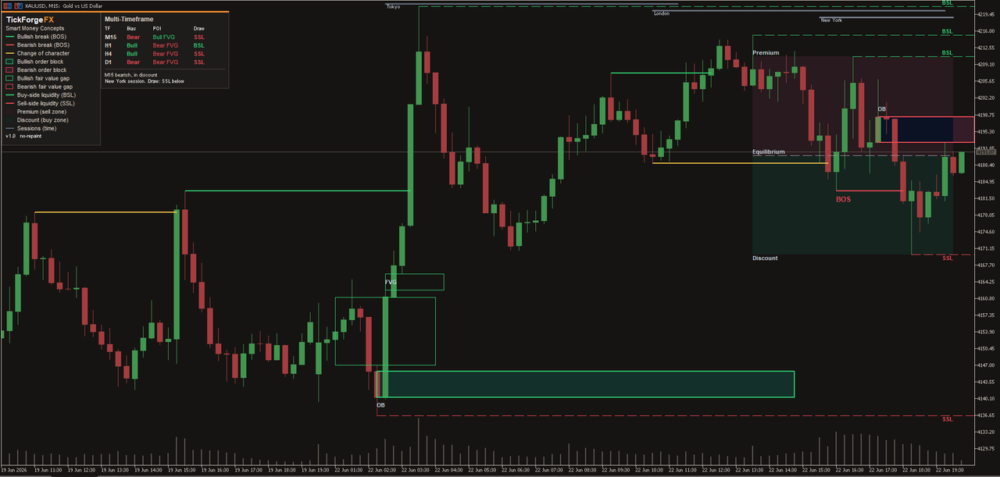
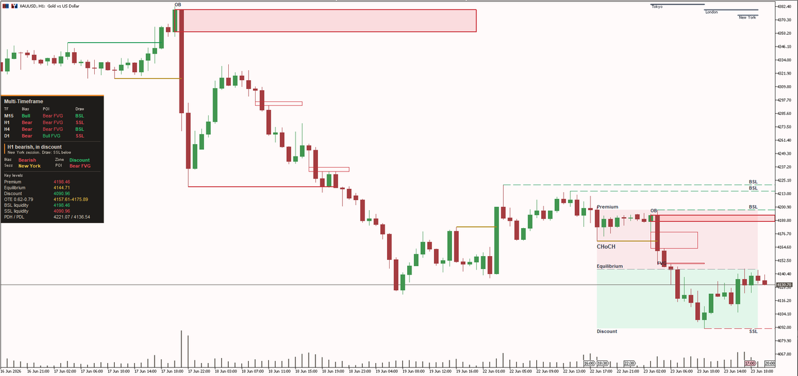

# TickForgeFX: Custom Trading Tools for MetaTrader 5

I build and backtest custom trading tools for traders, prop firms, and trading
communities. If you have a strategy, an indicator idea, or a tool you wish
existed, I build it, test it properly, and tell you honestly whether it holds up
before you risk a dollar.

## What I build

- **Expert Advisors (trading bots)** for MetaTrader 5, coded exactly from your
  strategy rules with proper risk management and tested honestly. You bring the
  strategy, I build it faithfully and tell you how it holds up before you risk a
  dollar. MetaTrader 4 (MQL4) builds on request.
- **Custom indicators** for MetaTrader 5: dashboards, alerts, liquidity tools,
  session markers, and more. TradingView (Pine Script) on request.
- **Strategy backtesting and validation.** I test your idea on years of real
  data with conservative, honest assumptions, so you know what is real before
  you trade it.
- **Trading tools and automation.** Risk and position-size calculators, trade
  journals, data scrapers, alert bots, prop-firm drawdown trackers.
- **Fixing and upgrading** existing bots and indicators.

## How I work

Six years in the markets means I speak your language and I understand what
actually matters: clean execution, real risk management, and honest testing. I
will not sell you a "guaranteed profitable bot," because nobody honest can. I
build your idea exactly to spec, test it rigorously, and give you the truth.

## Flagship: Smart Money Concepts by TickForgeFX

A clean, no-repaint Smart Money Concepts indicator for MetaTrader 5. Market
structure (BOS / CHoCH), order blocks, fair value gaps, liquidity (BSL / SSL,
equal highs and lows, previous day levels), premium and discount with an OTE
band, killzone sessions, and a multi-timeframe dashboard. The panel reads the
current bias, zone, session, nearest liquidity, and the named key price levels
at a glance. Detection runs on closed bars only and never repaints. Now live on
the MQL5 Market:
[SMC and ICT Structure Liquidity Dashboard](https://www.mql5.com/en/market/product/182687).

## Free tool: Visual Risk and Position Size Calculator

A clean, free position-size calculator for MetaTrader 5. Drop it on any chart and
drag three lines, Entry, Stop, and Target, to your levels. The panel reads back the
exact lot size for the percent of your account you choose to risk, the money at risk
in your account currency, the stop distance, and the reward-to-risk with the potential
profit at your target. It respects your broker's minimum, maximum, and step, and it
flags when your account is too small for your chosen risk. No signals, no repaint, just
the number you need before you place the trade. Free on the MQL5 Market:
[Visual Risk and Position Size Calculator](https://www.mql5.com/en/market/product/183000).

## Case study: Trend Breakout EA

A worked example of how I build and test a strategy, not a product. A trend-filtered
Donchian breakout coded exactly to spec, with real risk management and no grid or
martingale, then backtested honestly with conservative costs. Over two years on US30 H1
it returned a profit factor of 0.98, a marginal, slightly negative baseline, and the
case study reports that plainly. The value here is the transparent method and the clean,
extensible code, never a profit claim.

Full rules, setup, and numbers: [Trend Breakout EA case study](products/trend-breakout-ea/CASE_STUDY.md).

## Contact

- MQL5: https://www.mql5.com/en/users/tickforgefx
- Email: TickForgeFX@protonmail.com
