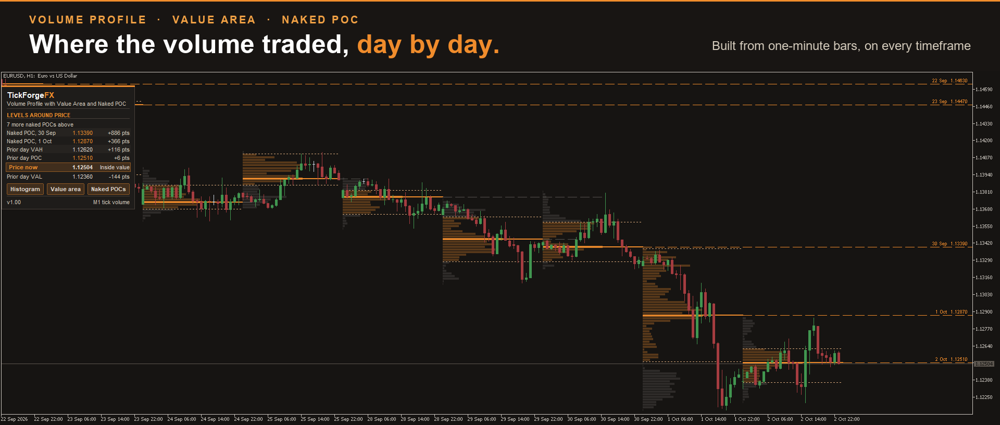
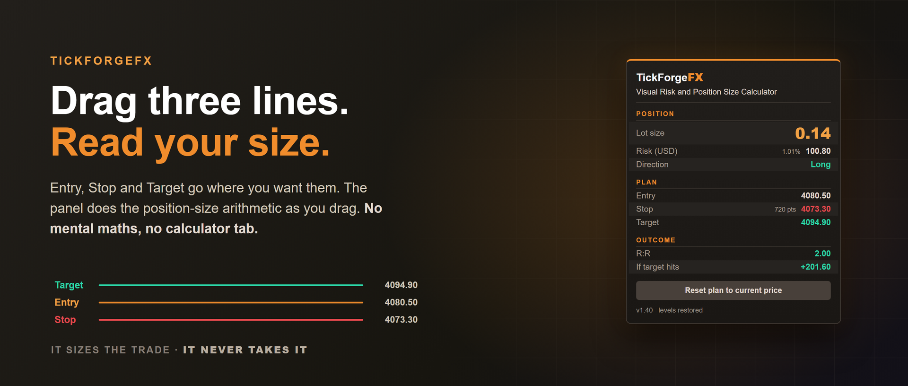
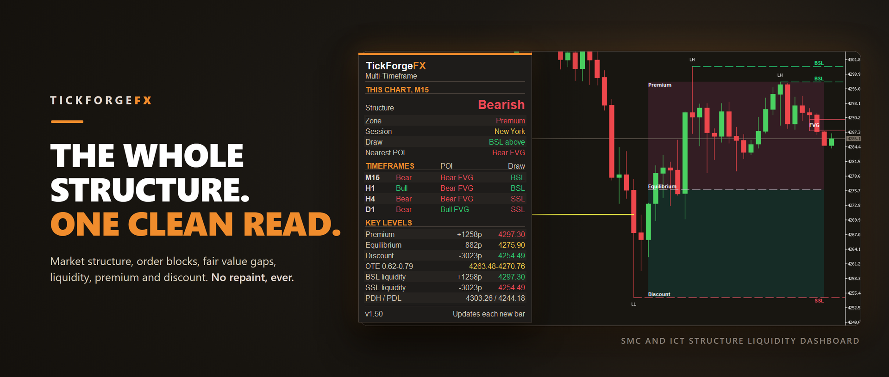
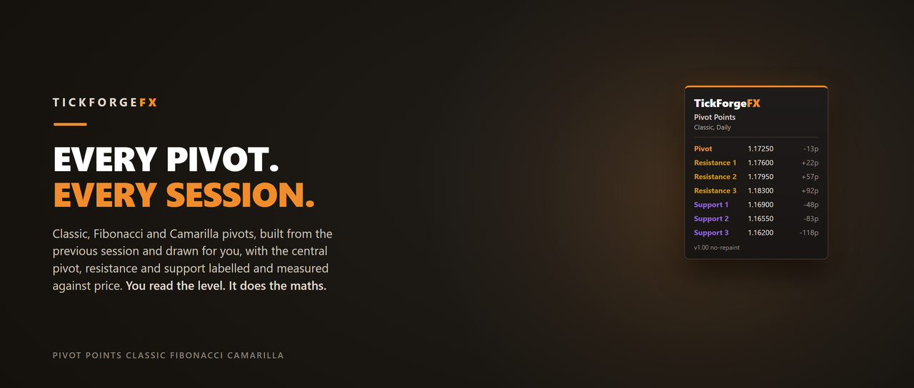
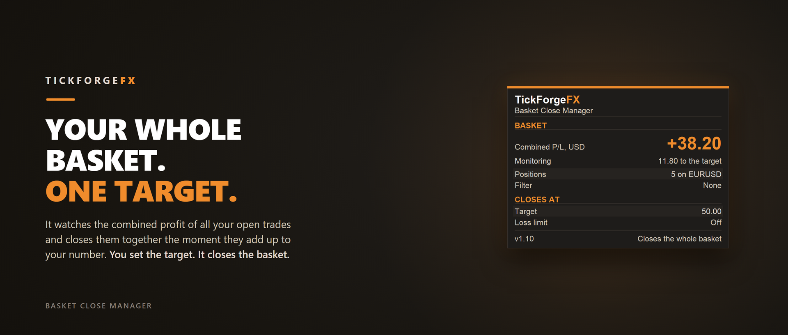
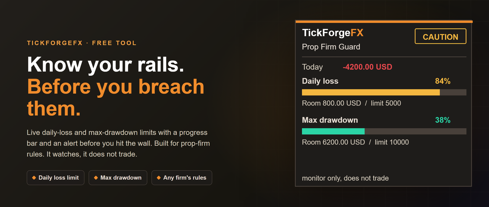

# TickForgeFX: Trading Tools for MetaTrader 5 and MetaTrader 4

TickForgeFX makes tools for MetaTrader 5, several with a MetaTrader 4 twin: indicators that read the chart, panels that read the account, and managers that size, protect and close trades. They are published on the MQL5 Market, a few paid and most free, and every free tool is a complete tool, not a demo of a paid one. There are no entry arrows, no strategies and no profit claims here: each tool measures, sizes, manages or closes on the rules you set, and the decisions stay yours.

## Paid tools

### Trade Manager with Risk Sizing and Trailing Stops

It manages the trade you opened by hand. Break-even, up to three partial closes, a trailing stop and a loss limit that acts, on every tick, whether or not you are watching.

On the MQL5 Market for [MetaTrader 5](https://www.mql5.com/en/market/product/189281). [Full description](products/trade-manager-risk-sizing/PRODUCT_PAGE.md).

### Daily Loss and Drawdown Risk Manager

Put it on one chart and it enforces your daily loss limit and max drawdown across the whole account, whoever opened the trade: you by hand, the phone app, another EA or a copied signal. At the limit it closes every position, deletes every pending order and keeps closing anything opened until the lock ends.

On the MQL5 Market for [MetaTrader 5](https://www.mql5.com/en/market/product/197828) and [MetaTrader 4](https://www.mql5.com/en/market/product/197830). [Full description](products/daily-loss-drawdown-risk-manager/PRODUCT_PAGE.md).

### Spread Swap and Broker Conditions Panel

Before you place a trade, this tells you what it will actually cost you: the spread and your commission converted into your account currency, at the lot size you are about to trade, on this broker and this symbol.

On the MQL5 Market for [MetaTrader 5](https://www.mql5.com/en/market/product/194871) and [MetaTrader 4](https://www.mql5.com/en/market/product/195090). [Full description](products/broker-conditions-panel/PRODUCT_PAGE.md).

### Volume Profile with Value Area and Naked POC

Where the volume traded, day by day: a volume profile for each day or session with its POC, value area high and value area low, and the naked POCs the market has not been back to, drawn to the right edge with their dates and prices. Built from one-minute bars on every timeframe, so the levels are the same on M5 and on H4, and a finished day's levels do not move.

On the MQL5 Market for [MetaTrader 5](https://www.mql5.com/en/market/product/199693) and [MetaTrader 4](https://www.mql5.com/en/market/product/199703). [Full description](products/volume-profile/PRODUCT_PAGE.md).

## Free tools

### Visual Risk and Position Size Calculator

Drag three lines onto your chart, your entry, your stop loss and your target, and read the exact lot size for the risk you choose. It is a visual position size and risk calculator: the panel shows the money at risk in your account currency, the stop distance in points, and the reward-to-risk, all updating as you drag.

On the MQL5 Market for [MetaTrader 5](https://www.mql5.com/en/market/product/183000) and [MetaTrader 4](https://www.mql5.com/en/market/product/189789). [Full description](products/risk-calculator/PRODUCT_PAGE.md).

### Auto Breakeven Trailing Stop and Partial Close

A free position manager for MetaTrader 5. Attach it to a chart and it looks after the trades you already have open: it moves them to break-even, trails the stop as they run, and takes a partial close at your target.

On the MQL5 Market for [MetaTrader 5](https://www.mql5.com/en/market/product/184556). [Full description](products/auto-trade-manager/PRODUCT_PAGE.md).

### SMC and ICT Structure Liquidity Dashboard

This Smart Money Concepts (SMC) and ICT indicator marks market structure with BOS and CHoCH, order blocks, fair value gaps, liquidity, premium and discount, and the trading sessions on your chart, then sums up the picture in one dashboard: your chart's own structure first, then M15, H1, H4 and D1. Detection runs on closed bars, so nothing repaints.

On the MQL5 Market for [MetaTrader 5](https://www.mql5.com/en/market/product/182687). [Full description](products/smart-money-concepts/PRODUCT_PAGE.md).

### Candle Close Countdown Timer

A free countdown for MetaTrader 5. Attach it to any chart and it shows the exact time left on the current candle, a progress bar as the candle forms, and a live countdown for a whole set of higher timeframes at the same time.

On the MQL5 Market for [MetaTrader 5](https://www.mql5.com/en/market/product/184779). [Full description](products/candle-close-countdown/PRODUCT_PAGE.md).

### Round Number Levels

A free round-number indicator for MetaTrader 5. Attach it to any chart and it draws the psychological round-number price levels that traders watch, the major "00" figures as solid lines and the "50" half levels as dotted lines, each labelled with its price.

On the MQL5 Market for [MetaTrader 5](https://www.mql5.com/en/market/product/184780). [Full description](products/round-number-levels/PRODUCT_PAGE.md).

### ICT Killzone and Session Tracker

Know which trading session is live, how long is left, and when the next one opens, with every session's high and low drawn on the chart. ICT Killzone and Session Tracker puts the trading day on your chart in GMT, so it reads the same on any broker, and it can alert you the moment a session or killzone opens or closes.

On the MQL5 Market for [MetaTrader 5](https://www.mql5.com/en/market/product/183024). [Full description](products/session-killzone-tracker/PRODUCT_PAGE.md).

### ADR Average Daily Range Meter

See how far this market usually moves in a day, how much of that range it has already used, and where the day runs out of room. The Average Daily Range (ADR) Meter draws the projected day high and low on your chart and can alert you when price reaches one, or when the day has spent a share of its average range that you choose.

On the MQL5 Market for [MetaTrader 5](https://www.mql5.com/en/market/product/183839). [Full description](products/adr-range-meter/PRODUCT_PAGE.md).

### Currency Strength Meter Multi Timeframe

A free currency strength meter for MetaTrader 5. It ranks the eight major currencies (EUR, GBP, AUD, NZD, USD, CAD, CHF, JPY) by how they are actually moving across the 28 major pairs, and shows which are strong, which are weak, and which way each one is turning.

On the MQL5 Market for [MetaTrader 5](https://www.mql5.com/en/market/product/184632). [Full description](products/currency-strength-meter/PRODUCT_PAGE.md).

### Daily Weekly Monthly Key Levels

The previous day's high and low, the weekly open, last week's range: the lines most traders redraw by hand every morning. Daily Weekly Monthly Key Levels draws them automatically from your broker's own candles and tells you how far price sits from each.

On the MQL5 Market for [MetaTrader 5](https://www.mql5.com/en/market/product/183203). [Full description](products/key-levels/PRODUCT_PAGE.md).

### Pivot Points Classic Fibonacci Camarilla

Pivot points are support and resistance levels a large part of the market watches every session, and they are the same calculation on every chart. This Pivot Points tool builds them for you from the previous closed candle and draws them for you, with the central pivot, resistance and support each labelled and measured against current price.

On the MQL5 Market for [MetaTrader 5](https://www.mql5.com/en/market/product/186251). [Full description](products/pivot-points/PRODUCT_PAGE.md).

### Basket Close Manager

If you run a grid, a hedge, or several trades toward one idea, you care about the whole basket, not each ticket. Attach this to a chart, set a total profit target, and it closes all your open trades at once the moment they add up to it.

On the MQL5 Market for [MetaTrader 5](https://www.mql5.com/en/market/product/185323). [Full description](products/basket-close-manager/PRODUCT_PAGE.md).

### Trading Performance Statistics

A free performance panel for MetaTrader 5. It reads your closed trade history and totals up the numbers most traders never actually calculate: net P/L, win rate, profit factor, average win vs loss, payoff, expectancy, best and worst.

On the MQL5 Market for [MetaTrader 5](https://www.mql5.com/en/market/product/184488). [Full description](products/performance-stats/PRODUCT_PAGE.md).

### Prop Firm Drawdown and Daily Loss Guard

A free risk panel for MetaTrader 5. It watches the two rails that end most prop-firm accounts, the daily loss limit and the overall (max) loss limit, and shows you exactly how close you are, live, with progress bars and an alert before you breach.

On the MQL5 Market for [MetaTrader 5](https://www.mql5.com/en/market/product/184431). [Full description](products/prop-firm-guard/PRODUCT_PAGE.md).

### Prop Firm Challenge Objectives Tracker

A funded-account challenge is decided by three numbers, and your terminal shows you none of them. This panel tracks all three on your chart: how much of the profit target you have made, how many trading days you have banked, and how much of your total profit came from your single best day.

On the MQL5 Market for [MetaTrader 5](https://www.mql5.com/en/market/product/189565). [Full description](products/prop-firm-challenge-tracker/PRODUCT_PAGE.md).

## Custom work

Custom work is taken through [MQL5 Freelance](https://www.mql5.com/en/job).

## Contact

- MQL5: https://www.mql5.com/en/users/tickforgefx
- Email: TickForgeFX@protonmail.com
