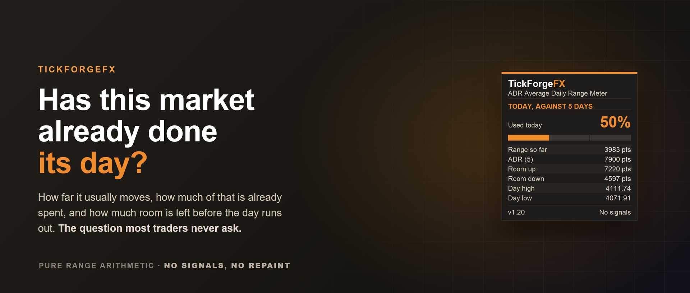

# ADR Average Daily Range Meter

See how far this market usually moves in a day, how much of that range it has already used, and where the day runs out of room. The **Average Daily Range (ADR) Meter** draws the projected day high and low on your chart and can **alert you when price reaches one**, or when the day has spent a share of its average range that you choose. No signals, no repaint, just the context that tells you whether there is still room to run.

## What it shows

- **Average Daily Range** over the last N days, the market's typical daily move.
- **Used today**, how much of that range price has already covered, in points and percent.
- **Room left** up and down before the day reaches an average-sized range.
- **ADR High and ADR Low**, the projected day ceiling and floor drawn on the chart, each with a price chip that stays visible even when the level is off-screen.

## Why it helps

Most traders never ask the simplest question: has this market already done its usual day, or is there still room? If a pair averages 60 pips and has moved 55, chasing a fresh breakout is a bad bet. If it has moved 15, there is room to run. And when price reaches a projection it has spent an average range, where continuation gets less likely and reversals more common. This keeps that context in front of you, so you size targets and time entries around what the day can realistically still do.

## Optional alerts on the two moments that matter

Get a popup, a sound, a push notification to the MetaTrader mobile app, or an email when price reaches a projection, or when the day has used a share of its average range that you set (80 percent by default). Off by default, once per event per day. Anything already true when you attach the tool is claimed silently, so you are never told about a move that happened before you were watching.

## Readable at any zoom

Zoom in tight and both projections can sit outside the visible price range. Each one pins to the chart edge as a price chip with an arrow showing which way its level lies, and when both are off-screen they stack in a readable column in price order instead of covering each other.

## What it does not do

It does not place trades, fire buy or sell signals, or predict direction. It measures the range and shows you the context. The decisions stay yours.

Free. Works on any symbol and any timeframe, and updates the moment you attach it.

---

Current version: **1.20**

On the MQL5 Market: [ADR Average Daily Range Meter](https://www.mql5.com/en/market/product/183839)
