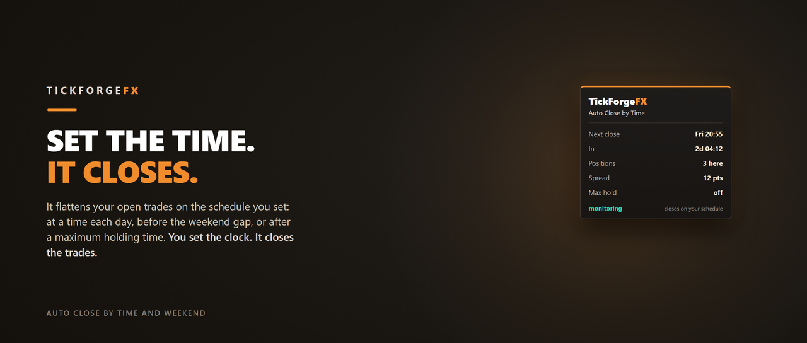

# Auto Close by Time and Weekend

A free scheduled closer for MetaTrader 5. Attach it to a chart, set a time, and it flattens your open trades for you: at a set time each day, before the weekend gap, or once a trade has been open too long. It opens nothing and fires no signal. It just gets you flat on the schedule you decide.

## Three ways to be flat

- **Daily time close.** Close every day at a time you set (server time), your session end, before rollover, whenever you want to be out.
- **Weekend close.** Be flat before the weekend gap. Pick the day and time (Friday 20:55 server by default), so you are not holding through the Monday open.
- **Max holding time.** Close any trade older than a limit you set, so a short-term position never quietly becomes an overnight or all-week bag.

Enable one, two, or all three. Each works on its own.

## Which trades it closes

- **This chart's symbol, or every symbol.** One toggle.
- **By magic number, or everything.** Watch one EA's trades, or leave it at 0 to include every position on the account, including trades you placed by hand.
- **Buys, sells, or both.** It can also delete your pending orders on a scheduled close.

## Built to be safe

- **It runs on server time** and keeps its own clock, so the weekend close still fires on a quiet Friday evening when ticks go sparse.
- **It waits out a spread spike.** If a scheduled close comes due while the spread is blown out, it holds briefly for the spread to settle before flattening, so it never dumps you into a spike. Spread never triggers a close, it only makes a scheduled one safer.
- **It will not fire a stale close.** If the terminal starts up well after a scheduled time, that one is skipped rather than closing you out at the wrong moment, and it tells you a close was missed.
- **A restart is safe.** A completed close is remembered, so restarting your terminal will not re-close trades you have re-opened.
- **No signals, no entries.** It only closes trades you already have open. It cannot open a position.
- **A clear panel** shows the next close and a live countdown, how many trades are in scope, the current spread, and your max-hold setting, and it drags anywhere on the chart.

## What it does not do

It does not open trades, predict direction, or fire buy and sell signals. You place the trades, this closes them on your schedule. It needs Algo Trading enabled to act.

**In the Strategy Tester** it opens small sample trades so it has activity to show (a tool that only watches and closes would otherwise do nothing in a backtest). On a live or demo account it never opens a trade.

Free. Works on any symbol and any timeframe. If you have ever forgotten to close before the weekend, this is the reminder that acts for you.

---

Current version: **1.0**

On the MQL5 Market: [Auto Close by Time and Weekend](https://www.mql5.com/en/market/product/185602)
