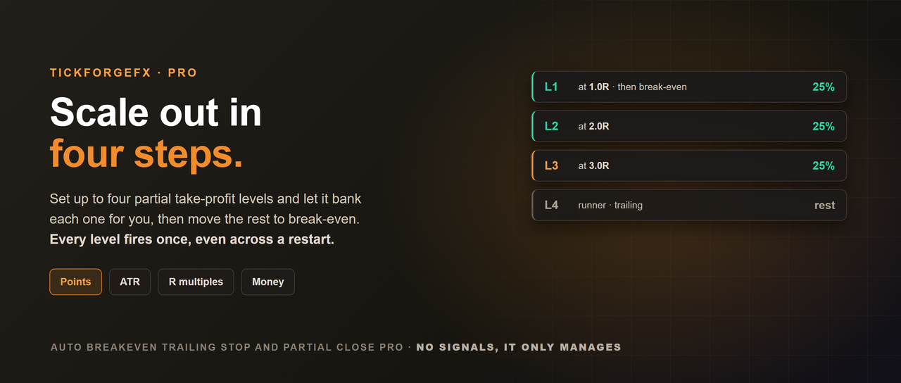
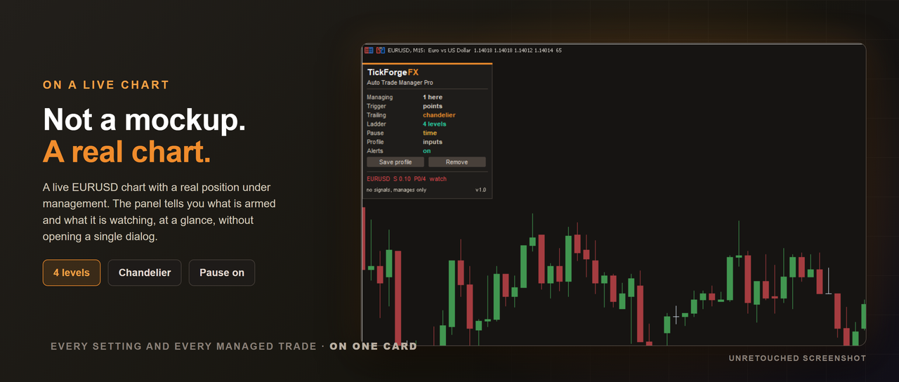
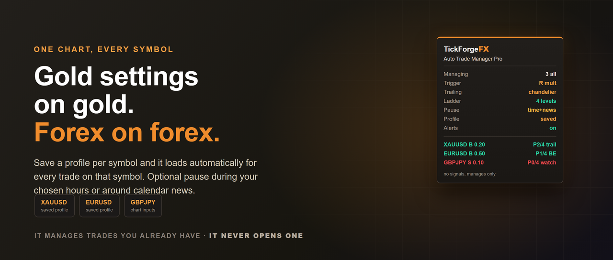
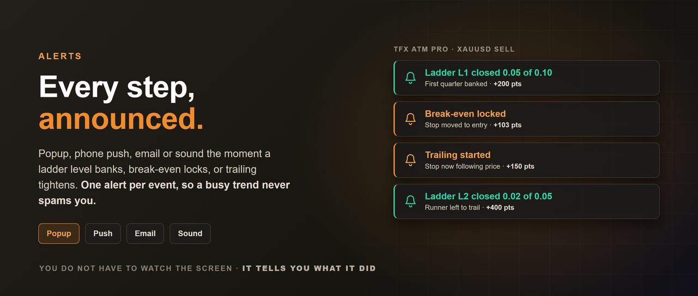

# Auto Breakeven Trailing Stop and Partial Close Pro

**MetaTrader 5 Expert Advisor / Experts / paid**

You planned the trade. Then the screen took over: you moved the stop too early, held the
runner too long, or forgot the second partial entirely. This EA executes the plan you
already made, on every trade you already have open.

It is the Pro edition of the free [Auto Breakeven Trailing Stop and Partial
Close](https://www.mql5.com/en/market/product/184556). Same attach-and-go idea, far more
depth: a four level partial ladder, four trailing engines, per symbol profiles, and an
optional pause for quiet hours or calendar news.

**It opens nothing and predicts nothing.** No signals, no entries, no strategy. It manages
positions you or your own EA already have.

On the MQL5 Market:
[Auto Breakeven Trailing Stop and Partial Close Pro](https://www.mql5.com/en/market/product/186844).

On a live chart, managing a real position. Nothing here is mocked up:

## A four level partial ladder

- Up to four take-profit levels, each with its own trigger and its own percent of what remains.
- Pick which level moves the rest to break-even.
- The last level can close the trade outright, or leave a runner for the trailing stop.
- Every level fires at most once per position, and that memory survives a reload, a
  recompile or a full terminal restart.

## Four trailing engines

| Engine | What it does |
| --- | --- |
| Classic | A fixed distance behind price |
| ATR | The distance adapts to volatility, wider when the market is fast |
| Chandelier | Hangs an ATR multiple below the highest high since entry, mirrored for sells |
| Candle | Sits behind the last N closed candles |

All four read closed bars only, so nothing repaints, and the stop only ever moves toward
profit. It is never loosened in any mode.

## Trigger units

Read every threshold in **points**, **ATR multiples** (one setting works on gold and on
EURUSD), **R multiples** (1R = the position's initial stop distance; attach at trade open
for the truest R), or **account currency**.

## Per symbol profiles

Save your management settings for a symbol and they load automatically for every trade on
that symbol, even when one chart manages the whole account. Gold keeps its wide ATR trail
while EURUSD keeps its tight one. Save and remove from the panel, no files to edit.

## Pause when you want it quiet

Optionally stand down inside a daily time window, or from a set number of minutes before a
high or medium impact calendar event until a set number after. Broker side stops stay
exactly where they are while paused; it simply stops adjusting them.

## Alerts

Popup, mobile push, email or sound when a level closes, when break-even locks, or when
trailing first tightens. One alert per event per position, so a busy trend never spams you.

## The panel

A draggable cockpit showing what is armed and then every managed position: symbol,
direction, volume, ladder progress such as P2 of 4, and whether that trade is still being
watched, protected at break-even, or trailing.

## Good to know

- Any account type, netting or hedging, any symbol your broker offers.
- Manages this chart's symbol or every symbol, with an optional magic number filter, so it
  covers manual trades and another EA's trades alike.
- If a position is too small to split, the level closes it rather than doing nothing silently.
- The Strategy Tester runs sample trades so you can see it work; live management is the real job.

---

Built by [TickForgeFX](https://www.mql5.com/en/users/tickforgefx). No signals, no profit
claims, no repaint.
