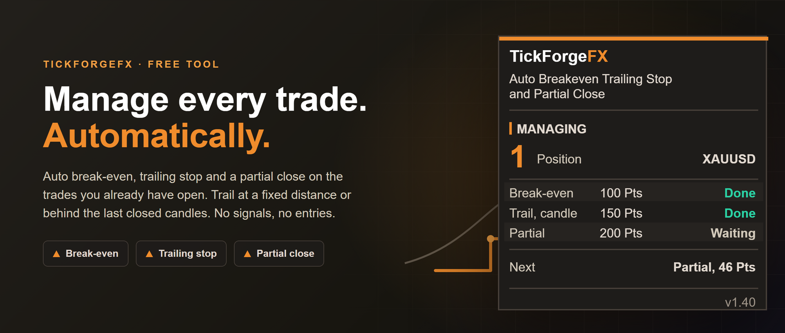
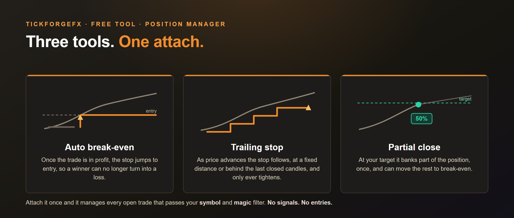

# Auto Breakeven Trailing Stop and Partial Close

A free position manager for MetaTrader 5. Attach it to a chart and it looks after the trades you already have open: it moves them to **break-even**, **trails the stop** as they run, and takes a **partial close** at your target. It never opens trades and never fires a signal. It only manages what is already there.

## What it does

- **Auto break-even.** Once a trade is a set number of points in profit, the stop jumps to entry, with an optional buffer so it locks a few points rather than exactly flat.
- **Trailing stop, two ways.** After a further threshold the stop starts to follow price. Keep it a **fixed distance** behind, or place it just beyond the **extreme of the last few closed candles** so it tracks structure instead of a set gap. Either way it tightens only when it improves by at least your step, so it never spams tiny changes.
- **Partial take-profit.** At your target it closes part of the position, any percent you set, once per position, and can move the rest to break-even straight after.

Each rule is toggled on or off independently. Run just one, or all three together.

This one manages a trade you already opened. If you also want it planned and sized before it opens, from a stop you drag on the chart, and three partial rungs instead of one, that is [Trade Manager with Risk Sizing and Trailing Stops](https://www.mql5.com/en/market/product/189281).

## Trailing behind structure

Traders who trail by hand rarely use a fixed gap. They move the stop under the last swing. This does the same thing automatically:

- **Behind the last closed candles.** Pick how many candles to look back, and the stop sits just beyond the lowest low of that window on a buy, or the highest high on a sell.
- **Closed candles only.** The level comes from finished bars, never the one still forming, so it cannot shift under you mid-bar.
- **Its own timeframe.** Trail off H1 structure while you watch an M5 chart, or leave it on the chart timeframe.
- **A clearance you set.** Place the stop a little beyond the extreme rather than exactly on it, read in the same unit as everything else.
- **The same protections.** It still waits for your profit trigger, still only ever tightens, and still respects your minimum step.

## Trigger units, your choice

Read every threshold above in whichever unit fits how you trade:

- **Points** (default), the classic fixed-distance behaviour.
- **ATR multiples**, so the same setup adapts to each symbol's volatility.
- **R multiples**, where 1R is the trade's initial stop distance, so break-even and targets are expressed in risk. For the truest R, attach the manager when the trade opens; it reads 1R from the stop present when it first sees the position.
- **Money**, in your account currency, so a trade moves to break-even after a set profit and trails a set amount behind.

One setting switches the unit for break-even, trailing and the partial together. Points is the default, so existing setups are unchanged.

## Alerts when it acts

The manager works silently, so this tells you the moment it does something. Get an alert the instant a trade moves to **break-even**, the **trailing stop** starts, or a **partial** closes:

- **Your channels.** Popup, sound, push notification to the MetaTrader mobile app, or email. Turn each one on or off.
- **One alert per event, per trade.** Each event is announced once and never repeats, even after a terminal restart, so you are not pinged on every tick.
- **Per-event switches.** Get only the partial alert, or only break-even, if that is all you want to hear about.

## Who and what it manages

- **This chart's symbol, or every symbol.** One toggle.
- **By magic number, or everything.** Manage one EA's trades, or leave it at 0 to manage every position on the account, including trades you placed by hand.
- **Works the moment you attach it** to any symbol and any timeframe.

## Built to be safe

- **No signals, no entries.** It manages risk on open trades. It cannot open a position.
- **Stops only ever move to protect.** A stop is never loosened, only tightened toward profit.
- **One partial per position, and it remembers.** The partial-taken state is stored durably, so a reload, recompile or restart can never take a second partial off the same trade.
- **Respects the broker.** It normalizes volume to the lot step and keeps every stop the broker's minimum distance away, so modifications are accepted.
- **It tells you when it cannot act, and why.** With algo trading switched off the manager cannot touch a single trade, so the panel says so in red rather than looking like it is working. The same is true of any single rule: if a partial cannot be sent, the panel marks that rule **Unavailable** and prints the reason underneath instead of passing over it in silence.

## The panel tells you what it has done

The card on your chart is not a list of switches. Each of the three rules shows its trigger and its live state, so you can see at a glance what has already happened to the trades you have open:

- **Break-even, trailing and the partial, each with its own state.** **Waiting**, **Done**, or **Done 1/2** when you are managing several trades at once.
- **Unavailable, with the reason.** A rule that cannot fire says so and prints why on the line below, rather than showing as switched on while nothing happens.
- **A Next line.** It names which rule fires next and how far price has to travel to get there, in whatever trigger unit you chose.
- **Readable at any display scaling** from 100 to 200 percent, and draggable to wherever you want it.

## What it does not do

It does not open trades, predict direction, or fire buy and sell signals. You (or another EA) open the trade, this looks after it.

**In the Strategy Tester** it opens small sample trades so it has activity to show (a manager that only watches would otherwise do nothing in a backtest). On a live or demo account it never opens a trade, it only manages what is already there.

**Note on account type.** On a hedging account each position is managed on its own. On a netting account there is one position per symbol, so adding to it will not trigger a second partial.

**Note on the partial and lot size.** Both sides of a partial have to be a tradable size: the part it closes and the part it leaves open must each be at least your broker's minimum lot. On a symbol with a 0.01 minimum, a 50 percent partial therefore needs a position of 0.02 or more. Below that the partial is skipped rather than sent and rejected, the panel marks the partial rule Unavailable and says why, and break-even and the trailing stop carry on as normal.

Free. Works on any symbol and any timeframe.

Built by TickForgeFX.

---

Current version: **1.40**

On the MQL5 Market: [Auto Breakeven Trailing Stop and Partial Close](https://www.mql5.com/en/market/product/184556)
