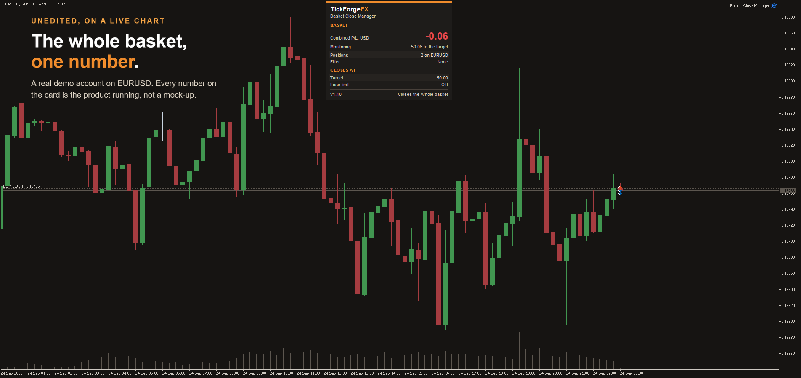

# Basket Close Manager

A free basket closer for MetaTrader 5. If you run a grid, a hedge, or several trades toward one idea, you care about the whole basket, not each ticket. Attach this to a chart, set a total profit target, and it closes **all** your open trades at once the moment they add up to it. It opens nothing and fires no signal.

## What it does

- **Close the whole basket at a profit target.** When the combined profit of your open trades reaches your target, it closes them all together, in one pass.
- **Optional loss limit.** Set a total loss and it closes the basket if the combined result falls to it, a simple per-basket stop.
- **It commits to the close.** Once your target is hit, it flattens the entire basket and keeps at it until every trade is closed, so a momentary broker rejection can never leave a straggler open.

## Target in whatever fits you

- **Account currency**, a fixed cash amount.
- **Percent of balance**, or
- **Percent of equity.**

Profit is the combined floating result of the basket, including swap (you can exclude it).

## Which trades are in the basket

- **This chart's symbol, or every symbol.** One toggle.
- **By magic number, or everything.** Watch one EA's trades, or leave it at 0 to include every position on the account, including trades you placed by hand.
- **Buys, sells, or both.**

## Built to be safe

- **It will not act on a bad reading.** It waits for a connected, valid account and skips a warm-up cycle after every (re)connect, so a startup glitch can never trigger a close.
- **No signals, no entries.** It only closes trades you already have open. It cannot open a position.
- **Respects the broker.** It picks the symbol's fill mode and retries a rejected close on the next tick rather than giving up.
- **A clear panel** shows the live basket profit/loss, how many trades are in it, your target and stop, and the current state, and it drags anywhere on the chart.

## What it does not do

It does not open trades, predict direction, or fire buy and sell signals. You place the trades, this closes the basket when it reaches your number.

**In the Strategy Tester** it opens small sample trades so it has activity to show (a tool that only watches and closes would otherwise do nothing in a backtest). On a live or demo account it never opens a trade.

**Note on scope.** With the magic filter at 0 and "this symbol only" off, the basket is every open position on the account, so the target closes everything. Narrow the scope with the symbol, magic and direction filters if you only want part of your book managed.

Free. Works on any symbol and any timeframe.

---

Current version: **1.10**

On the MQL5 Market: [Basket Close Manager](https://www.mql5.com/en/market/product/185323)
