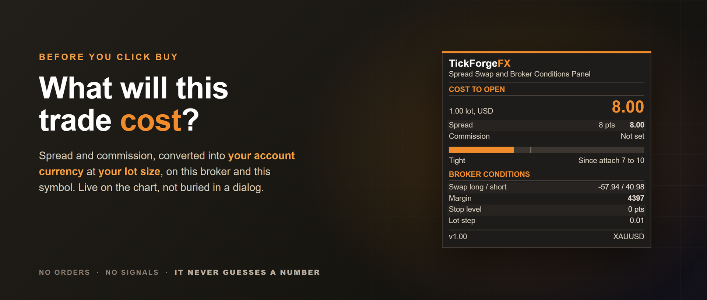
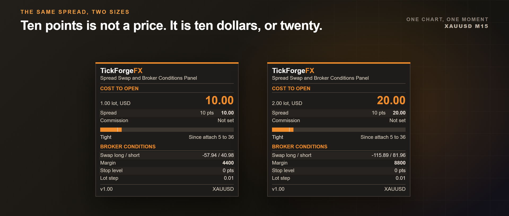

# Spread Swap and Broker Conditions Panel

Before you place a trade, this tells you what it will actually cost you: the spread and your commission converted into your account currency, at the lot size you are about to trade, on this broker and this symbol.

**MetaTrader already shows you the raw numbers.** Right-click a symbol, open Specification, and the spread, the swap and the stop level are all there, free. What that dialog will not do is turn any of it into money at your size, and it will not sit on the chart and watch the spread move while you wait for a fill. That is what this is for.

**It never guesses.** Every figure on the card comes from the terminal or from a number you typed. Where a value cannot be converted, it prints the figure the broker gave and names the unit instead of quietly showing you a wrong one.

## The number at the top is the whole point

Cost to open, in your account currency, for the lot size you set. It is the spread cost plus your commission, and the row underneath shows the spread as both points and money so you can see which half is which. Set your lot size to what you actually trade and the figure is yours, not an example.

- **Spread, in points and in money, on one row.** Twelve points means nothing until you know it is twelve dollars at your size on this pair.
- **Commission is a field you fill in once**, because no broker exposes it to the terminal. Leave it empty and the card says **Not set** rather than printing a zero that would read as "this broker is free".
- **Five-digit and three-digit quotes, indices, metals, crypto and cross pairs, not just the majors**, because the conversion is built from the symbol's own tick value and tick size rather than assuming a dollar a point.

## The spread is the only thing on this card that moves, so it gets the bar

A strip under the cost shows where the live spread sits between the lowest and highest it has been since you attached the panel, with a marker for the session average. Under it, one word: **Steady** before the spread has moved at all, then **Tight**, **Normal** or **Wide**. The word is there so the state is readable without relying on the colour.

- The range resets at your broker's midnight, and the caption says whether it is measuring since you attached (**Since attach**) or since 00:00 (**Since 00:00**), so the number is never older than it claims.
- This is the part that matters around a news release or a session open, when the number in the Specification dialog is already out of date by the time you have read it.

## Broker conditions, converted where they can be

- **Swap long and short, in money, per night, at your lot size**, where the broker quotes it in a form that can be converted. Where it cannot be, the card shows the broker's own figure and names the unit, because an interest rate shown as dollars would be a guess.
- **Margin for your lot size**, computed from the symbol's own contract terms and your account leverage. Checked against the platform's own answer on eight symbols including cross pairs, indices and metals.
- **Stop level**, which is the distance inside which the broker will simply reject your stop. This is the one that ambushes people on gold and indices.
- **Lot step**, because a size the broker will round is a size you did not choose.

## What it is not

It places no trades, sends no orders and has no opinion about direction. It reads the symbol, does the arithmetic and shows you the answer. Nothing on it can move your account.

It is also not a position size calculator. If you want the lot size for a percentage of your account at a given stop distance, that is a different tool and we publish one free. **That one sizes the position. This one prices holding it.**

## Built to stay out of the way

- Drag it anywhere on the chart with the mouse. It stops at every edge with all of itself still on screen, and it does not pan the chart while you are moving it.
- Readable at every Windows display scaling from 100 percent through 200 percent. The geometry is measured against the same Windows text engine MetaTrader draws with, so rows do not overlap on a high resolution laptop.
- Charcoal card with a single accent, on a light chart or a dark one.
- Set your lot size and your commission once and it remembers nothing else. There is no account connection, no server, no data leaves your terminal.

## MT5 and MT4

Both platforms, same card, same arithmetic. This listing is the MetaTrader 5 build.

## Every input, and there are not many

- **Lot size to price**: the size every money figure on the card is computed for.
- **Commission per lot, round turn**: your broker's commission. Leave at zero and the card says **Not set**.
- **Show the panel**, **Lock the panel in place**, **Panel corner**, and the X and Y offsets.

## Two sizes at once, if you want them

Attach it twice with different lot sizes and you get two independent cards, so you can see what 1 lot costs beside what 2 lots costs. Give the second one a different **Panel Y offset** before you press OK, otherwise both open in the same place and sit on top of each other.

---

Current version: **1.0**, on MetaTrader 5 and MetaTrader 4

On the MQL5 Market:

- MetaTrader 5: [Spread Swap and Broker Conditions Panel](https://www.mql5.com/en/market/product/194871)
- MetaTrader 4: [Spread Swap and Broker Conditions Panel MT4](https://www.mql5.com/en/market/product/195090)
