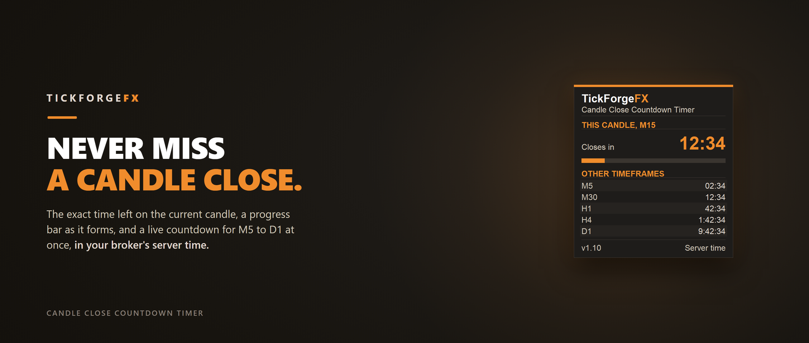

# Candle Close Countdown Timer

A free countdown for MetaTrader 5. Attach it to any chart and it shows the exact time left on the current candle, a progress bar as the candle forms, and a live countdown for a whole set of higher timeframes at the same time. Accurate to the second, and out of your way.

## What it shows

- **The exact time to the close.** A big, live countdown on the current chart timeframe, ticking every second, with the last few seconds highlighted.
- **A progress bar.** See at a glance how much of the current candle has already formed.
- **Every timeframe at once.** A live countdown for M5, M15, M30, H1, H4 and D1 side by side, so you can see the next close on any of them without switching charts. Choose which ones to list.

## Why it helps

- Time entries and exits to the candle close instead of guessing.
- Know when a higher-timeframe candle is about to print while you work on a lower one.
- Server-time accurate, so the countdown matches the actual bar close on your broker.

## What it does not do

It fires no signals, makes no predictions, and never trades. It is a clock, nothing more. No repaint.

The panel is draggable, lockable, and always stays fully on-screen. Works on any symbol and any timeframe. Free to use.

---

Current version: **1.0**

On the MQL5 Market: [Candle Close Countdown Timer](https://www.mql5.com/en/market/product/184779)
