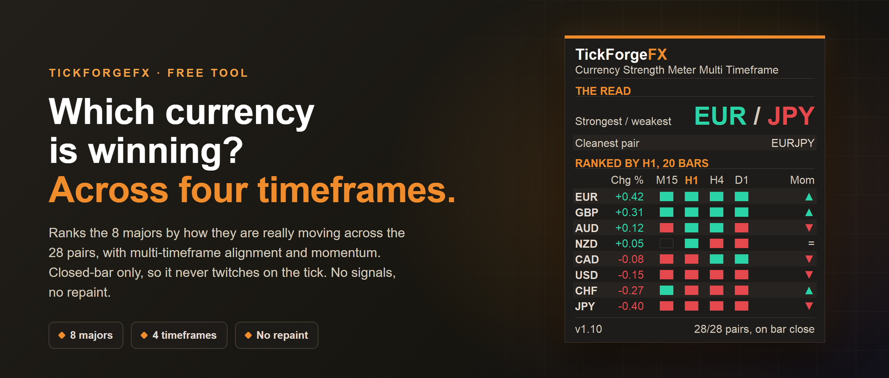

# Currency Strength Meter Multi Timeframe

A free currency strength meter for MetaTrader 5. It ranks the eight major currencies (EUR, GBP, AUD, NZD, USD, CAD, CHF, JPY) by how they are actually moving across the 28 major pairs, and shows which are strong, which are weak, and which way each one is turning. It computes on **closed bars only**, so it does not twitch on every tick. It never trades and fires no signals.

## What it shows

- **The eight majors ranked** strongest to weakest, each with its strength value in green or red.
- **Multi-timeframe alignment.** Four timeframe cells per currency (M15, H1, H4, D1 by default, all configurable). Green across all four means strong on every horizon, the high-conviction read.
- **Momentum direction.** An arrow on each currency showing whether it is gaining or losing strength, so you catch a currency turning, not just where it already is.
- **The standout pair.** The strongest currency versus the weakest, named as the pair to watch. A read, not a signal.

## Stable and transparent

- **Closed bars only, no repaint.** Strength updates when a bar closes, not tick by tick. Most free meters jump on every price change, which is noise. This one holds still.
- **A transparent method.** Strength is the averaged percent change of each currency across the pairs that contain it, oriented so up means stronger. No hidden formula.
- **It measures, it does not predict.** No buy and sell arrows, no promises.

## Built to just work on your broker

It auto-detects your broker's symbol naming, including suffixes like .pro or .m, and skips any pair your broker does not offer. The panel footer shows how many of the 28 pairs the ranking is built from.

## Configure it to your style

- Four timeframes you choose for the alignment cells, and which one drives the ranking.
- Lookback in bars for the percent-change window.
- Toggle the momentum arrows and the pair read on or off.

## What it does not do

It does not trade, predict, or fire signals. It measures relative strength from real price and puts it in front of you. The decisions stay yours.

Free. Works on any symbol and timeframe.

---

Current version: **1.10**

On the MQL5 Market: [Currency Strength Meter Multi Timeframe](https://www.mql5.com/en/market/product/184632)
