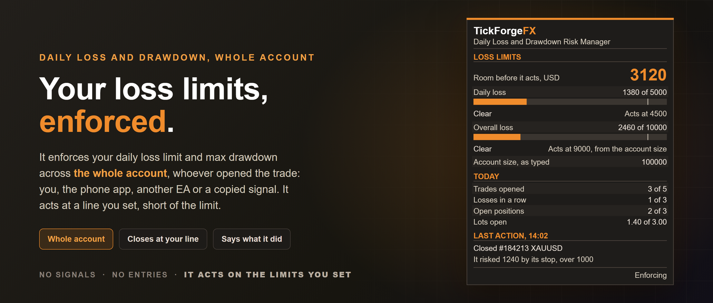
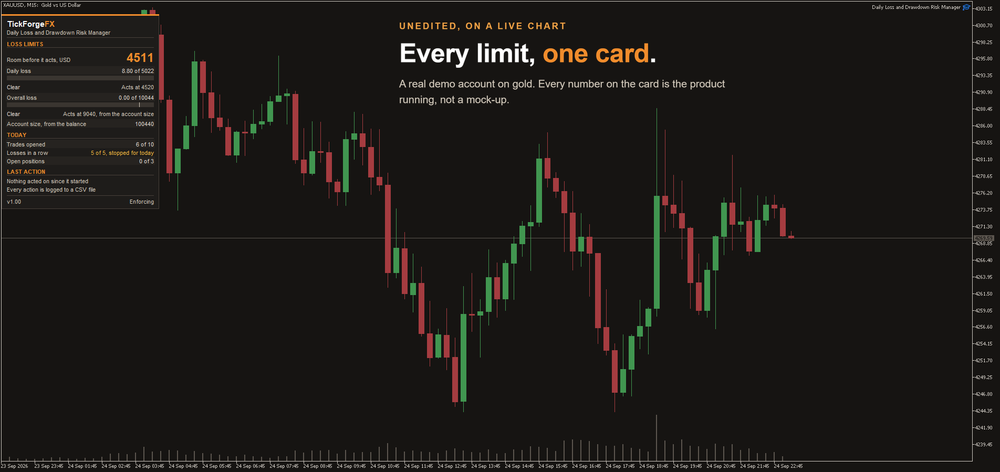

# Daily Loss and Drawdown Risk Manager

Put it on one chart and it enforces your daily loss limit and max drawdown across the whole account, whoever opened the trade: you by hand, the phone app, another EA or a copied signal. At the limit it closes every position, deletes every pending order and keeps closing anything opened until the lock ends. It acts at a line you set short of the limit, not after it, and says in plain words what it did.

**What goes wrong with a risk manager is rarely a missing feature.** It is a limit that fires late, a setting that means something other than its name, a lock that editing the inputs quietly undoes, or trades closed that nobody expected it to touch. Each of those has a plain answer below.

## Setting it up

For a prop firm challenge, or for limits of your own, these are the settings that matter:

- **Account size**: the challenge size, for example 100000, or the size you want your own limits measured from. Leave it at 0 and it takes your balance on the first run.
- **Daily loss limit** and **Overall loss limit**: your daily loss limit and your max drawdown. The **Loss limits are set in** setting chooses between money in your account currency and a percent: of the account size, or of the high point once the overall limit trails.
- **Daily baseline**: where the day's drawdown is measured from. The balance at the start of the day, the equity at the start of the day, whichever of those is higher, or the day's highest equity, which never counts from below the day's starting balance.
- **Daily reset hour**: when your firm's day rolls, in server time.

Every other rule is off until you set it. The overall limit is measured from the account size by default, the fixed floor most challenges use. One dropdown makes it a trailing drawdown from the highest equity reached instead, and then a percent is of that high point, so it grows as the account grows. If your firm trails a fixed amount, set that limit in money.

## At the limit it acts. It does not report afterwards.

- **It acts at 90 percent of a limit by default and warns at 80**, both yours to set. That margin is there to absorb a price gap or a slow fill before it reaches your firm's line. A move bigger than the margin can still pass it.
- All positions on every symbol are closed and every pending order deleted, the biggest exposure first. A close the broker refuses is sent again at the next price: straight after a price refusal, and after any other once a wait of at most 30 seconds has passed. Every attempt goes in the log with the broker's reply.
- **Anything opened while the lock stands is closed as soon as it appears**, checked on every tick and every second while MetaTrader is running with the tool attached, whether it came from your hand, your phone or another program.
- Losses are measured on equity, as an equity protector does, so a floating loss counts the way most firms count it. Credit your broker adds is left out, so it can never hide a loss.
- A daily lock ends at the daily reset. An overall lock stands until you ask to clear it, until your equity is back where it was measured from, or until switching that limit off takes effect.

**The day is measured from its reset, even if MetaTrader was closed then.** Start it after the reset and whatever the account booked since, a stop that filled overnight included, counts toward today's limit, as it would have if the tool had been running. With an equity baseline, the trades open at the reset are valued at the prices of that moment, read from the chart history, including any that closed while MetaTrader was off. If a price at the reset cannot be read within a minute, it says so in the Experts log and measures the day from the trades as they stand when it starts, without the reset's prices.

## A lock that holds

- Restarting MetaTrader does not lift it, and neither does removing the tool and attaching it again. It is kept in this MetaTrader under the account's login number, so a lock on one account does not follow you onto another.
- **Editing the inputs does not undo it.** A stricter loss limit applies at once. A looser one, switching a limit off included, waits for the next daily reset or a clear you ask for, and the Experts log says so. An overall limit switched off takes its lock with it when that change lands.
- The same goes for the two daily counts, for Watch only and for the account size, where the stricter figure is the larger one while the overall limit is measured from the account size, the default, because that raises the line where it acts, and the smaller one otherwise. A new account size reaches the daily limit from the next reset or a clear, unless it replaces a size the loss limits refused to arm under, and while a loss limit is on a larger one reaches the risk per trade then too. The rules for each trade take a new value at once.
- **A setting the tool cannot accept**, such as a warning set at or above the act line, stops it: MetaTrader takes it off the chart and says why, in a popup by default and always in the Experts log. Nothing is enforced until you attach it again with settings it accepts, and a lock already standing is kept.
- **Clearing is a request, not a switch.** Set **Ask to clear a tripped lock** to true and it takes effect 30 minutes later if it is still true then; set it back before that to cancel. When it lands, the dialog applies as typed, account size included, except **Daily reset hour** and a **Daily baseline** read at the start of the day, which wait for the next reset, and what already happened keeps counting. So a lock that real losses tripped trips again at once, and a lock that a wrong setting tripped stays clear once the setting is corrected. Then set it back to false: left true, it cannot ask again, and it says so if you try.

## Rules for every trade, whoever opened it

Each one is off until you set it. Each group has its own action, close the trade or only warn, and a trade without a stop can also be given one.

- **Most one trade may risk, by its stop.** The money lost if the stop fills, measured from the open price, as a percent of the account size, or of the balance if both loss limits are off and no size is typed. It is judged when the trade appears, again whenever its stop or size changes, and afresh when MetaTrader restarts or the tool is attached again, not once the loss has already happened.
- **A trade without a stop loss.** After the number of seconds you allow, it adds a stop loss at the risk limit, which needs **Most one trade may risk** set, and keeps the take profit, or closes the trade, or warns. If price is already past where that stop would go, it closes the trade rather than place a stop that would fill at once.
- **Symbols allowed.** A trade on any other symbol is acted on. A symbol in the list that your broker does not have stops the tool from starting, with a popup naming it, rather than leaving it to close every trade on the symbol you meant.
- **Most open positions, and most lots open in total.** The newest is acted on: the newest trade for the lots, and on a netting account the newest whole position for the count.
- **Most trades per day, and a stop for the day after a number of losses in a row**, the two rules against overtrading, counted with swap, commission and fees. Only trades opened after a limit is reached are acted on.

## It does not close what was already open

Attach it to an account with trades already running and those trades are warned about under the per-trade rules, never closed by them. The loss limits are different, and say so: from the moment they arm they cover every trade on the account, because a limit that ignored some trades would not be a limit.

Closing MetaTrader at night, or Windows restarting the PC, does not change which trades it governs. Only taking the tool off its chart and attaching it again on a later day starts it afresh, and the Experts log says when that happens.

## Beside your other EAs

MetaTrader runs one Expert Advisor per chart, so this goes on a chart of its own and your other EAs keep theirs. It governs their trades like any other: the loss limits close them at the line, and a rule you switch on acts on them too. Nothing can be exempted, so an EA that trades without a stop loss on purpose will have one added if you set that rule to add one; set it to warn instead. It cannot be backtested together with another EA, because the Strategy Tester runs one program at a time.

## When another program keeps reopening

- A trade opened under the lock is closed every time. When a program reopens a trade the lock has closed, on the same symbol within 15 minutes, the popup names it by magic number and comment and lists the Expert Advisors on that symbol's charts, because MetaTrader has no way to map a magic number to a program. That popup comes the first time and every fifth time after, so a looping EA does not bury you in them. Every close, magic number included, is in the log.
- **Or it can close MetaTrader** once the account is flat, so the programs running in it stop until you open it again. It cannot stop trades from your phone or another terminal, and nothing closes those while MetaTrader is closed. Off by default, and never on an MQL5 VPS, where nothing would open it again. Nothing is restarted or restored afterwards: your charts and your other EAs are as you left them, and the lock is still standing when you return.

## Deposits, withdrawals and credit

- A deposit is not a gain and buys no extra room. The account size never follows a deposit up.
- A withdrawal is not counted as a loss. It comes out of the profit above what you deposited first, then out of your deposits, and the account size moves down only by the part that takes the balance below it.
- Credit is left out of the equity it measures.
- If the balance moves and the deal history cannot be read, the limits stand down rather than guess, and the card says **Paused**. A lock already standing is not paused: it keeps closing what is opened, and the card says **Locked**.

## It refuses to arm on a mistake

The first time it runs on an account, a loss limit that is already past the line where it acts does not arm: nothing is closed, the card says **Not armed**, and the Experts log says why. It arms once that loss is back under the line, the daily one at the latest at the next daily reset, and until then it does not protect the account. The other limit arms as usual. On an account it has run on before, a loss taken while it was off still counts, and it acts on it as soon as it is attached again. While the overall limit is on and measured from the account size, the default, an account size typed with an extra zero is refused and the card says **Check the account size**, unless a lock is standing, and neither limit arms while it stands. One that a clear of a lock puts in force is not refused: the lock trips again, and a corrected figure lands with the next clear. Under a trailing overall limit, or with it off, an extra zero is not caught, and once it lands it makes every limit set in percent ten times wider. While a loss limit is on, the card shows the account size it measures from, so a size with an extra zero is there to see.

## A record of everything it did

- One CSV file per account login in the MQL5\Files folder: server and local time, the rule, the ticket, symbol, side, volume, magic number, price, the broker's reply code and result, and a note. It records what the tool did; warnings stay in the Experts log.
- Each row is opened, written and closed on its own, so a crash loses nothing already written.
- If Excel or another program holds the file open, the rows wait in a file beside it and go into it in order once it is free. If MetaTrader closes first, they are kept and written the next time the tool starts.

## Netting and hedging

Both. On a netting account each add to a position is judged as its own trade, with its own size and time, and a rule closes only the volume that broke it. A position bigger than the symbol's maximum lot is closed in pieces rather than refused.

## Watch only

One setting turns every rule into a warning: it alerts, closes nothing, and the card says **Reached** instead of **Locked**. Switched on a running tool it counts as loosening: the rules for each trade change at once, but the loss limits and the daily counts keep closing until the next daily reset, including a limit first reached after you switch.

## The card

- **Room before it acts**, in your account currency, to whichever limit is nearer. That is the number to watch.
- Daily and overall loss, each with a bar, a mark where it acts, and its state: Clear, Near the limit, Reached, Locked or Not armed.
- The account size, and where it came from: as typed, from the balance, or after a withdrawal.
- Today's trades, losses in a row, open positions and lots open, for the rules you have switched on.
- The last thing it did, and why.
- Drag it anywhere, lock it in place, or pin it to a corner from the inputs.

Alerts come as a popup with a sound, a push to the MetaTrader app and an email, each switchable. Push and email need setting up in MetaTrader's own options first.

## MT5 and MT4

Both platforms, built from one file: the same version, the same settings with the same names and defaults, the same card, the same rules. This listing is the MetaTrader 5 build. The MetaTrader 4 build is listed separately, and its page says where MetaTrader 4 itself makes a difference: what it records about who opened a trade, what a partial close leaves behind, and how much history it hands a program.

## About the demo, stated plainly

On this market a paid product's demo runs only in the Strategy Tester, where a tool that places no trades would have nothing to show. So in a **visual** test it opens trades of its own, one act at a time, each built to break a rule you have switched on, and the card shows that rule acting. Out of the box only the two loss limits are on, so switch on the rules you want to watch before you start. Its trades carry a comment starting "TFX demo". After a loss-limit trip it opens one more trade under the lock, so you see that closed at once too.

Alerts are not delivered in the tester at all; the card and the log show every event instead. **One thing it does in the tester and nowhere else:** in a NON-VISUAL run on a netting account funded under 2000, which is the setup this market's automated validator uses, it places minimum-lot sample trades so the validator can see trading operations, and it enforces nothing in that run. It says so in the journal, and it is worth knowing before you run a non-visual backtest of your own on a netting account with a small deposit, because that is the same shape. A visual run is the demo, and every other run enforces. Outside the Strategy Tester it never opens a trade.

## What it is not

It is not a trade manager: no break-even, no trailing stop, no partial profit-taking, no entries and no signals. Our Trade Manager does those, for the trades on its own chart's symbol. This one governs every trade on the account from one chart, and the only things it ever does to a trade are close it or give it a stop.

It is not only a monitor either. We publish a free panel that shows your two loss limits and never touches a trade. This one acts on them.

## Good to know

- Put it on one chart. One copy governs the whole account; a second copy would act on the same trades.
- Nothing exempts a program or a symbol from the loss limits. If a trade is on the account, they cover it.
- The daily reset hour can be moved, and a change can lengthen a day but never shorten one.

## If you need me, I answer

Ask in the comments or by MQL5 message and you get a reply from me, not a support desk. If something is broken I want to know about it, and a bug report gets a fix rather than a workaround.

You already know your limits. This enforces them, and tells you exactly what it did.

---

Current version: **1.0**, on MetaTrader 5 and MetaTrader 4

On the MQL5 Market:

- MetaTrader 5: [Daily Loss and Drawdown Risk Manager](https://www.mql5.com/en/market/product/197828)
- MetaTrader 4: [Daily Loss and Drawdown Risk Manager MT4](https://www.mql5.com/en/market/product/197830)
