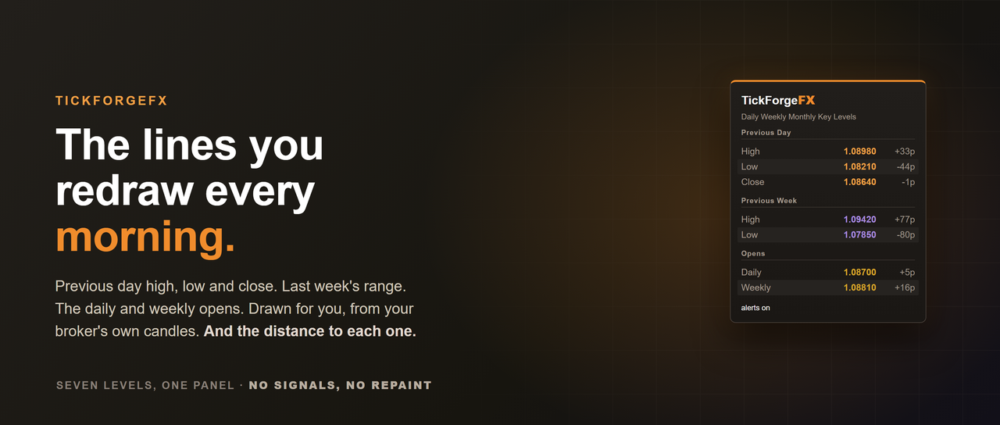
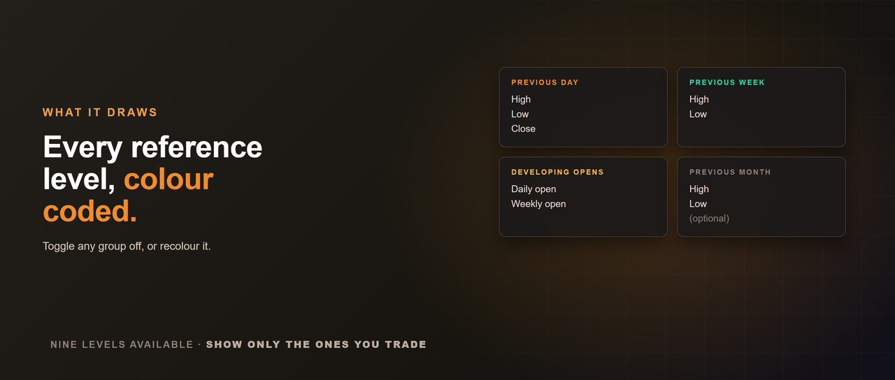
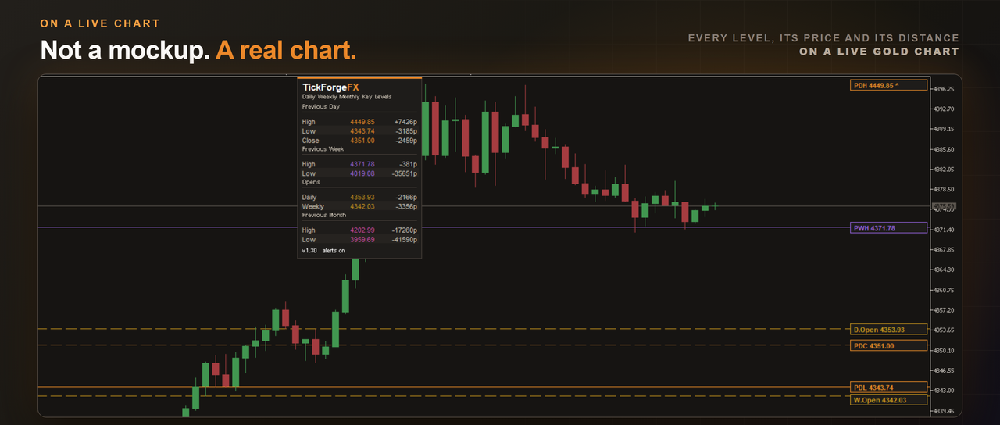
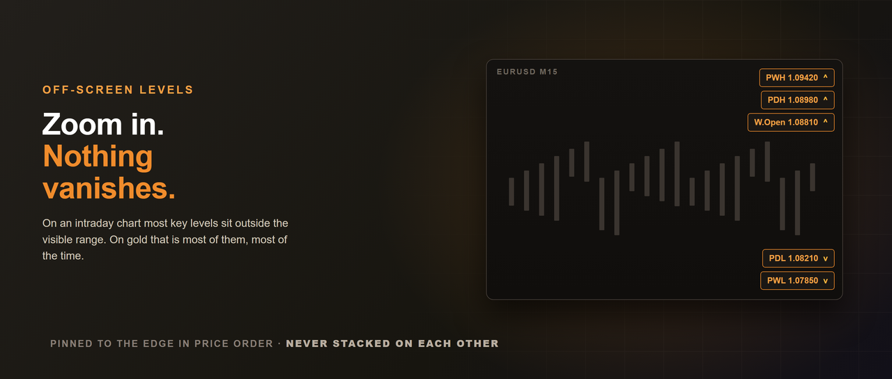
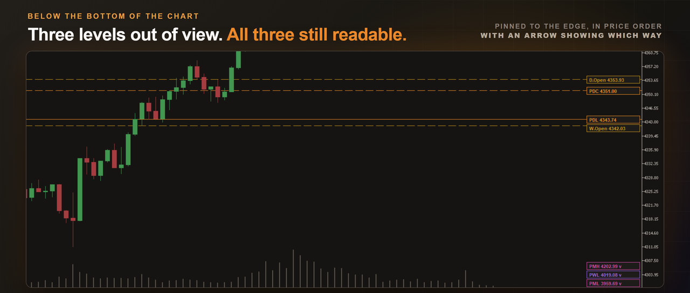
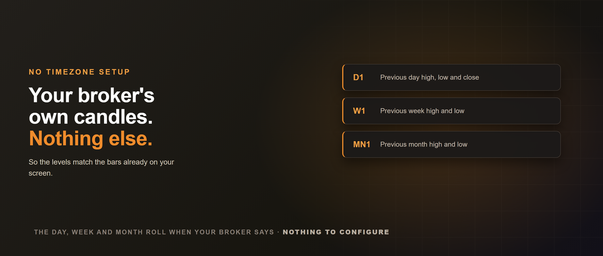
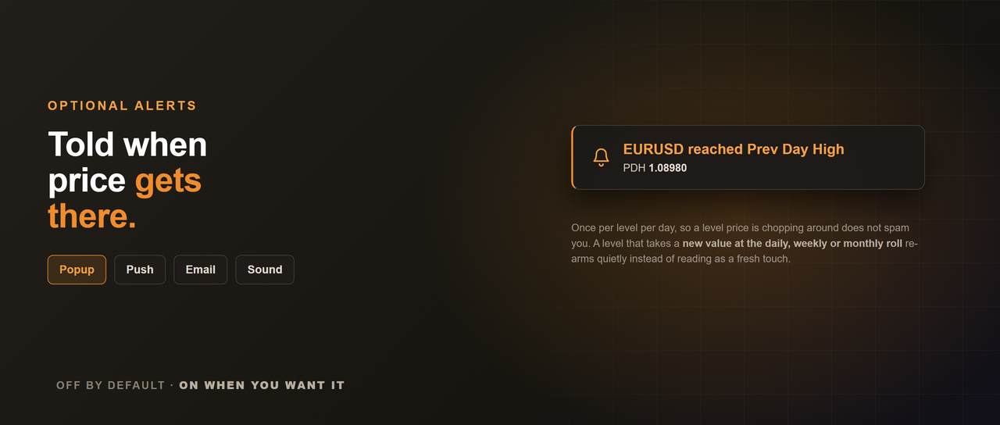
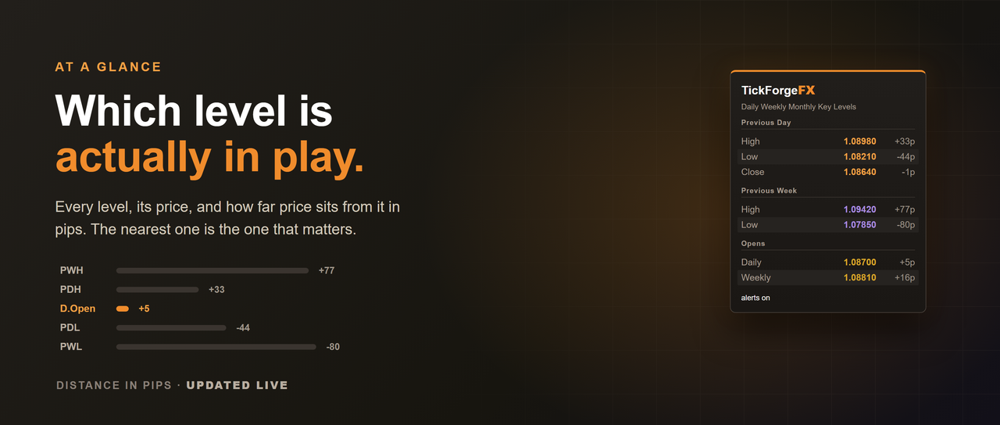
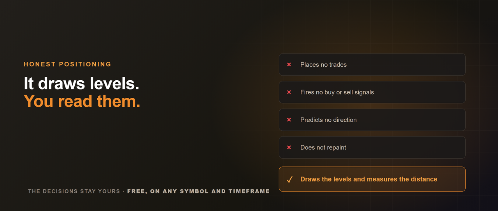

# Daily Weekly Monthly Key Levels by TickForgeFX

The previous day's high and low, the weekly open, last week's range: these are the lines most
traders redraw by hand every morning. This Daily Weekly Monthly Key Levels tool draws them for
you, automatically and accurately, and tells you how far price sits from each. No signals, no
repaint, no clutter.

## What it draws

- **Previous day** high, low and close.
- **Previous week** high and low.
- **Daily and weekly open**, the developing opens watched heavily intraday.
- **Previous month** high and low (optional).

Each level is a clean labelled line, colour-coded by period, and a compact panel groups them by
period and lists every level, its price, and how far price sits from it. That distance can read
in pips, in price, or as a percentage, whichever you prefer.

## On a live chart

## Levels that do not vanish when you zoom in

On an intraday chart most of your key levels sit outside the visible price range, and on gold
that is most of them, most of the time. A level you cannot see is worse than useless, because
you assume it is far away.

Any level above or below the view pins to the chart edge as a small price chip showing its name,
its price, and an arrow pointing the way it lies. Several off-screen levels spread into a
readable column instead of stacking on each other, and they stay in price order.

## Straight from your broker's candles

The levels are taken from your broker's own daily, weekly and monthly candles, so they match
the bars you already see. There is nothing to configure for your timezone: the day, week and
month boundaries are whatever your broker uses.

## Optional level alerts

A popup, a sound, a push notification to the MetaTrader mobile app, or an email when price
reaches a level. Off by default. Each level announces itself once per day, so a level price is
chopping around does not spam you, and a level that takes a new value at the daily, weekly or
monthly roll re-arms quietly instead of reading as a fresh touch.

## The panel

## What it does not do

It does not place trades, fire signals, or predict direction. It draws levels and measures
distance. The decisions stay yours.

## Recommended use

Works on any symbol and any timeframe, and is most useful on intraday charts where these levels
guide the session. Toggle any group on or off, recolour them, and drag the panel where you like
or lock it in place. Free, and built to the TickForgeFX standard: clean, honest, no hype. If it
earns a spot on your charts, an honest review helps more than you know.

## Support

Reach me through the Comments or MQL5 messaging. I answer honestly and quickly.
