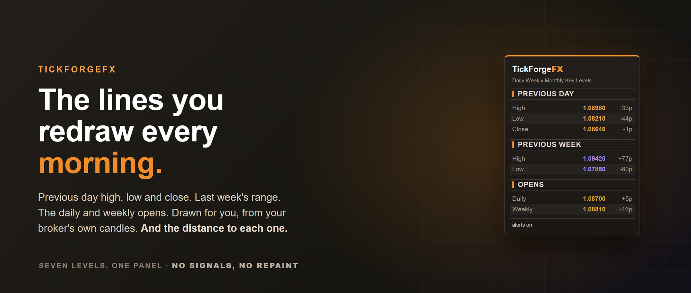
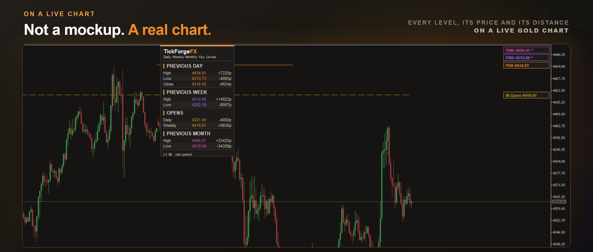

# Daily Weekly Monthly Key Levels

The previous day's high and low, the weekly open, last week's range: the lines most traders redraw by hand every morning. **Daily Weekly Monthly Key Levels** draws them automatically from your broker's own candles and tells you how far price sits from each. Zoom in tight and nothing vanishes, because **any level outside the view pins to the chart edge** as a labelled price chip with an arrow. No signals, no repaint, no clutter.

## What it draws

- **Previous day** high, low and close.
- **Previous week** high and low.
- **Daily and weekly open**, the developing opens watched heavily intraday.
- **Previous month** high and low (optional).

Each level is a labelled line, colour-coded by period, and a compact panel groups them by period and lists every level, its price, and how far price sits from it. Choose whether that distance reads in pips, in price, or as a percentage.

## Levels that do not vanish when you zoom in

On an intraday chart most of your key levels sit outside the visible price range, and on gold that is most of them, most of the time. A level you cannot see is worse than useless, because you assume it is far away. Any level above or below the view pins to the chart edge as a small price chip showing its name, its price, and an arrow pointing the way it lies. Several off-screen levels spread into a readable column instead of stacking on each other, and they stay in price order.

## Straight from your broker's candles

The levels are taken from your broker's own daily, weekly and monthly candles, so they match the bars you already see. There is nothing to configure for your timezone, because the day, week and month boundaries are whatever your broker uses.

## Optional level alerts

Get a popup, a sound, a push notification to the MetaTrader mobile app, or an email when price reaches a level. Off by default. Each level announces itself once per day, so a level price is chopping around does not spam you, and a level that takes a new value at the daily, weekly or monthly roll re-arms quietly instead of reading as a fresh touch.

## What it does not do

It does not place trades, fire signals, or predict direction. It draws levels and measures distance. The decisions stay yours.

Works on any symbol and any timeframe, and is most useful on intraday charts where these levels guide the session. Toggle any group on or off, recolour them, and drag the panel where you like or lock it in place. Free to use.

---

Current version: **1.40**

On the MQL5 Market: [Daily Weekly Monthly Key Levels](https://www.mql5.com/en/market/product/183203)
