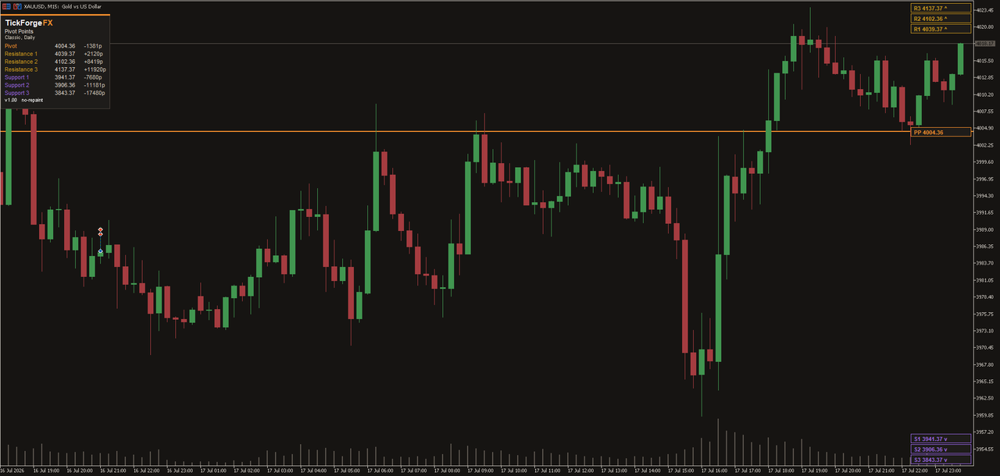

# Pivot Points Classic Fibonacci Camarilla

Pivot points are support and resistance levels a large part of the market watches every session, and they are the same calculation on every chart. This **Pivot Points** tool builds them for you from the previous closed candle and draws them for you, with the central pivot, resistance and support each labelled and measured against current price.

## Three calculation methods

- **Classic** floor pivots: the standard central pivot, R1 to R3 and S1 to S3.
- **Fibonacci**: the pivot with resistance and support projected at the 0.382, 0.618 and 1.000 ratios of the prior range.
- **Camarilla**: the close-based levels, including the R3/S3 reversal and R4/S4 breakout levels.

## Daily, weekly or monthly

Pick the period the pivots are built from. Daily for the session, weekly and monthly for the higher-timeframe levels that hold across the week or month. One period at a time keeps the chart readable.

## Read every level at a glance

Each level is a labelled line showing its price, and a compact forge panel lists them grouped under Resistance, Pivot and Support, in that order, with the outermost level of each group first. Every row shows the level's price and how far price sits from it. Choose whether that distance reads in pips, in price, or as a percentage. Percent is the one that means the same thing on every instrument.

## An alert when price gets there

Optional, and off until you switch it on. Choose any mix of a popup, a sound, a push notification to your phone, and an email. It fires once per level per day, it will not announce a level price had already passed when you attached the indicator, and it stays quiet when the period rolls over and every pivot recalculates at once. It tells you price reached a level you chose. It is not a suggestion to trade it.

## Straight from your broker's candles

Levels are computed from your broker's own previous day, week or month candle, so they match the bars you already see. Because the source candle is closed, the levels are fixed for the whole period. No repaint.

## What it does not do

It does not place trades, fire signals, or predict direction. It marks the levels, measures distance, and can tell you when price arrives. The call stays yours.

Works on any symbol and any timeframe. Switch method or period, choose how many levels to show, recolour any group, and drag the panel where you like or lock it in place. Free to use.

---

Current version: **1.20**

On the MQL5 Market: [Pivot Points Classic Fibonacci Camarilla](https://www.mql5.com/en/market/product/186251)
