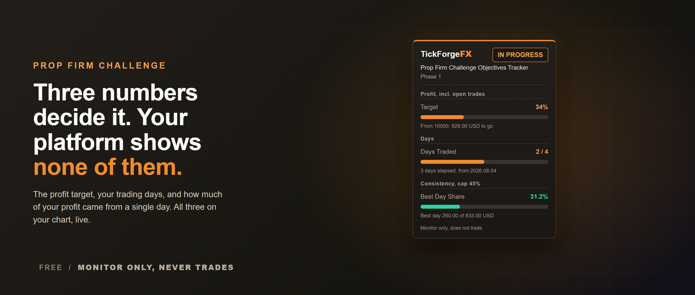

# Prop Firm Challenge Objectives Tracker

A funded-account challenge is decided by three numbers, and your terminal shows you none of them. This panel tracks all three on your chart: how much of the profit target you have made, how many trading days you have banked, and how much of your total profit came from your single best day. That last one is the consistency rule, and it costs more traders their payout than drawdown does.

**It never trades and it fires no signals.** It reads your account and your own closed deal history, works out where your challenge started, and shows you where you stand against the objectives you configured. Nothing else.

## The profit target

- Progress toward your target as a percentage, with the cash amount still to go.
- Measured on closed trades plus open ones, or on closed trades only, whichever your firm counts.
- Deposits, withdrawals, credits and bonuses are never counted as profit, so a payout or a top-up does not move your progress.
- Separately billed costs count against you the way your firm sees them. Commission posted as its own daily entry, charges, swap and exchange fees all reduce the figure, not just the profit printed on the trade.

## Minimum trading days

- Counts the days you actually opened a trade, so one position scaled out across a week stays one trading day rather than four.
- Switch it to count any trading activity instead if that is how your firm words the rule.
- The day boundary follows your firm's reset hour, not your broker's midnight.

## The consistency rule

- Your largest winning day as a share of total profit, measured on closed results.
- Set the cap your firm uses. It turns amber as you approach it and red past it.
- It stays blank until the sample is large enough for the cap to be reachable at all. On a 45 percent cap that is three winning days, because one winning day is always 100 percent of your profit and two can never be under 50. A number that is certain in advance tells you nothing.

## It tells you when it does not know

The account size and the challenge start are worked out from your deal history. If your terminal has not kept enough of that history to see where the account began, the panel shows dashes and asks you to enter the two numbers yourself, instead of showing you a confident wrong one. Set them and everything measures normally. This matters because a tool of this kind is usually installed in the middle of a challenge, not on day one.

## Built for the way challenges actually run

- A reset, a retry, a new deposit or a payout starts a new cycle, and the panel follows it rather than carrying the last attempt forward.
- Small broker movements like rebates and loyalty credits do not disturb the window.
- Nothing is stored between sessions. Every figure is recomputed from your history, so there is no stale state to clear and nothing to reset by hand.
- Two accounts in one terminal never share a baseline.

## Alerts

- A popup when the profit target is reached, and when your best day passes the consistency cap.
- Optional push notification to the MetaTrader app on your phone.
- Attaching it to an account you have already been trading never announces something that happened before you installed it. Only a change while it is watching is worth telling you about.

## The panel

- Drag it anywhere, lock it in place, or pick a corner. It cannot be dragged off the chart.
- Reads correctly on light and dark charts.
- Every figure states what it is measured from, so you can check it rather than trust it.

## What it does not do

This is the objectives side of a challenge, the part that decides whether you pass. It does not watch your daily loss limit or your maximum drawdown. It also cannot know your firm's exact wording, so set the target percent, the minimum days, the cap and the reset hour to match your own rules. Defaults are generic and every one of them is configurable.

## Settings

- Challenge: phase label, account size, profit target percent, profit basis, challenge start.
- Trading days: minimum days, what makes a day count, day boundary hour.
- Consistency: best day cap, or zero to switch the objective off.
- Alerts: target, consistency, popup, push.
- Panel: show, lock, corner, offsets.

Free, monitor only, and it never places, modifies or closes an order.

---

Current version: **1.10**

On the MQL5 Market: [Prop Firm Challenge Objectives Tracker](https://www.mql5.com/en/market/product/189565)
