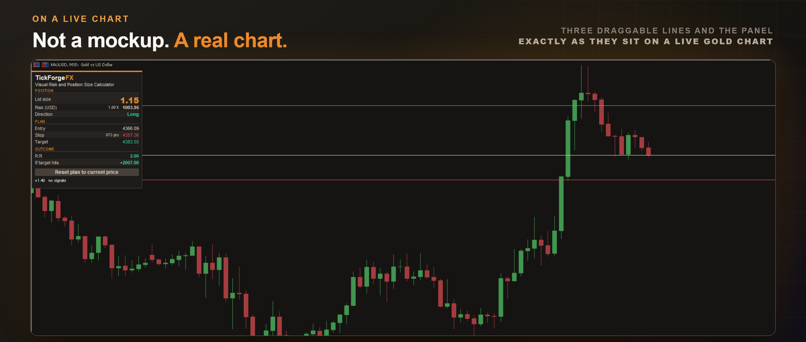

# Visual Risk and Position Size Calculator

Drag three lines onto your chart, your entry, your stop loss and your target, and read the exact **lot size** for the risk you choose. It is a visual **position size and risk calculator**: the panel shows the money at risk in your account currency, the stop distance in points, and the reward-to-risk, all updating as you drag. **Your levels are remembered between sessions**, so the plan you set up is still there after a timeframe switch or a restart. No signals, no repaint.

## What it shows

- **Lot size** for the percent of your account you choose to risk, respecting your broker's minimum, maximum and step.
- **Money at risk** in your account currency.
- **Stop distance** in points, from your entry to your stop loss.
- **Reward-to-risk** and the potential return at your take profit.
- **Direction**, long or short, read from where your lines sit.

This one sizes the trade and stops there. If you want the same sizing with the order sent from the panel, then partial closes, break-even and a trailing stop after the fill, that is [Trade Manager with Risk Sizing and Trailing Stops](https://www.mql5.com/en/market/product/189281).

## Your plan stays where you put it

Entry, stop loss and target are saved per symbol and per account. Change timeframe, restart the terminal, come back tomorrow, and your three lines are where you left them. A plan older than 30 days is treated as stale and replaced with fresh defaults, so you never restore levels into empty space. Switch it off if you would rather start clean every time. When you do want a fresh plan, the panel has a **Reset plan to current price** button: one click to arm it, a second to confirm, so it never happens by accident.

## Nothing disappears when you zoom in

Zoom in tight and a level often sits outside the visible price range. Instead of the line simply vanishing, a small chip pins to the chart edge carrying the level's name, its price, and an arrow showing which way it lies. You always know where your stop loss is, even when you cannot see it.

## Let the target follow your risk

Set the reward-to-risk you want, and your target, the take profit you are planning for, follows entry and stop loss as you drag them, so a 2R target stays a 2R target instead of being repositioned by hand every time. Switch it off to place the target freely.

## Optional entry alert

Set your levels, walk away, and get a popup, a sound, a push notification to the MetaTrader mobile app, or an email the moment price reaches your entry line. Off by default, and it announces once rather than on every tick.

## Why it helps

Position sizing is the part of risk management that is easiest to rush, and getting it wrong is how an ordinary losing streak turns into a blown account. Set your **risk per trade** once (1% of balance by default), size off balance or equity, or type a fixed account size to plan a different number. If the account is too small for your chosen risk at a given stop loss, it falls back to the minimum lot and flags the real risk, so you are never quietly over-exposed.

## What it does not do

It does not place trades, move your stop loss for you, fire signals, or predict direction. It is a calculator, and it does the arithmetic correctly so you do not have to do it by hand. The decisions stay yours.

Works on any symbol and any timeframe. Free to use.

Built by TickForgeFX.

---

Current version: **1.40**, on MetaTrader 5 and MetaTrader 4

On the MQL5 Market:

- MetaTrader 5: [Visual Risk and Position Size Calculator](https://www.mql5.com/en/market/product/183000)
- MetaTrader 4: [Visual Risk and Position Size Calculator MT4](https://www.mql5.com/en/market/product/189789)
