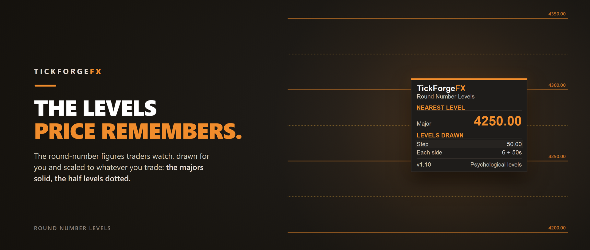

# Round Number Levels

A free round-number indicator for MetaTrader 5. Attach it to any chart and it draws the psychological round-number price levels that traders watch, the major "00" figures as solid lines and the "50" half levels as dotted lines, each labelled with its price. It follows price automatically as the market moves.

## What it does

- **Draws the round numbers for you.** The major figures and the half levels around current price, so you never mark them by hand.
- **Auto-scales to the instrument.** It reads the price and picks a round step near 1% of it: at today's prices, 100 pips on EURUSD, 50 dollars on gold and 500 points on US30. You can also set the spacing yourself.
- **Labelled and readable.** Every major level shows its price, and the labels are placed to read on both light and dark charts.
- **Follows price.** As the market moves into new territory, the levels re-centre automatically.

## How it is different from Daily Weekly Monthly Key Levels

That tool draws session highs and lows (previous day, week and month). This one draws round-number magnets. They answer different questions and work well side by side.

## What it does not do

It fires no signals, makes no predictions, and never trades. It draws levels, nothing more. No repaint.

The panel is draggable, lockable, and always stays fully on-screen. Works on any symbol and any timeframe. Free to use.

---

Current version: **1.10**

On the MQL5 Market: [Round Number Levels](https://www.mql5.com/en/market/product/184780)
