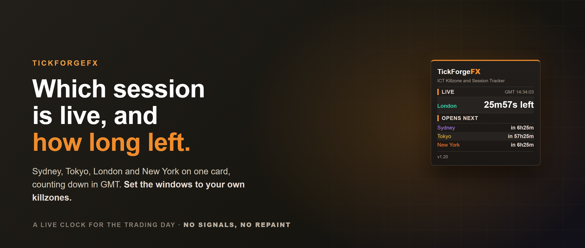
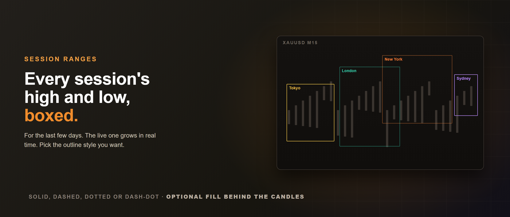

# ICT Killzone and Session Tracker

Know which trading session is live, how long is left, and when the next one opens, with every session's high and low drawn on the chart. **ICT Killzone and Session Tracker** puts the trading day on your chart in GMT, so it reads the same on any broker, and it can **alert you the moment a session or killzone opens or closes**. No signals, no repaint.

## What it shows

- **Live session panel** with a GMT clock and a row for Sydney, Tokyo, London and New York, each showing active with the time left, or how long until it opens. The active session is highlighted in its colour.
- **Session range boxes** drawn from each session's high to its low across its hours, labelled and colour-coded, for the last few days. The current session's box grows in real time.

## Set to your killzones

The session times are plain GMT inputs. Leave them on the defaults for the standard sessions, or set your exact killzone windows, for example a London killzone of 07:00 to 10:00 GMT. The labels are editable too, so the panel and the boxes read the way you trade.

## Automatic daylight saving

You never re-time it twice a year. Each session carries a daylight-saving rule (Europe, US, Australia, or none for Tokyo) and shifts by an hour through its local summer, so the panel and the boxes stay correct year-round. On by default, and optional if you would rather drive the times manually.

## Optional session alerts, quiet when the market is

Get a popup, a sound, a push notification to the MetaTrader mobile app, or an email the instant a session or killzone opens or closes. Off by default.

Session times are only clock arithmetic, so a naive tool announces London opening on a Saturday morning. This one asks your broker which hours it actually quotes your symbol and stays silent outside them, so a closed weekend produces no alerts at all. At the Sunday reopen a session that is already running announces its open, and nothing announces a close that happened while you were away. Run it on several charts and you get one alert, not one per chart, because a session opening is a fact about the clock rather than about a symbol.

## Correct on any broker clock

The panel reasons in GMT and the boxes are converted to your server's clock before they are drawn, so on a GMT+3 broker the London box starts at 10:00 on the chart while the panel reads 08:00 GMT. Same moment, two clocks, both correct.

## What it does not do

It does not place trades, fire signals, or predict direction. It tracks sessions and draws their ranges. The decisions stay yours.

Works on any symbol, and is best on intraday timeframes (M1 to H1) where the session ranges matter. Free to use.

---

Current version: **1.20**

On the MQL5 Market: [ICT Killzone and Session Tracker](https://www.mql5.com/en/market/product/183024)
