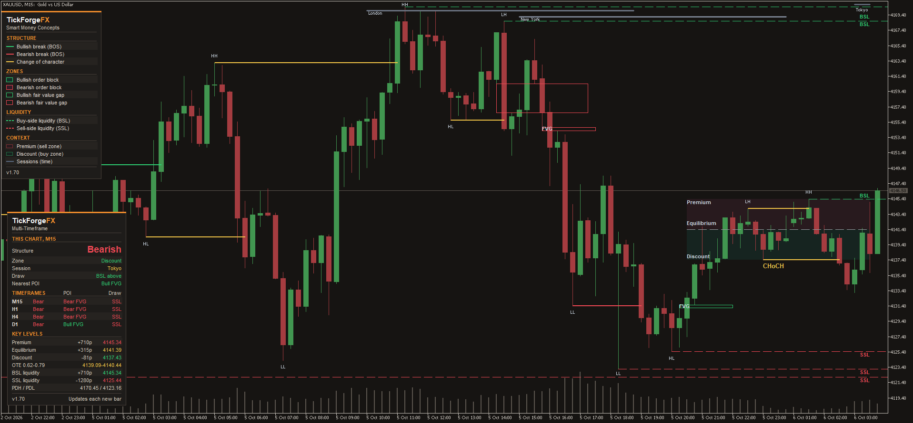

# SMC and ICT: Structure, Liquidity, Dashboard

The whole structure, one clean read. This Smart Money Concepts (SMC) and ICT indicator for
MetaTrader 5 marks market structure with BOS and CHoCH, order blocks, fair value gaps,
liquidity, premium and discount, and the trading sessions on your chart, then sums up the
picture in one dashboard: your chart's own structure first, then M15, H1, H4 and D1. Detection
runs on closed bars, so nothing repaints.

## On your chart

- **Market structure**: Break of Structure (BOS) and Change of Character (CHoCH) on confirmed
  swings, with HH, HL, LH and LL labels. A second, internal layer for the smaller swings is one
  switch away.
- **Order blocks**: the last opposing candle before a break, drawn as a zone and followed until
  price mitigates it. Mitigated blocks hide, fade or stay, as you choose.
- **Fair value gaps**: the three-candle imbalance, with an optional minimum size. Gaps that overlap
  within a few bars merge into one zone.
- **Liquidity**: buy-side and sell-side levels at the swing highs and lows (unswept only, by
  default), with equal highs and lows as an option.
- **Premium and discount**: the current dealing range split at equilibrium, with an optional OTE
  band.
- **Sessions**: Tokyo, London and New York, with Sydney as an option, lined up with your broker's
  server time automatically on a live chart and adjusted for daylight saving. Every hour is an
  input, so you can narrow them to the ICT killzone windows you use.

## In the dashboard

- **Your chart first**: its structure in large type, Bullish or Bearish from its last break, then
  the zone price is in, the session, the nearest unswept liquidity and the nearest open fair value
  gap.
- **Then M15, H1, H4 and D1**: bias, nearest open fair value gap and nearest liquidity, one row
  each.
- **Key levels**: premium, equilibrium and discount, the OTE band, the nearest buy-side and
  sell-side liquidity, and the previous day's high and low, most with their distance in pips
  from the last closed bar.

## What the colours mean

Green is bullish and buy-side, red is bearish and sell-side, gold marks a change of character
(and a mitigated zone, if you choose Fade), and grey is quiet context. Order blocks are a
bordered zone, fair value gaps a clean outline, buy-side and sell-side liquidity a dashed line
(equal highs and lows are solid), premium and discount a soft wash. The colour key card on the
chart names each one.

## No repaint

Structure is detected on closed bars only, and no zone, level or label is drawn from the bar
still forming. A bar close changes the chart only by fixed rules: a level is swept, a zone is
mitigated, extends to the right or takes in an overlapping gap, an older zone makes way for a
newer one, and the premium and discount bracket moves with the newest bars. At the far left edge
of the scan (the most recent 1,500 bars by default), older structure is re-read as the window
moves on. Labels are laid out again at each bar close and whenever you zoom, scroll or resize the
chart: a label can move a little, two liquidity labels on one level share one, and a label with no
room hides until there is room. This changes where a label sits, not what it marks.

## Make it yours

- Every module switches on and off on its own, and every
  line and zone colour, swing strength, count and session hour is an input.
- Labels and zones follow your chart's background, light or dark, automatically.
- The colour key and the dashboard drag anywhere or lock in place, and keep their shape on
  displays scaled to 125% or 150%. On a short chart the dashboard stands beside the key, when
  there is room, instead of on top of it.
- Alerts by popup, push notification or email for the events you pick: BOS, CHoCH, a new fair
  value gap or price trading into one, an order block tapped, liquidity swept, price entering
  premium or discount, or a session opening. Each fires once, when the bar closes.
- Three presets, Minimal, Balanced and Full, are attached in the product's Comments on MQL5.
  Balanced matches the defaults.

## What it is not

An analysis tool, not a trading system. It does not open trades, draw entry arrows, or predict
where price goes next. It lays the structure out the same way every time, and the
decisions stay yours. Works on any symbol and any timeframe.

## Changelog

- v1.6: three fixes. Order blocks now show with market structure switched off; switching structure off turns off
  only the structure itself: the BOS / CHoCH breaks, the HH, HL, LH and LL labels, and the BOS / CHoCH alerts. The
  previous day high and low lines on the chart now come from the daily candles, so they match the dashboard's PDH /
  PDL row; before, they could be missing or show the wrong day, for example all Monday at a broker with no Sunday
  candles, during the first candle of each day, and on a D1 chart. In the Strategy Tester the sessions now use the
  manual GMT offset, set to your broker's offset from GMT: the tester's clock cannot show a broker's offset, so the
  automatic one came out as 0 there. On a live chart the offset is still detected automatically.
- v1.5: both panels rebuilt as one house card. The colour key has four titled sections, its
  premium and discount swatches are visible, and its liquidity swatches are dashed like the lines
  they stand for. The dashboard opens with your chart's own structure in large type, then the
  zone, the session, the nearest unswept liquidity and the nearest open fair value gap, then one
  row per timeframe and the key levels; empty cells say what they mean. Both panels keep their
  shape on displays scaled to 125% or 150%, the dashboard stands beside the key on a short chart,
  and both follow the chart as soon as it is resized. Nothing about detection changed.
- v1.4: sessions that place themselves, and distances on the key levels. The broker's
  GMT offset is now read from the terminal instead of typed in, so the session ribbons
  and the dashboard's session line land correctly on the first attach rather than two or
  three hours out on a typical broker. Sessions also follow daylight saving now, with
  London on the European rule, New York on the United States rule, Sydney on the
  Australian one, and Tokyo correctly fixed because Japan keeps none. Each bar is judged
  on its own date, so a changeover weekend splits correctly instead of re-timing recent
  history. Both behaviours can be switched off, and the manual offset field still works
  exactly as before. Separately, the Key Levels section now shows how far premium,
  equilibrium, discount and the nearest buy-side and sell-side liquidity sit from the
  last closed bar, in pips.
- v1.3: fixed the OTE band label colliding with a Change of Character label where the two
  overlapped. The OTE tag now sits at the right edge of its bracket, clear of the
  structure labels on the left.
- v1.2: HH / HL / LH / LL swing labels on the major structure layer, theme-adaptive and
  suppressed at any swing that already carries a BOS or CHoCH so nothing stacks. Plus a
  declutter: the defaults now keep four order blocks and three fair value gaps per side
  instead of five each.
- v1.1: dashboard upgrade. The Read is promoted to a prominent context line, a confluence
  panel shows bias, zone, session, and the nearest point of interest as plain factual
  state, and a new Key Levels section lists named prices: premium, equilibrium, discount,
  the OTE band, nearest buy-side and sell-side liquidity, and previous day high and low.
  Panel readability pass on the text. No repaint, no new chart objects, all closed-bar.
- v1.0: first release. Market structure, order blocks, fair value gaps, liquidity,
  premium and discount with OTE, killzone sessions, the multi-timeframe dashboard, and
  closed-bar alerts.

## Support

Reach me through the product Comments or MQL5 messaging. Each update runs through its test
suite before release.

---

Current version: **1.70**

On the MQL5 Market: [SMC and ICT Structure Liquidity Dashboard](https://www.mql5.com/en/market/product/182687)
