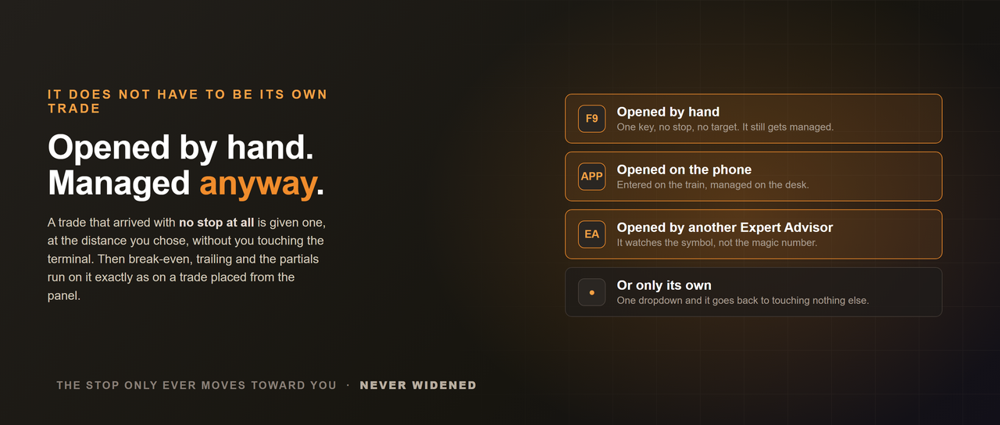
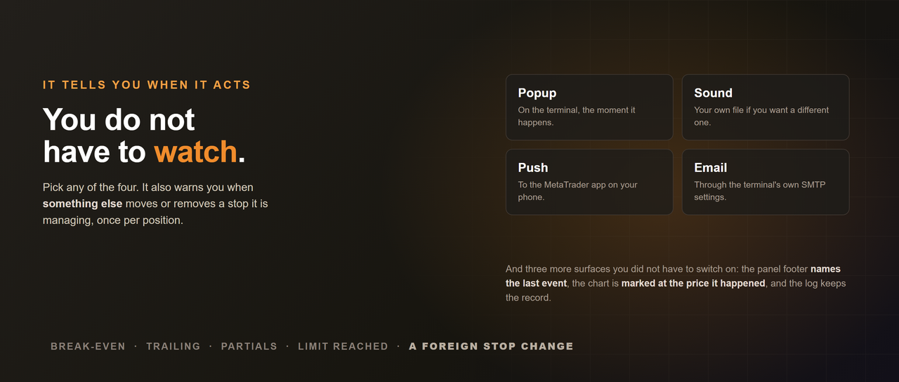
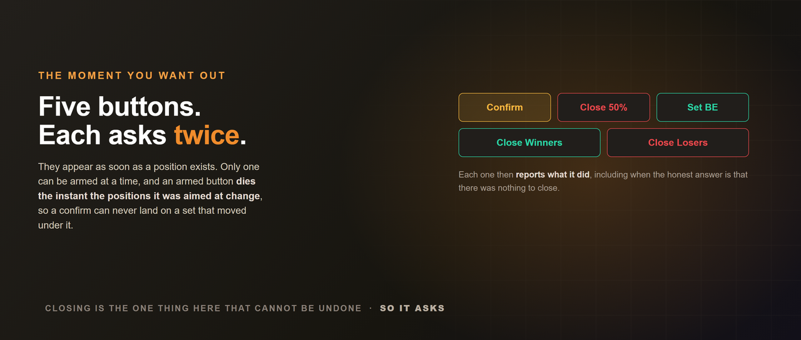
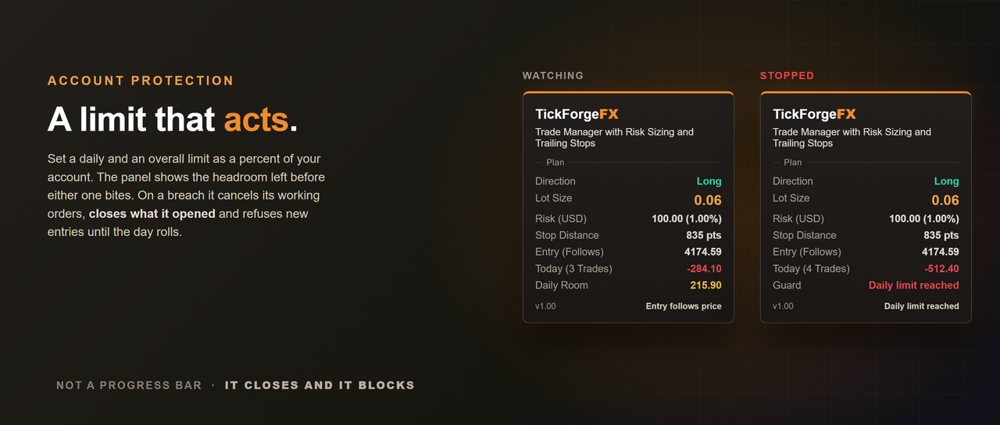

# Trade Manager with Risk Sizing and Trailing Stops

**MetaTrader 5 Expert Advisor / Utilities / Risk management / paid**

Three lines on your chart: entry, stop and target. Drag the stop to where the trade is
actually wrong, and the lot size follows it, so the risk stays exactly the percent you set
no matter how wide or tight you place it. One click sends the order at that size. After
that it runs the trade for you: partial closes, break-even, a trailing stop, and a daily
limit that stops you entering when the day has gone badly enough.

**It never decides to trade. You do.** There are no signals, no entry rules and no strategy
anywhere in it. You choose the direction and the levels; this places that trade at the
correct size and then manages it exactly the way you configured.

## Plan it on the chart

- Drag the Stop anywhere along the line, not at one hidden weld point. Entry and Target
  follow price for you out of the box, and can be dragged too once you switch that off.
- Lot size, money at risk, stop distance and reward-to-risk recompute as you drag.
- Risk as a percent of balance or of equity. Set a fixed account size and the percent is
  measured against that instead of your live balance, so a good week does not quietly grow
  your position size.
- Prefer a rule to a drag? Put the stop a fixed number of points or an ATR multiple behind
  price, and lock the target to a reward-to-risk multiple so it follows.
- Your plan is saved per symbol and restored when you come back, so a timeframe change or a
  restart never quietly rebuilds it from wherever price happens to be.

- A level you cannot see still tells you where it is. Zoom in until a line leaves the view
  and it pins to the edge of the chart as a chip showing its name and price. Click it and the
  chart refits.

## Enter it in one click

- Buy or sell at the planned size, with the stop and target taken straight from your lines.
- Place the entry line away from price and it becomes the right pending order by itself, a
  stop order or a limit order depending on which side you put it.
- The button names what it is about to do before you press it, including the order type and
  the size.
- An optional second click confirms, and the confirmation expires on its own and dies the
  moment you move a line.

## It manages the trade you opened on your phone

Out of the box it manages every position on the chart's symbol, however it got there.
Opened from this panel, opened by hand with F9, opened from the phone app on the train,
opened by another EA. Switch on **"Protect a trade that has no stop"** and a trade that
arrived without one is given a stop at your planned distance, measured from that trade's own
open price, or told plainly why it declined. That switch is **off until you turn it on**,
because Manage covers every trade on the symbol and another EA may be running without stops
on purpose. It protects a position once; if something later removes that stop it says so
rather than fighting for it. If you would rather it stayed out of
everything it did not open, one dropdown says so.

It will not take a partial for ground covered before it was watching, either. Attach it to a
chart where a trade is already past your partial level and it leaves that level alone rather
than closing half of a position it has only just met.

## It tells you when it acts, and when something else does

A popup, a sound, a push to the phone app and an email, whichever of the four you want. The
panel footer names the last event, the chart is marked at the price it happened, and the log
keeps the record. **And if a stop it is managing is moved, or removed altogether, by anything
other than this tool, you get one warning that says which of the two happened.**

## Five buttons for the moment you want out

Close All, Close 50%, Set BE, Close Winners, Close Losers. Each asks for a second click, only
one can be armed at a time, and an armed button dies the instant the positions it was aimed
at change. Each then reports what it did, including when the honest answer is that there was
nothing to close.

## Then it manages the trade

| Stage | What it does |
| --- | --- |
| Partial close | Takes part of the position off at your first target |
| Break-even | Stop to entry plus a buffer, so it locks a little rather than sitting on your fill |
| Second partial | A percent of what is left, not of the original size |
| Third partial | The same again on what remains after the second. Ships switched off |
| Trailing stop | Fixed distance, ATR, Chandelier below the high since entry, or behind the last N closed candles. The first two follow price, one at the distance you set and one at a distance that widens and tightens with volatility. Chandelier and the candle trail anchor to market structure instead |

Triggers read in whichever unit suits you: points, ATR multiples, R multiples, or your
account currency. Every indicator reading comes from closed bars, so nothing it draws
repaints, and the stop only ever
moves toward you. It is never widened, in any mode.

## And it stops you when the day is done

Set a daily limit and an overall limit as a percent of your account. The panel shows the
headroom you have left before either one bites. On a breach it cancels its working orders,
closes what it opened and refuses new entries. The daily rail releases when the day rolls;
the overall rail releases when equity recovers above the account size it recorded, or when
you clear it yourself. It is a limit that acts,
not a progress bar that watches.

## What it refuses to do

- **It refuses to size a bad plan.** Put the stop a hair from the entry and most panels hand
  back a confident 77 lot number. This one prints two dashes and tells you the stop is too
  tight to size. That is the single most expensive mistake a sizing tool can make, and it is
  one click from being an order.
- **A button that cannot fire tells you why.** Market closed, trading disabled, daily limit
  reached, not enough free margin, stop too close to the current price. Eighteen distinct
  reasons, in plain words, instead of a control that silently does nothing.
- **The sizing arithmetic is right on instruments where it usually is not.** A stop is a loss
  and a target is a gain, and on many CFDs and crosses your broker values those two
  differently. Sizing off the wrong one quietly risks more than you asked for. This reads the
  correct value for each leg.
- **If price runs through your stop while the entry is tracking price, the plan voids.** It
  does not silently flip into the opposite trade, which is what reading direction from
  geometry alone would do.
- **The stop is never widened.** Not in any trailing mode, not after a partial, not across a
  restart. It only ever moves toward you.

## It stays out of the way

A panel you leave on the chart all day should cost you almost nothing. This one is built so
it does.

- **The expensive redraw sits behind a throttle** rather than on every tick. A zoom or a
  scroll beats it deliberately, because a card showing the wrong thing is worse than one
  drawn twice. The expensive work sits
  behind a deliberate throttle.
- **It puts nothing in your Objects list.** Open the object window on a chart running this
  and it is empty. The whole interface is drawn as hidden objects, so it never clutters the
  list you keep your own lines and zones in, and you cannot select or delete half the panel
  by accident while you are working.
- **Every reading comes from closed bars**, so nothing it shows you can change after the fact.

## Good to know

- Works on netting and hedging accounts, on any symbol your broker offers.
- It manages every trade on the chart's symbol by default, whichever tool or hand opened it.
  Set Manage to "Only trades this tool opened" and it goes back to touching nothing but its
  own, identified by its own magic number.
- Partials, break-even, trailing, the target line, the alerts and the account limits can each
  be switched off. With all of them off it is simply a risk-sized one-click entry panel.
- Every stage fires at most once per position, and that memory survives a restart, a
  recompile and a change of ticket.
- A break-even or trailing trigger smaller than your broker's own minimum stop distance can
  never execute, and the card will keep saying "too close to move yet" for as long as it stays
  that way. If you see that permanently, the number to raise is the trigger.
- **A partial needs a position big enough to split.** On a symbol whose smallest tradable size
  is 0.01, Partial 1 needs 0.02 or more, Partial 2 needs 0.07 because it takes a quarter of
  what Partial 1 left behind, and Partial 3 needs 0.09 because it takes a quarter of what
  Partial 2 left. Below those sizes the level is retired quietly instead
  of being retried forever, because your broker will not accept an order smaller than its
  minimum.
- **On a trade that reached it with no stop at all, the three structural trailing modes can
  set the first stop below your entry price.** Break-even, the two extra ladder steps and the
  fixed-distance trail never place below it. ATR, Chandelier and candle place where the
  structure is, and sometimes the structure is behind your entry. That is a capped loss where
  a moment ago there was none, so it is a reduction rather than a widening, but it is worth
  knowing before you point a structural mode at a trade you opened by hand.

## About the demo, stated plainly

On the MQL5 Market a paid product's demo runs only in the Strategy Tester. The buttons are
fully usable there: pick your direction, place the trade from the panel, press the action
buttons, and watch break-even, the partial closes and the trailing stop run on that position
as the test advances.

Three things do not work in the tester and not one of them is a setting of this tool.
MetaTrader never sends mouse events to an Expert Advisor in a test, so nothing on the chart
can be dragged there: not the panel, and not the Entry, Stop and Target lines. Set your stop
with the Points or ATR mode instead and the levels are placed from a rule rather than by hand.
And alerts cannot be delivered at all, so no popup, sound, push or email will fire
there. What the tester does still show you is that they fired: every event names
itself in the panel footer, marks the chart at the price it happened, and is written to the
log. On a live chart all four delivery channels behave normally.

---

Part of the [TickForgeFX](https://github.com/TickForgeFX/trading-tools-portfolio) toolkit.

## If you need me, I answer

Ask in the comments or by MQL5 message and you get a reply from the person who wrote the
code, not a support desk. If something is broken I want to know about it, and a bug report
gets a fix rather than a workaround.

## This is a new listing, and you can see that

No long review history and no years of version numbers behind it. What being early buys you
is this price, kept for good on everything you own, and a developer with the time to actually
answer you. It goes up as reviews come in, not down.
