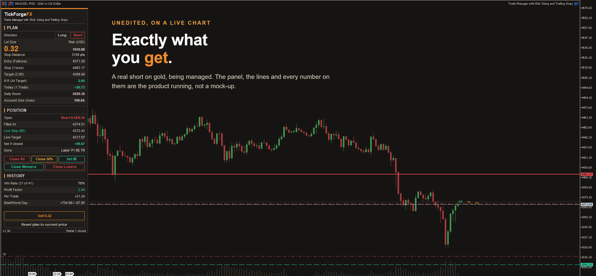
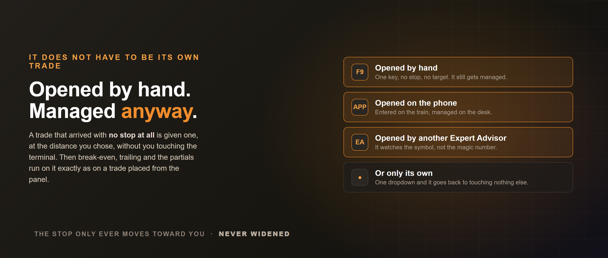

# Trade Manager with Risk Sizing and Trailing Stops

It manages the trade you opened by hand. Opened with F9, opened from the phone, opened by another EA, or placed from its own panel: it adopts the position and runs your rules on it. Break-even, up to three partial closes, a trailing stop and a loss limit that acts, on every tick, whether or not you are watching.

**And when it will not act, it tells you why**, in plain words on the card, instead of leaving a control that silently does nothing. That includes refusing to hand you a lot size for a plan it cannot size, which is the one refusal that saves real money.

**It never decides to trade. You do.** There are no signals, no entry rules and no strategy anywhere in it. You choose the direction and the levels; this places that trade at the correct size and then manages it exactly the way you configured.

## Three things it does, and the third is the one you feel

- **The size follows your stop**, not the other way round. Drag the stop to where the trade is actually wrong and the lot recomputes, so one percent is one percent whether that stop sits ten points away or two hundred.
- **The Place button sends it** at exactly that size, as a market order or as the right pending order depending on where you put the entry line.
- **Then it runs the trade without you, and not only the trades it opened.** Partial closes, break-even, a trailing stop and a daily limit, on every tick, while you are asleep.

## Every trade on the symbol, however it got there

Out of the box this manages every position on the chart's symbol, however it got there. Opened from this panel, opened by hand with F9, opened from the phone app on the train, opened by another EA. Switch on "Protect a trade that has no stop" and a trade that arrived without one is given a stop at your planned distance, in points or ATR, measured from that trade's own open price. If price has already run past that distance it declines rather than placing a stop where it would fill immediately, and the card tells you which. Either way the Done row records it. That switch is off until you turn it on, deliberately: Manage covers every trade on the symbol, and another EA may be running without stops on purpose. If you would rather it stayed out of everything it did not open, one dropdown says so.

- Break-even, the stop ladder, trailing and the partial closes all run on an adopted trade exactly as they run on one placed from the panel.
- Triggers are read in points by default, because a trade opened by hand usually carries no stop, and R is measured from the stop. Choose R and the card says so on any trade it cannot measure, instead of going quiet.
- **It works on the chart's symbol, and only that.** Every price it reads belongs to this chart, so it will never reach across and manage another symbol's position with the wrong prices. Put it on the charts you actually trade.
- Moving a stop is reversible and only ever reduces your risk, so it does that by default. Closing a position is neither, so a breached loss limit closes only what this tool opened unless you explicitly switch that on and Manage is set to every trade on the symbol.
- **It will not take a partial for ground covered before it was watching.** Attach it to a chart where a trade is already well past your partial level and it leaves that level alone rather than closing half of a position it has only just met.

## What it refuses to do

Anyone can divide risk by stop distance. These are the things that only get written by someone who has been hurt by their absence, and they are the reason to trust it with a live account.

- **It refuses to size a bad plan.** Put the stop a hair from the entry and most panels hand back a confident 77 lot number. This one prints two dashes and tells you the stop is too tight to size. That is the single most expensive mistake a sizing tool can make.
- **A button that cannot fire tells you why.** Market closed, trading disabled, daily limit reached, not enough free margin, stop too close to the current price. The card names the one that applies, so you know whether to wait, change a number, or take it up with your broker.
- **The sizing arithmetic is right on instruments where it usually is not.** A stop is a loss and a target is a gain, and on many CFDs and crosses your broker values those two differently. Sizing off the wrong one quietly risks more than you asked for. This reads the correct value for each leg.
- **If price runs through your stop while the entry is tracking price, the plan voids.** It does not silently flip into the opposite trade, which is what reading direction from geometry alone would do.
- **The stop is never widened.** Not in any trailing mode, not after a partial, not across a restart. It only ever moves toward you.

## Plan it on the chart

- Drag the Stop anywhere along the line, not at one hidden weld point. Entry and Target follow price for you out of the box, and become draggable once you switch that off in the settings.
- Lot size, money at risk, stop distance and reward-to-risk recompute as you drag.
- Risk as a percent of balance or of equity. Set a fixed account size and the percent is measured against that instead of your live balance, so a good week does not quietly grow your position size.
- Prefer a rule to a drag? Put the stop a fixed number of points or an ATR multiple behind price, and lock the target to a reward-to-risk multiple so it follows.
- Your plan is saved per symbol and restored when you come back, so a timeframe change or a restart never quietly rebuilds it from wherever price happens to be.
- A level you cannot see still tells you where it is. Zoom in until a line leaves the view and it pins to the edge of the chart as a chip showing its name and price. Click it and the chart refits so you can see it again.

## Enter it straight from the chart

- Buy or sell at the planned size, with the stop and target taken straight from your lines.
- Place the entry line away from price and it becomes the right pending order by itself, a stop order or a limit order depending on which side you put it.
- The button names what it is about to do before you press it, including the order type and the size.
- An optional second click confirms, and the confirmation expires on its own and dies the moment you move a line.

## Then it manages the trade

- **Partial closes**, three levels, each one taken from what is left rather than from the original size. The third arrives switched off. Set the three in increasing order and the tool says so in the log if they are not.
- **Break-even** at your trigger, locking a buffer beyond entry rather than exactly on it, then up to two further steps that lock more as the trade runs. Steps two and three stay off until you set them, and the order you configure them in does not matter.
- **Trailing** in four modes: a fixed distance, an ATR multiple, Chandelier below the highest high since entry, or behind the last N closed candles. The first two follow price, one at the distance you set and one at a distance that widens and tightens with volatility. Chandelier and the candle trail anchor to market structure instead, to the extreme since entry or to the last N closed candles.
- Triggers read in whichever unit suits you: points, ATR multiples, R multiples, or your account currency. Points is the default, because it is the one unit that works on a trade that arrived without a stop.
- **It tells you when it acts.** A popup, a sound, a push to the phone app and an email, whichever of the four you want. The panel footer names the last event, the chart is marked at the price it happened, and the log keeps the record.
- **And it tells you when something else acts.** If a stop it is managing is moved, or removed altogether, by anything other than this tool, you get one warning that says which of the two happened. Once per position, not every few seconds.

## Five buttons for the moment you want out

A row of actions appears on the card as soon as a position exists: Close All, Close 50%, Set BE, Close Winners, Close Losers. Each one asks for a second click before it does anything, which you can switch off, only one can be armed at a time, and an arm expires on its own and dies the instant the positions it was aimed at change. Each one then reports what it did, including when the honest answer is that there was nothing to close.

The part nobody writes about is what happens when your broker has taken a close and not confirmed it. This tool tracks each request by the order ticket the server gave it, so the card can tell you which of two very different things is true: your close is with the broker and awaiting a fill, or the position is simply busy with an earlier request of this tool's own and another click will work. A full close the broker only partly fills is reported as partly closed and still open, never as closed. And if one of its own close orders is still working after the wait, it withdraws that order rather than sending a second one on top of it, because on a netting account two closes for one position do not stop at flat.

## And it stops you when the day is done

Two things in here exist because a prop-firm day is not a calendar day. **The daily reset hour is yours to set**, in server time, so the limit rolls when your firm says the day rolls rather than at midnight. And **the roll only ever moves forward**: if the server clock steps backwards across that hour, a daylight-saving change being the ordinary way that happens, it holds the baseline and says so in the log instead of handing you a second full allowance for the same day. **The tripped state is also stored per account login**, so a limit you hit on one account does not follow you onto another.

Set a daily limit and an overall limit as a percent of your account. The panel shows the headroom you have left before either one bites. On a breach it cancels its working orders, closes what it opened and refuses new entries. It is a limit that acts, not a progress bar that watches. Closing trades it did not open is a separate switch and it is off until you turn it on, because that is the one action here that cannot be undone.

**The overall rail measures from the highest equity your account has reached**, so it protects what you have made and not only what you deposited. On an account that has grown, that is the tighter of the two readings and it is the default for exactly that reason. If you would rather have the fixed line, one dropdown measures it from your account size instead. Either way it releases when equity recovers above the reference it is using, or when you clear it yourself, which re-anchors both rails to where the account stands now rather than leaving you locked out.

**A withdrawal is not a trading loss, and this does not treat it as one.** Taking money out of the account moves equity down, and a limit that reads that fall as losing can close your open positions over a transfer you made on purpose. The limits move their own references instead, and the log records the event with the amount. A deposit is handled the same way and does not widen your limits, so money added after a bad day buys no extra room.

There is a daily target row as well, off by default, sitting directly under the loss rails and measured against the same account size they use. It shares their block, so it appears when the loss limits are on. It counts what is left to earn and turns teal when the day is done. It only ever displays. It will not close a trade and will not block an entry, so it cannot cost you one.

## The panel

**With more than one trade open it lists every one it is managing**, a row each carrying direction, size, profit or loss and the same short codes the Done row uses. Click a row and the detail below follows to that trade. The list folds to a single line and remembers that for the symbol, and with one trade open or none it takes no space at all.

One draggable, lockable card, banded row by row so a label and its value read as one thing. The block at the top is the exception and it is deliberate: lot size and the money it puts at risk sit together in one band, under their own labels rather than beside them, with the size large and in ember because it is the number this tool exists to compute. The trade you are planning, then the position you have open with its live stop, its live target, what the manager has already done to it and what it is waiting for. An optional history section adds win rate, profit factor, average per trade and your best and worst day, read from your broker's own closed deals rather than a tally this tool kept.

## It stays out of the way

A panel you leave on the chart all day should cost you almost nothing. This one is built so it does.

- **The expensive redraw sits behind a throttle** rather than running on every tick. A zoom or a scroll is allowed to beat it, because a card showing you the wrong thing is worse than one drawn twice.
- **It puts nothing in your Objects list.** Open the object window on a chart running this and it is empty. The whole interface is drawn as hidden objects, so it never clutters the list you keep your own lines and zones in, and you cannot select or delete half the panel by accident while you are working.
- **Every indicator reading comes from closed bars**, so nothing it draws can change after the fact. The live figures, your size and your open profit, follow price.

## Good to know

- Works on netting and hedging accounts, on any symbol your broker offers.
- It manages every trade on the chart's symbol by default, whichever tool or hand opened it. Set Manage to "Only trades this tool opened" and it goes back to touching nothing but its own, identified by its own magic number.
- Partials, break-even, trailing, the target line, the alerts and the account limits can each be switched off. With all of them off it is simply a risk-sized entry panel.
- Every stage fires at most once per position, and that memory survives a restart, a recompile and a change of ticket.
- **A stop that will not move has two different causes and the card names which.** A break-even or trailing step landing inside your broker's own minimum stop distance is held, not lost: it is written as soon as price has moved far enough away, and until then the card reads "Stop too close to move yet". The one that never clears is a **Fixed distance** trail set smaller than that minimum, because the stop it wants is always the same distance behind price. If that message is permanent, the number to raise is "Fixed distance: keep the stop this far behind", not the trigger.
- **A partial needs a position big enough to split.** On a symbol whose smallest tradable size is 0.01, Partial 1 needs 0.02 or more, Partial 2 needs 0.07 because it takes a quarter of what Partial 1 left behind, and Partial 3 needs 0.09 because it takes a quarter of what Partial 2 left. Below those sizes the level waits and the card says "Too small to take a partial", so raising the percent brings it back.
- **On a trade that reached it with no stop at all, three of the four trailing modes can set the first stop on the losing side of your entry price.** Break-even, the two extra ladder steps and the fixed-distance trail never place it there. Chandelier and the candle trail place where the structure is, and sometimes the structure is behind your entry. ATR gets there a different way: its distance behind price widens with volatility, so on a quiet entry into a volatile stretch that distance can be larger than the profit so far. That is a capped loss where a moment ago there was none, so it is a reduction rather than a widening, but it is worth knowing before you point a structural mode at a trade you opened by hand.

## About the demo, stated plainly

On this market a paid product's demo runs only in the Strategy Tester. The buttons are fully usable there: pick your direction, place the trade from the panel, press the action buttons, and watch break-even, the partial closes and the trailing stop run on that position as the test advances.

**One thing it does in the tester that it never does anywhere else.** In a NON-VISUAL run on a netting account funded under 2000, which is the configuration this market's own automated validator uses, it opens minimum-lot sample positions by itself so that validator can see trading operations. It says so in the journal when it happens. Run your own tests in VISUAL mode and it never trades unless you press a button, which is where the demo is meant to be driven from anyway.

**Two things do not work in the tester, and neither is a setting of this tool.** MetaTrader never sends mouse events to an Expert Advisor in a test, so **nothing on the chart can be dragged there: not the panel, and not the Entry, Stop and Target lines**. Set your stop with the Points or ATR mode instead and the levels are placed from a rule rather than by hand, which is the same plan arrived at a different way. And alerts cannot be delivered at all, so no popup, sound, push or email will fire there.

What the tester does still show you is that the alerts fired: every event names itself in the panel footer, marks the chart at the price it happened, and is written to the log. On a live chart all four delivery channels behave normally.

## If you need me, I answer

Ask in the comments or by MQL5 message and you get a reply from the person who wrote the code, not a support desk. If something is broken I want to know about it, and a bug report gets a fix rather than a workaround.

You already know where your stop belongs and what you are willing to risk. This makes sure the size matches that decision, the order matches the plan, and the management actually happens.

---

Current version: **1.60**

On the MQL5 Market: [Trade Manager with Risk Sizing and Trailing Stops](https://www.mql5.com/en/market/product/189281)
