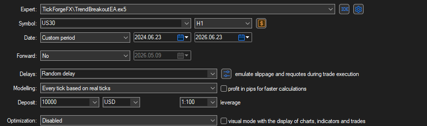
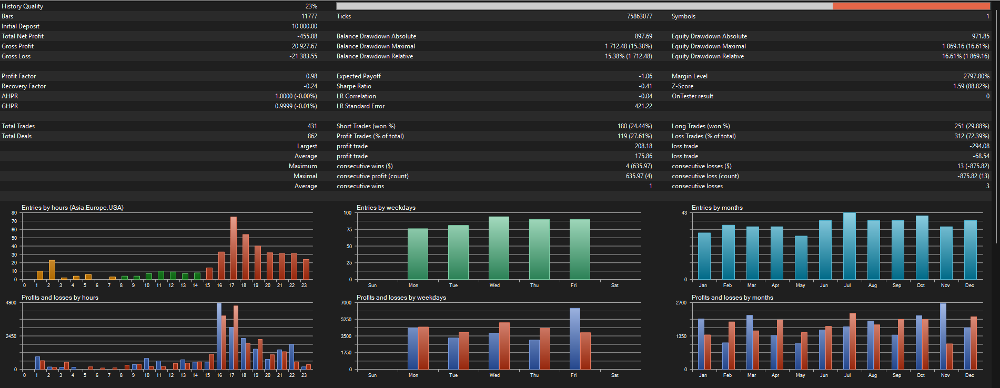
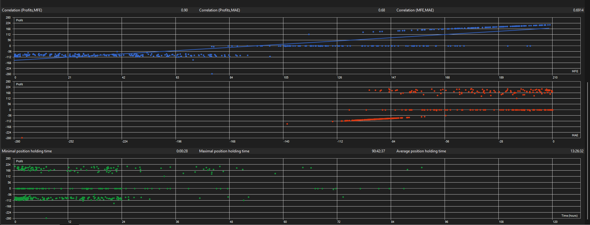

# Trend Breakout EA: a transparent breakout baseline

A worked example of how I build and test a trading strategy. The rules are simple and
fully disclosed, the risk model has no grid and no martingale, and the test is reported
honestly, including the parts that are not flattering.

This page is a portfolio piece, not a profit claim. The value on offer is the method:
a clean, readable Expert Advisor built exactly to a spec and tested without
cherry-picking. The numbers below are a baseline, not a finished product.

## The idea in one line

Trade in the direction of the trend, only when price breaks out of its recent range,
with a volatility-based stop and a fixed percent of the account at risk.

## The exact rules

Everything acts on closed bars. Nothing is decided on the forming candle.

- **Bias filter.** Close above a 200-period EMA = long-only bias. Close below = short-only.
- **Entry.** The last closed bar closes beyond the highest high (long) or lowest low
  (short) of the prior N bars (a Donchian breakout), in the direction of the bias.
- **Stop.** ATR(14) x a multiplier, so the stop widens in volatile conditions and
  tightens in quiet ones.
- **Target.** A fixed reward-to-risk multiple of the stop distance.
- **Sizing.** A fixed percent of balance at risk per trade, sized from the actual stop
  distance.
- **Break-even.** Optional. The stop moves to entry once the trade reaches +1R.
- **One position at a time.** No stacking, no averaging, no recovery trades.
- **Optional session window.** Restrict entries to chosen server hours.

Default parameters: lookback 20, EMA 200, ATR 14, stop 2.0x ATR, reward-to-risk 2.0,
risk 1.0% per trade.

## The risk model (what it does not do)

- **No grid.** One position, one stop.
- **No martingale.** Position size never increases after a loss.
- **No hidden averaging.** There is no second entry to rescue a losing trade.
- **A stop on every trade.** Every position is opened with a stop and a target attached.

A single losing trade costs the configured risk percent and no more. This is the whole
point: the equity curve is allowed to be honest.

## Test setup

| Field | Value |
|---|---|
| Symbol | US30 (Dow 30 CFD) |
| Timeframe | H1 |
| Period | 2024.06.23 to 2026.06.23 (2 years) |
| Data / modelling | Every tick based on real ticks. History quality 23% (see note). |
| Starting balance | 10,000 USD |
| Execution | Random-delay (slippage emulated), real historical spread from the tick data |
| Risk per trade | 1.0% |
| Parameters | defaults above (no per-period optimization) |

This test commits to a conservative cost model on purpose. Real spread from the tick
data, plus random-delay execution so fills take realistic slippage. It pulls the result
down, and that is the point: a number that survives honest costs is worth more than a
flattering one that does not.

One caveat, stated plainly: the broker's real-tick history covered only about a quarter
of the period (history quality 23%), with the rest modelled. That does not change the
conclusion below (a sub-1.0 profit factor does not become strong on cleaner data), but a
higher-quality tick source would firm up the exact figure. A backtest is only as honest
as its spread, costs, and data quality, so this is on the table, not hidden.

## Results

| Metric | Result |
|---|---|
| Net profit | -455.88 USD (-4.6% of the 10,000 balance) |
| Profit factor | 0.98 |
| Total trades | 431 (251 long, 180 short) |
| Win rate | 27.61% (119 wins, 312 losses) |
| Average win / average loss | 175.86 / 68.54 USD (realized reward-to-risk about 2.6 to 1) |
| Expected payoff | -1.06 USD per trade (about -0.015R) |
| Max drawdown | 15.38% balance (1,712), 16.61% equity (1,869) |
| Longest losing streak | 13 trades |
| Sharpe ratio | -0.41 |
| Recovery factor | -0.24 |

For reference, the earlier optimistic run on the same logic (ideal fills) came in at a
profit factor of ~1.02. Switching to honest, conservative execution pushed it to 0.98,
from marginally positive to marginally negative. That delta is the cost of telling the
truth, and it is exactly why we test this way.

## The honest read

This is the honest result, and it is not a system to trade live as it stands. With a
conservative cost model, the strategy returned a profit factor of 0.98 and a net loss of
456 USD, about 4.6% of the starting balance, over two years and 431 trades. The earlier,
more optimistic run was 1.02. Honest execution costs pushed it just under water. A
marginal edge does not survive real costs, and we would rather show you that than hide it.

The shape is a classic low-win-rate trend follower. It wins only 27.61% of the time, but
the average win (176 USD) is about 2.6 times the average loss (69 USD), so it earns from
the occasional trend that runs. The excursion data backs this up: profit correlates
strongly with maximum favorable excursion (0.90), meaning the winners are the trades
allowed to run, while the losers are cut at the ATR stop (adverse excursion clusters near
the stop distance). The balance curve wanders sideways, oscillating roughly between 9,050
and 11,200 before closing down near 9,560, the visual signature of a system with no
durable edge. Maximum drawdown was 15.4%, and the longest losing streak was 13 trades in
a row, which is the part a real trader has to be able to sit through.

What a marginal baseline is good for:
- A clean starting point to build a real edge on (filters, exits, regime detection).
- A demonstration that the code does exactly what the spec says, and the test hides
  nothing.
- A reference for honest expectation-setting before anyone risks a dollar.

## What this maps to as a service

This is the kind of job I take: you bring a strategy in plain rules, I build it as a
clean Expert Advisor with proper risk management, test it on real data with honest
assumptions, and tell you whether it holds up before you trade it. No grid, no
martingale, no "guaranteed profit." The truth, built to spec.

- MQL5: https://www.mql5.com/en/users/tickforgefx
- Email: TickForgeFX@protonmail.com
