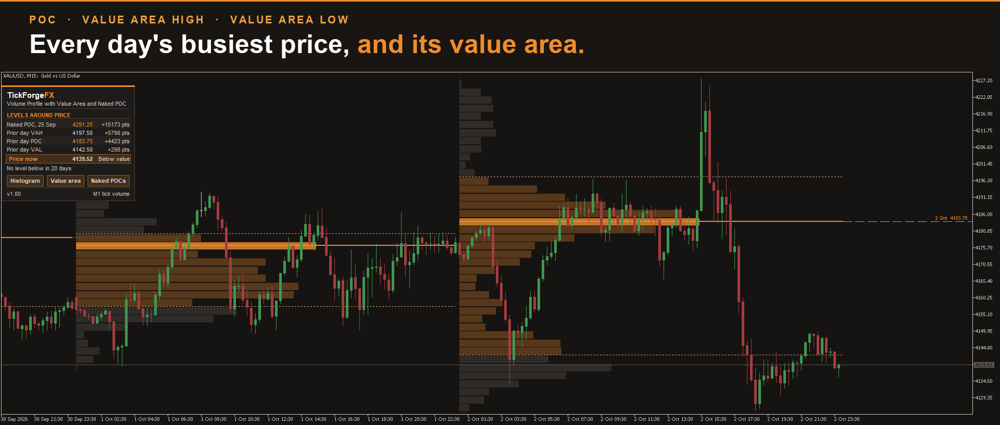

# Volume Profile with Value Area and Naked POC

Where the volume traded, day by day: a volume profile for each day or session with its **POC, value area high and value area low**, and the **naked POCs** the market has not been back to, drawn to the right edge with their dates and prices. Built from one-minute bars on every timeframe, so the levels are the same on M5 and on H4, and a finished day's levels do not move.

## What it draws

- **A profile for each day**, or for each trading session, drawn for the last 10 by default ("Profiles drawn on the chart"): the volume at each price as a histogram behind the candles, the value area in ember and the rest in a quiet grey.
- **The POC** (point of control, the price where the most volume traded) as a solid line, and the **value area high and low** as dotted lines.
- **Naked POCs**: a finished day's POC that no later bar has touched stays drawn to the right edge with its date and price, looked for over the last 20 days by default ("Look for naked POCs in the last N profiles"). Once price touches it, the line ends there and turns grey.
- **Today's developing POC** as a thin step line, showing where it stood as the day built.
- **Optional, off by default:** a visible-range profile at the right edge of the chart, and a fixed-range profile between two dates, up to 120 days back, whose lines you can drag.

## The levels around price, in one card

A card lists the levels around price, up to four above and four below in price order, each with its price and its distance in points: always the prior day's POC, VAH and VAL and today's POC, then the nearest naked POCs in the room left, with a line counting any more. It also reads where price sits against the prior day's value area: Inside value, Above value or Below value. Three switches on the card turn the day histograms, the value area and the naked POCs on and off on the chart; the card lists the levels whatever the switches show.

## Levels that do not move

Each day's rows are sized from the average range of the 20 days before it, divided into the number of rows you choose (30 by default) and rounded to a tidy step. Because only the past sets them, once the history behind them has loaded, a finished day's POC, VAH and VAL come out the same after a reload, on every timeframe, and on every day after.

## How the volume is counted

From one-minute bars, whatever the chart's timeframe: each minute's volume is spread evenly over the prices it traded, from its low to its high. It uses tick volume, or real volume where the symbol's bars are built from trades and carry it. The POC is the fullest row. The value area grows from the POC one row at a time, adding the fuller neighbour (the higher one on a tie), until it holds at least 70% of the day's volume (the share is a setting). Platforms stop this growth at slightly different points, so a VAH or VAL can sit a row away from another tool's. A naked POC counts as touched when a later bar's range reaches it, compared in whole ticks.

## Days, a custom day start, or sessions

By default a profile is your broker's day, the same days as its daily candles. You can move the start of the day to any server hour, for example to match a gold or index open, or switch to sessions: up to three windows a day, set in server time, by default Asia 01:00 to 09:00, London 09:00 to 15:00 and NY 15:00 to 23:00, each with its own profile and each one editable or off. In day profiles a short Sunday session is folded into Monday (a setting), while a market that trades a full Sunday, such as crypto, keeps it as a day of its own.

## It says what data it has

The card's bottom line names the data behind the profiles: "M1 tick volume", "M1 real volume", "Loading M1" with a percentage while history arrives, or, on charts above M1, "M1 only since" a date when the terminal holds less one-minute history than the lookback needs, for example when "Max bars in chart" is set low. A day whose start is missing from the history is left out rather than drawn wrong.

## Alerts, off by default

A popup, a sound, a push notification to the MetaTrader mobile app, or an email when price touches a naked POC, or when price reaches the prior day's POC, VAH or VAL. A naked POC announces itself once, when it is touched; the prior day's levels each announce once per day, or once per session in session mode. A prior day's POC that is still naked can announce under both alerts, and a price gap across a level counts as reaching it. A level that price had already passed when the indicator started is announced at its next revisit, not the moment you attach it.

## For your own EA

Six values in the Data Window, readable with iCustom: the prior day's POC, VAH and VAL, and the developing POC, VAH and VAL of each bar's own day as they stood at that bar's close. Values cover the profiled days, about the last 22 by default, so earlier bars read empty, and the developing values are kept on D1 and lower.

## On MetaTrader 4

The MetaTrader 4 version draws the same profiles by the same rules, with two differences. MetaTrader 4 has tick volume only. And a fresh MetaTrader 4 terminal holds about a day and a half of one-minute bars, so on charts above M1 the card first says "M1 only since" a recent date; scrolling a one-minute chart back, or the History Center, gives it more, and the indicator picks that up by itself.

## About the demo, stated plainly

The demo runs in the Strategy Tester, where a few things differ from a live chart. The histogram rows are drawn in whole bars, so on H1 they look blockier than they will on your chart. In the "Open prices only" mode the tester cannot give an indicator one-minute data without ending the test, so there the profiles are built from the chart's own bars and the card says so, for example "Coarse: from H1 bars"; above H4 in that mode a day is too few bars to profile, so it draws nothing and asks for H4 or lower. Every other mode reads one-minute bars, as a live chart does. Alerts are muted in the tester, but a touched naked POC still ends where it was touched. Nothing can be dragged in the tester, so the fixed-range lines stay where the settings put them.

## What it does not do

It does not place trades, give signals, or predict where price goes. It does not split volume into buying and selling, because tick volume has no side, and it does not draw TPO letters. On most forex symbols the volume MetaTrader shows is tick volume, the number of price changes, not traded contracts. It measures where activity sat; the decisions stay yours.

Day and session histograms draw on M1 to H4; above H4 a day holds too few bars for one, so H6 and higher draw the lines only. It works on any symbol and any account type. The histogram's colours are mixed from your chart's own background and text colours, so it suits a dark or a light chart; the card keeps its own dark style. The card can be dragged anywhere on the chart or locked in place, and its switches are remembered across a timeframe change.

## If you need me, I answer

Ask in the comments or by MQL5 message and you get an answer from me directly. If something is broken I want to know, and a bug report gets a fix rather than a workaround.

---

Current version: **1.0**, on MetaTrader 5 and MetaTrader 4

On the MQL5 Market:

- MetaTrader 5: [Volume Profile with Value Area and Naked POC](https://www.mql5.com/en/market/product/199693)
- MetaTrader 4: [Volume Profile with Value Area and Naked POC MT4](https://www.mql5.com/en/market/product/199703)
